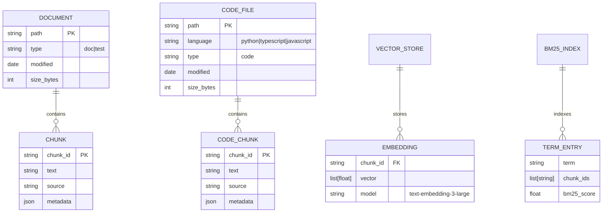
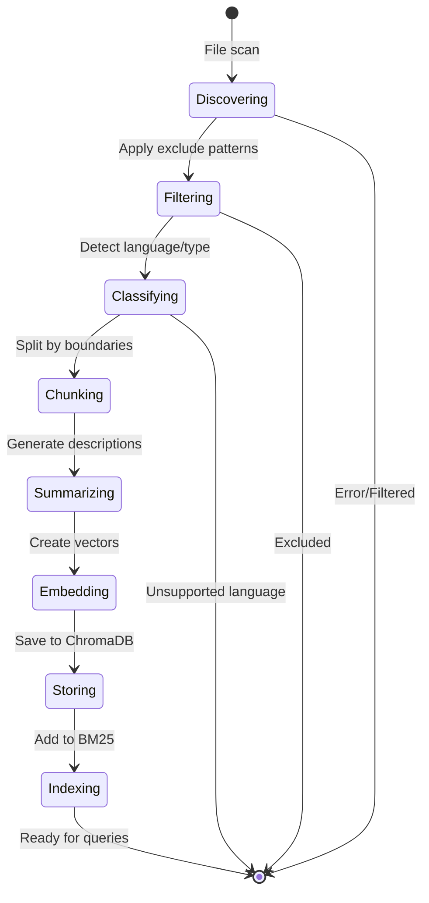
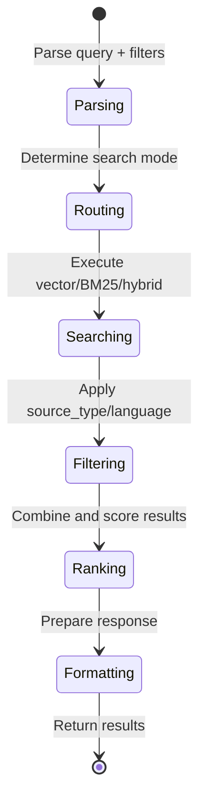

# Data Model: Code Ingestion

## Overview

The code ingestion feature extends Doc-Serve's data model to support source code alongside documentation. This creates a unified searchable corpus where users can cross-reference between implementation and documentation.

## Entity Relationships



## Core Entities

### Document
Represents traditional documentation files (Markdown, PDF, etc.)

**Fields:**
- `path` (string, PK): Full file system path
- `type` (enum): "doc" | "test"
- `modified` (datetime): Last modification timestamp
- `size_bytes` (int): File size for monitoring

### CodeFile
Represents source code files with language-specific metadata

**Fields:**
- `path` (string, PK): Full file system path
- `language` (enum): "python" | "typescript" | "javascript"
- `type` (string): Always "code"
- `modified` (datetime): Last modification timestamp
- `size_bytes` (int): File size for monitoring

### Chunk (Extended)
Base chunk entity extended with unified metadata schema

**Fields:**
- `chunk_id` (string, PK): UUID-based unique identifier
- `text` (string): Chunk content (up to 2000 chars for code)
- `source` (string): File path this chunk came from
- `metadata` (json): Rich metadata (see below)

### CodeChunk (Specialized)
Code-specific chunk with AST-aware boundaries

**Inherits from Chunk with additional constraints:**
- Text content respects function/class boundaries
- Metadata includes symbol information
- Chunking uses tree-sitter AST parsing

## Metadata Schema

### Universal Metadata (All Chunks)
```json
{
  "chunk_id": "chunk_a1b2c3d4",
  "source": "/path/to/file.py",
  "file_name": "file.py",
  "chunk_index": 0,
  "total_chunks": 5,
  "source_type": "code",
  "created_at": "2025-12-18T10:00:00Z"
}
```

### Code-Specific Metadata
```json
{
  "language": "python",
  "symbol_name": "UserService.authenticate",
  "symbol_kind": "method",
  "start_line": 120,
  "end_line": 145,
  "section_summary": "Authenticates user credentials against database",
  "prev_section_summary": "Initializes user service with database connection",
  "docstring": "Authenticate user with username and password.\n\nReturns User object or None.",
  "parameters": ["username: str", "password: str"],
  "return_type": "User | None",
  "decorators": ["@staticmethod"],
  "imports": ["from typing import Optional", "from models import User"]
}
```

### Document-Specific Metadata
```json
{
  "source_type": "doc",
  "language": "markdown",
  "heading_path": "Authentication > User Service > Methods",
  "section_title": "User Authentication",
  "content_type": "tutorial"
}
```

## State Transitions

### Indexing Pipeline States


### Query Processing States


## Validation Rules

### Code File Validation
- **Extension Check**: Must match supported extensions (.py, .ts, .tsx, .js, .jsx)
- **Language Detection**: Must be parseable by tree-sitter grammar
- **Size Limits**: Individual files < 10MB, total codebase < 100k LOC
- **Encoding**: Must be valid UTF-8

### Chunk Validation
- **Size Bounds**: 100-2000 characters for code chunks
- **Boundary Integrity**: Chunks must not split function/class definitions
- **Metadata Completeness**: Required fields must be present
- **Symbol Accuracy**: AST parsing must correctly identify symbols

### Metadata Validation
- **source_type**: Must be "code" | "doc" | "test"
- **language**: Must match supported parsers when source_type="code"
- **symbol_kind**: Must be valid enum value ("function", "class", "method", etc.)
- **line_numbers**: Must be positive integers within file bounds

## Relationships & Constraints

### Foreign Key Constraints
- Chunk.source → Document.path OR CodeFile.path
- Embedding.chunk_id → Chunk.chunk_id
- TermEntry.chunk_ids → Chunk.chunk_id (many-to-many)

### Uniqueness Constraints
- chunk_id must be globally unique across all chunks
- (source, chunk_index) must be unique within a file
- symbol_name + source must be unique for code symbols

### Data Integrity Rules
- All code chunks must have source_type="code"
- All doc chunks must have source_type="doc"
- Language field is required when source_type="code"
- Symbol fields are optional but recommended for code chunks
- Summary fields enhance search but are not required

## Indexing Strategy

### Single Collection Design
Store all chunk types (docs + code) in one ChromaDB collection for unified search:
- Enables cross-referencing between docs and code
- Simplifies query filtering by source_type/language
- Maintains consistent embedding space

### Metadata-Driven Filtering
Use ChromaDB's where clause for efficient filtering:
```python
# Code-only search
{"source_type": {"$eq": "code"}}

# Language-specific
{"$and": [
    {"source_type": {"$eq": "code"}},
    {"language": {"$eq": "python"}}
]}

# Cross-reference search
{"source_type": {"$in": ["code", "doc"]}}
```

### BM25 Integration
Maintain separate BM25 index for keyword search:
- Code chunks indexed alongside document chunks
- Symbol names treated as high-weight terms
- Supports exact identifier matching

## Performance Considerations

### Storage Overhead
- Code chunks: ~2x document chunk density (smaller, more numerous)
- BM25 index: <50% additional storage for code terms
- Metadata: ~20% increase in storage due to rich code metadata

### Query Performance
- Vector search: Same performance as document-only
- BM25 search: Minimal overhead for code chunks
- Hybrid search: ~50% slower due to dual execution
- Filtering: ChromaDB where clauses add <10ms overhead

### Indexing Performance
- Code parsing: 2-3x slower than document parsing (AST overhead)
- Summary generation: Adds LLM calls (most expensive step)
- Total indexing: <2x document indexing time

## Migration Path

### From Document-Only to Unified
1. **Schema Extension**: Add new metadata fields to existing chunks
2. **Backward Compatibility**: Existing document chunks work unchanged
3. **Progressive Migration**: Can index code separately initially
4. **Unified Queries**: Gradually enable cross-referencing features

### Data Migration Strategy
- Existing document chunks: Add source_type="doc", language="markdown"
- New code chunks: Full metadata schema
- Re-indexing: Optional, can coexist with old schema temporarily
- Rollback: Can disable code features without data loss