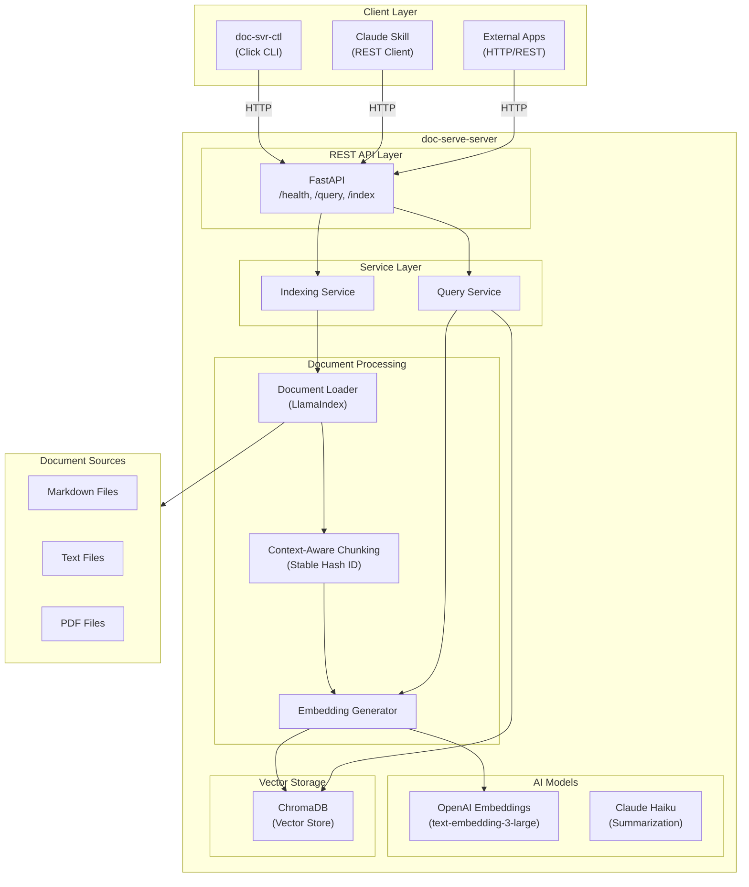

# Doc-Serve Developer Guide

This guide covers setting up a development environment, understanding the architecture, and contributing to Doc-Serve.

## Table of Contents

- [Architecture Overview](#architecture-overview)
- [Monorepo Structure](#monorepo-structure)
- [Quick Start](#quick-start)
- [Task Commands](#task-commands)
- [Development Workflow](#development-workflow)
- [Testing](#testing)
- [Code Style](#code-style)
- [Contributing](#contributing)
- [Troubleshooting](#troubleshooting)

---

## Architecture Overview

Doc-Serve is a RAG (Retrieval-Augmented Generation) system for semantic document search.



---

## Monorepo Structure

| Package | Directory | Description |
|---------|-----------|-------------|
| `doc-serve-server` | `doc-serve-server/` | FastAPI REST API backend |
| `doc-svr-ctl` | `doc-svr-ctl/` | Click-based CLI management tool |
| `doc-serve-skill` | `doc-serve-skill/` | Claude Code skill definition |
| `e2e` | `e2e/` | End-to-end integration tests |

---

## Quick Start for Developers

### Prerequisites
- **Python 3.10+**
- **Poetry** - `pip install poetry`
- **Task** - `brew install go-task/tap/go-task`
- **OpenAI & Anthropic API keys**

### Installation
```bash
git clone git@github.com:SpillwaveSolutions/doc-serve.git
cd doc-serve
task install
```

### Global CLI Setup (Recommended)
```bash
task install:global
```
This installs `doc-serve` and `doc-svr-ctl` in your current Python environment's bin folder, allowing you to run them from any directory.

---

## Task Commands

The root `Taskfile.yml` orchestrates the entire monorepo.

| Command | Description |
|---------|-------------|
| `task install` | Install all dependencies |
| `task install:global` | Install tools as global CLI commands |
| `task dev` | Start server in development mode |
| `task pr-qa-gate` | **MANDATORY** before push: Run all quality checks |
| `task test` | Run all tests |
| `task status` | Wrapper for `doc-svr-ctl status` |

---

## Testing

### Running the QA Gate
Before pushing any changes, you MUST run:
```bash
task pr-qa-gate
```
This ensures:
1. Linting (Ruff) passes.
2. Type checking (mypy) passes.
3. Unit and Integration tests pass.
4. Test coverage is above 50%.

### Test Directories
- `doc-serve-server/tests/`: Server-specific tests.
- `doc-svr-ctl/tests/`: CLI-specific tests.
- `e2e/`: Full workflow integration tests.

---

## Troubleshooting

### ModuleNotFoundError: No module named 'src'
This usually means you are running the tool without installing it or the `PYTHONPATH` is not set. 
**Solution**: Run `task install:global` or always use `poetry run`.

### Port 8000 Already in Use
**Solution**: `lsof -ti :8000 | xargs kill -9`

### Duplicated Results in Query
**Solution**: The system uses stable IDs based on file path and chunk index. If you see duplicates, run `doc-svr-ctl reset --yes` to clear the old index and re-index.
