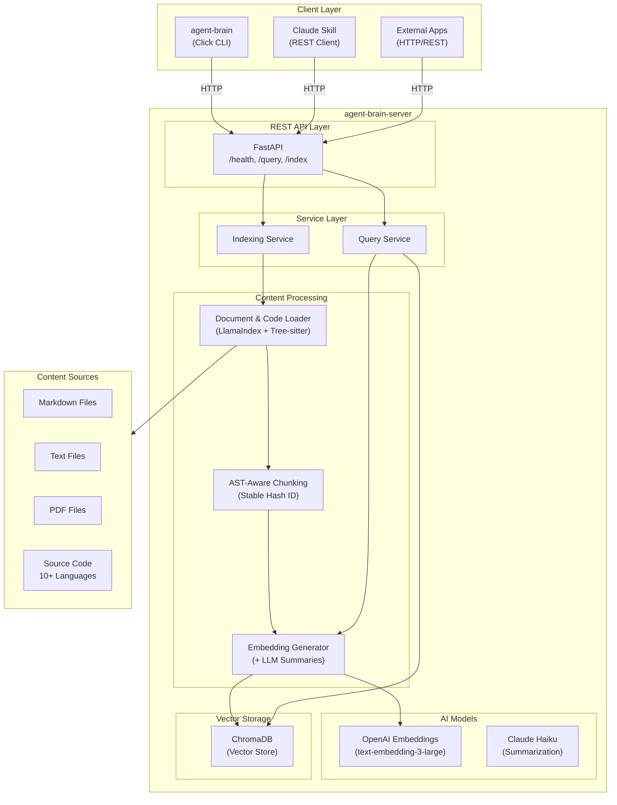

# Agent Brain Developer Guide

This guide covers setting up a development environment, understanding the architecture, and contributing to Agent Brain.

## Table of Contents

- [Architecture Overview](#architecture-overview)
- [Monorepo Structure](#monorepo-structure)
- [Quick Start](#quick-start)
- [Task Commands](#task-commands)
- [Development Workflow](#development-workflow)
- [Testing](#testing)
- [Code Style](#code-style)
- [Contributing](#contributing)
- [Troubleshooting](#troubleshooting)
- [Adding Support for New Languages](#adding-support-for-new-languages)

---

## Architecture Overview

Agent Brain is a RAG (Retrieval-Augmented Generation) system for semantic search across documentation and source code.



---

## Monorepo Structure

| Package | Directory | Description |
|---------|-----------|-------------|
| `agent-brain-server` | `agent-brain-server/` | FastAPI REST API backend |
| `agent-brain-cli` | `agent-brain-cli/` | Click-based CLI management tool |
| `agent-brain-skill` | `agent-brain-skill/` | Claude Code skill definition |
| `e2e` | `e2e/` | End-to-end integration tests |

---

## Quick Start for Developers

### Prerequisites
- **Python 3.10+**
- **Poetry** - `pip install poetry`
- **Task** - `brew install go-task/tap/go-task`
- **OpenAI & Anthropic API keys**

### Installation
```bash
git clone git@github.com:SpillwaveSolutions/doc-serve.git
cd doc-serve
task install
```

### Global CLI Setup (Recommended)
```bash
task install:global
```
This installs `agent-brain-serve` and `agent-brain` in your current Python environment's bin folder, allowing you to run them from any directory.

---

## Task Commands

The root `Taskfile.yml` orchestrates the entire monorepo.

| Command | Description |
|---------|-------------|
| `task install` | Install all dependencies |
| `task install:global` | Install tools as global CLI commands |
| `task dev` | Start server in development mode |
| `task pr-qa-gate` | **MANDATORY** before push: Run all quality checks |
| `task test` | Run all tests |
| `task status` | Wrapper for `agent-brain status` |

---

## Testing

### Running the QA Gate
Before pushing any changes, you MUST run:
```bash
task pr-qa-gate
```
This ensures:
1. Linting (Ruff) passes.
2. Type checking (mypy) passes.
3. Unit and Integration tests pass.
4. Test coverage is above 50%.

### Test Directories
- `agent-brain-server/tests/`: Server-specific tests.
- `agent-brain-cli/tests/`: CLI-specific tests.
- `e2e/`: Full workflow integration tests.

### End-to-End Validation Script

Before releasing any version or merging major features, you MUST run the end-to-end validation script:

```bash
./scripts/quick_start_guide.sh
```

This script validates the complete Agent Brain workflow by:
1. Starting a real server instance
2. Indexing the project codebase with `--include-code`
3. Running semantic, BM25, and hybrid search queries
4. Testing summarization features
5. Verifying proper error handling and cleanup

**Requirements:**
- `OPENAI_API_KEY` environment variable set
- Poetry and lsof installed
- Server and CLI dependencies installed

**Exit Codes:**
- `0`: All tests passed
- Non-zero: Test failures or setup issues

The script serves as both a release validation tool and a comprehensive demonstration of Agent Brain's capabilities.

---

## Troubleshooting

### ModuleNotFoundError: No module named 'src'
This usually means you are running the tool without installing it or the `PYTHONPATH` is not set.
**Solution**: Run `task install:global` or always use `poetry run`.

### Port 8000 Already in Use
**Solution**: `lsof -ti :8000 | xargs kill -9`

### Duplicated Results in Query
**Solution**: The system uses stable IDs based on file path and chunk index. If you see duplicates, run `agent-brain reset --yes` to clear the old index and re-index.

---

## Multi-Instance Architecture

Agent Brain supports running multiple concurrent instances with per-project isolation. This enables developers to work on multiple projects simultaneously without port conflicts or index cross-contamination.

### State Directory Structure

Each project stores its state in `.claude/doc-serve/`:

```
<project-root>/
└── .claude/
    └── doc-serve/
        ├── config.json      # Project configuration (optional, can be committed)
        ├── runtime.json     # Runtime state (DO NOT commit - add to .gitignore)
        ├── doc-serve.lock   # Lock file for preventing double-start
        ├── doc-serve.pid    # Process ID file
        ├── data/            # ChromaDB and index data
        └── logs/            # Server logs
```

### Runtime State Format

The `runtime.json` file contains:

```json
{
  "mode": "project",
  "port": 49321,
  "base_url": "http://127.0.0.1:49321",
  "pid": 12345,
  "instance_id": "abc123def456",
  "project_id": "my-project",
  "started_at": "2026-01-27T10:30:00Z"
}
```

### Lock File Protocol

The lock file prevents concurrent startup:

1. Server attempts exclusive lock on `doc-serve.lock`
2. If lock fails, another instance is starting/running
3. Lock released on graceful shutdown
4. Stale locks detected via PID validation

### Project Root Resolution

Project root is determined in this order:

1. **Git repository root**: `git rev-parse --show-toplevel`
2. **Marker files**: Directory containing `.claude/`, `pyproject.toml`, `package.json`, `Cargo.toml`, etc.
3. **Current directory**: Fallback if no markers found

Symlinks are resolved to canonical paths to ensure consistent state directories.

### Configuration Precedence

Settings are resolved in order (first wins):

1. Command-line flags (`--port 8080`)
2. Environment variables (`DOC_SERVE_STATE_DIR`, `DOC_SERVE_MODE`)
3. Project config (`.claude/doc-serve/config.json`)
4. Global config (`~/.doc-serve/config.json`)
5. Built-in defaults

### Health Endpoint Enhancement

The `/health` endpoint now includes mode information:

```json
{
  "status": "healthy",
  "mode": "project",
  "instance_id": "abc123def456",
  "project_id": "my-project"
}
```

---

## Code Ingestion & Language Support

Agent Brain supports AST-aware code chunking for 9+ programming languages using tree-sitter. The current implementation includes: **Python, TypeScript, JavaScript, Java, Go, Rust, C, C++, C#**.

Adding support for new programming languages is straightforward:

### Recommended Package: tree-sitter-language-pack

Use [`tree-sitter-language-pack`](https://pypi.org/project/tree-sitter-language-pack/) - a maintained fork with 160+ pre-built language grammars.

**Advantages:**
- Pre-compiled binaries (no C compiler needed)
- 160+ languages in a single dependency
- Permissive licensing (no GPL dependencies)
- Aligned with tree-sitter 0.25.x

**Installation:**
```bash
pip install tree-sitter-language-pack
```

### Simple API

```python
from tree_sitter_language_pack import get_language, get_parser

# Get parser for any supported language
parser = get_parser('rust')
language = get_language('rust')

# Parse code
tree = parser.parse(b"fn main() { println!(\"Hello\"); }")
```

### Step-by-Step: Adding a New Language

**Step 1: Verify language support**
```python
from tree_sitter_language_pack import get_language

try:
    lang = get_language('ruby')
    print("Ruby is supported!")
except Exception:
    print("Ruby not available")
```

**Step 2: Update extension mapping**

In `agent_brain_server/indexing/document_loader.py`:

```python
# Add to CODE_EXTENSIONS
CODE_EXTENSIONS: set[str] = {
    ".py", ".ts", ".tsx", ".js", ".jsx",
    ".rb",  # NEW: Ruby
}

# Add to EXTENSION_TO_LANGUAGE
EXTENSION_TO_LANGUAGE = {
    # ... existing mappings ...
    ".rb": "ruby",
}
```

**Step 3: Register with CodeChunker**

In `agent_brain_server/indexing/code_chunker.py`:

```python
class CodeChunker:
    SUPPORTED_LANGUAGES = [
        "python", "typescript", "javascript",
        "ruby",  # NEW
    ]
```

**Step 4: Add language-specific config (optional)**

```python
LANGUAGE_CHUNK_CONFIG = {
    "python": {"chunk_lines": 50, "overlap": 20},
    "ruby": {"chunk_lines": 50, "overlap": 20},  # NEW
    "java": {"chunk_lines": 80, "overlap": 30},  # Verbose
    "c": {"chunk_lines": 40, "overlap": 15},
}
```

### C# Language Support

C# is fully supported with AST-aware parsing:

**File Extensions:**
- `.cs` - C# source files
- `.csx` - C# script files

**Extracted Symbols:**
- Classes, interfaces, structs, records, enums
- Methods, properties, fields
- Parameters and return types
- Namespaces

**XML Documentation:**
Agent Brain extracts XML doc comments (`/// <summary>`, `/// <param>`, `/// <returns>`) and stores them as metadata on chunks.

**Tree-sitter Grammar:**
Uses the `c_sharp` grammar from `tree-sitter-language-pack`.

**Content Detection Patterns:**
- `using System;`
- `namespace` declarations
- Property accessors `{ get; set; }`
- Attributes `[AttributeName]`

### Available Languages (160+)

| Category | Languages |
|----------|-----------|
| Systems | C, C++, Rust, Go, Zig |
| JVM | Java, Kotlin, Scala, Groovy |
| .NET | C#, F# |
| Scripting | Python, Ruby, Perl, Lua, PHP |
| Web | JavaScript, TypeScript, HTML, CSS |
| Functional | Haskell, OCaml, Elixir, Erlang, Clojure |
| Data | SQL, JSON, YAML, TOML, XML |
| Config | Dockerfile, Terraform (HCL), Nix |
| Shell | Bash, Fish, PowerShell |
| Scientific | R, Julia, Fortran |
| Mobile | Swift, Objective-C |

### Alternative: Individual Packages

For minimal dependencies, use individual tree-sitter packages:

```bash
pip install tree-sitter-python tree-sitter-javascript
```

```python
import tree_sitter_python as tspython
from tree_sitter import Language, Parser

PY_LANGUAGE = Language(tspython.language())
parser = Parser(PY_LANGUAGE)
```

### Alternative: tree-sitter-languages

The original [`tree-sitter-languages`](https://pypi.org/project/tree-sitter-languages/) package (40+ languages):

```bash
pip install tree-sitter-languages
```

```python
from tree_sitter_languages import get_language, get_parser

language = get_language('python')
parser = get_parser('python')
```

### References

- [tree-sitter-language-pack on PyPI](https://pypi.org/project/tree-sitter-language-pack/)
- [tree-sitter-languages on PyPI](https://pypi.org/project/tree-sitter-languages/)
- [tree-sitter-languages GitHub](https://github.com/grantjenks/py-tree-sitter-languages)
- [Tree-sitter Documentation](https://tree-sitter.github.io)
