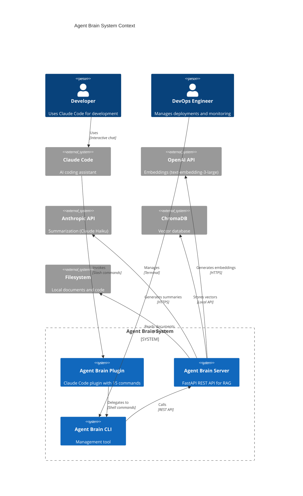
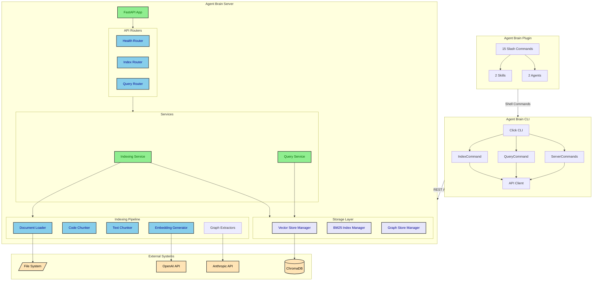
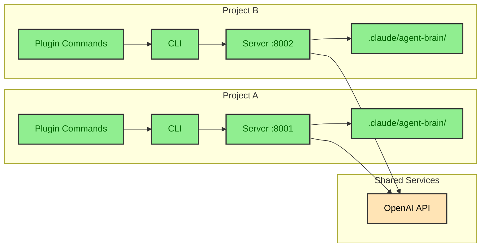
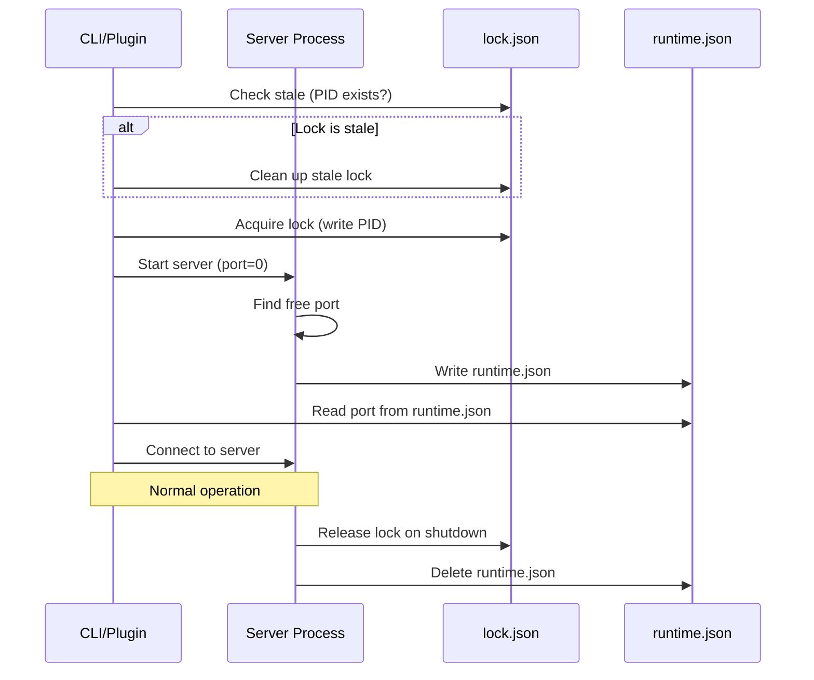

# Agent Brain System Architecture Overview

This document provides a comprehensive architectural view of Agent Brain, a RAG-based document indexing and semantic search system designed for developer productivity.

## Executive Summary

Agent Brain is a monorepo containing four interconnected packages that work together to provide intelligent document and code search capabilities. The system combines traditional BM25 keyword matching with modern semantic vector search and optional GraphRAG knowledge graph retrieval.

## C4 Context Diagram

This diagram shows Agent Brain's position in the broader ecosystem and its interactions with external systems.

### Why This Architecture?

1. **Plugin-First Design**: The Claude Code plugin provides natural language access to all functionality
2. **CLI Abstraction**: The CLI provides a stable interface that both the plugin and users can rely on
3. **REST API Foundation**: The server exposes all capabilities through a well-documented API
4. **External Service Integration**: Leverages best-in-class services (OpenAI for embeddings, Anthropic for summaries)

## Component Architecture

This diagram shows the internal structure of each package and their relationships.

### Component Descriptions

| Component | Purpose | Technology |
|-----------|---------|------------|
| **Agent Brain Plugin** | Claude Code integration with slash commands | Markdown-based Claude plugin format |
| **Agent Brain CLI** | Command-line management tool | Python + Click + Rich |
| **Agent Brain Server** | Core RAG API server | Python + FastAPI + Uvicorn |
| **ChromaDB** | Vector similarity search | ChromaDB with cosine similarity |
| **BM25 Index** | Keyword-based retrieval | LlamaIndex BM25Retriever |
| **Graph Store** | Knowledge graph storage | SimplePropertyGraphStore / Kuzu |

## Advantages of This Architecture

### 1. Separation of Concerns
- **Plugin**: User experience and natural language interface
- **CLI**: Scripting, automation, and DevOps
- **Server**: Business logic and data management
- **Storage**: Persistence and retrieval optimization

### 2. Flexibility
- Multiple entry points (plugin, CLI, API)
- Pluggable storage backends
- Optional features (GraphRAG)
- Per-project isolation

### 3. Scalability
- Stateless server design
- Batch processing for embeddings
- Async operations throughout
- Configurable chunk sizes

### 4. Developer Experience
- Natural language search from Claude Code
- Rich CLI with progress indicators
- OpenAPI documentation
- Comprehensive error handling

## Multi-Instance Architecture

Agent Brain supports running multiple isolated instances for different projects.

### Per-Project Isolation

Each project maintains its own:
- **State Directory**: `.claude/agent-brain/`
- **Vector Database**: `chroma_db/`
- **BM25 Index**: `bm25_index/`
- **Graph Index**: `graph_index/` (if enabled)
- **Runtime State**: `runtime.json` with port and PID

### Lock File Protocol

## Technology Stack Summary

| Layer | Technology | Purpose |
|-------|------------|---------|
| **Interface** | Claude Plugin (Markdown) | Natural language commands |
| **CLI** | Click + Rich | Terminal interface |
| **API** | FastAPI + Uvicorn | HTTP endpoints |
| **Embeddings** | OpenAI text-embedding-3-large | Semantic vectors (3072 dims) |
| **Vector DB** | ChromaDB | Similarity search |
| **Keyword Search** | LlamaIndex BM25Retriever | Term-based retrieval |
| **Graph Store** | SimplePropertyGraphStore/Kuzu | Knowledge graph |
| **AST Parsing** | tree-sitter | Code analysis |
| **Summarization** | Anthropic Claude Haiku | Code summaries |
| **Config** | Pydantic Settings | Environment-based config |

## Next Steps

For more detailed views of specific subsystems:

- [Query Flow Architecture](./query-architecture.md) - How queries are routed and processed
- [Indexing Pipeline](./indexing-pipeline.md) - Document and code processing
- [Storage Architecture](./storage-architecture.md) - Persistence and retrieval
- [Class Diagrams](./class-diagrams.md) - Object model details
- [Deployment Architecture](./deployment-architecture.md) - Production setup
