# Class Diagrams

This document provides detailed class diagrams for Agent Brain's core components.

## Service Layer Classes

The service layer implements the core business logic for indexing and querying.

### QueryService

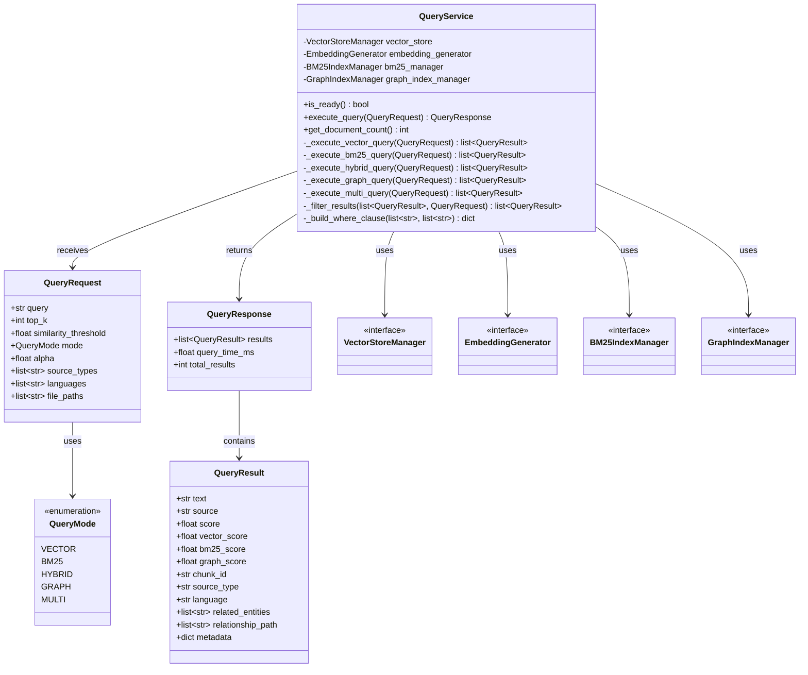

### IndexingService

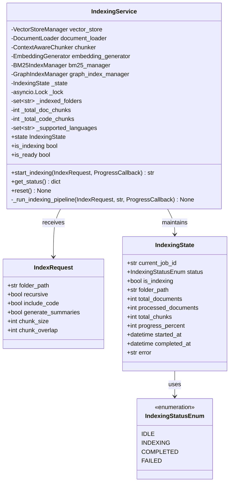

## Storage Layer Classes

### VectorStoreManager

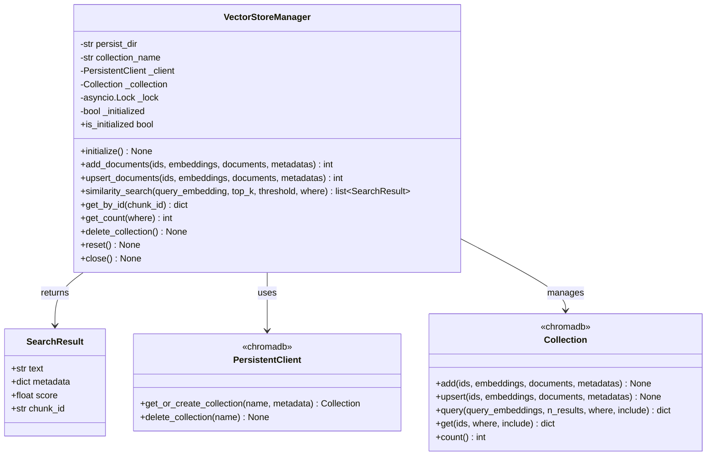

### BM25IndexManager

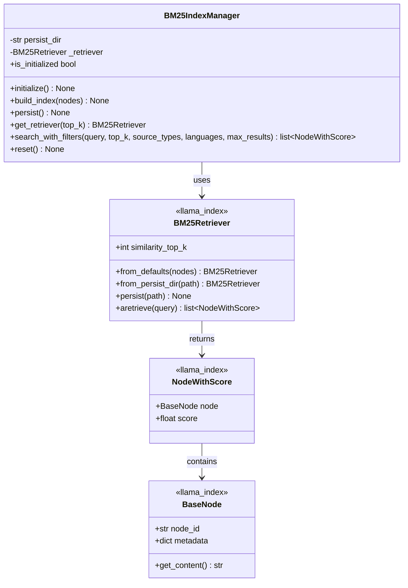

### GraphStoreManager

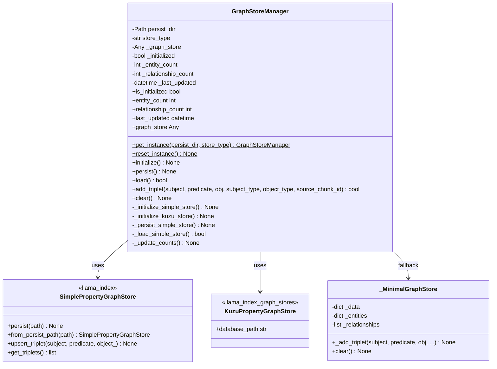

## Indexing Pipeline Classes

### Document Loading

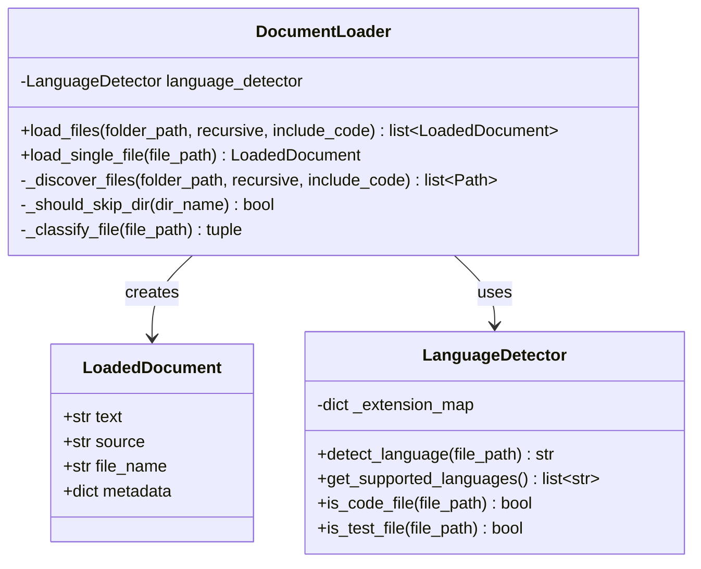

### Chunking

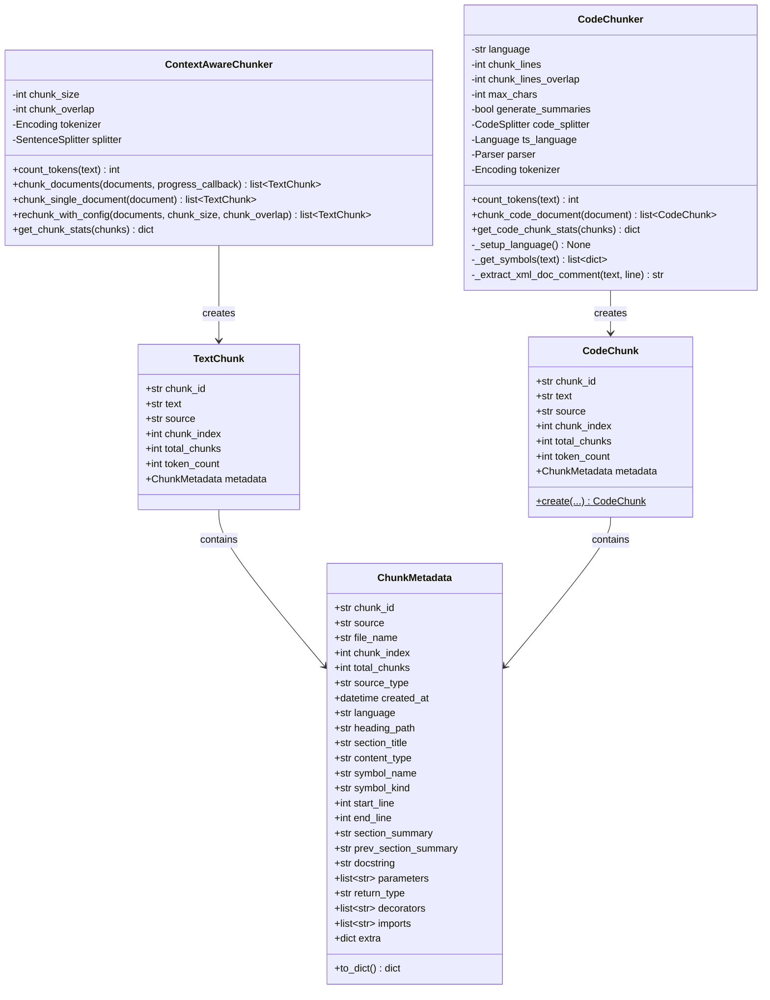

### Embedding Generation

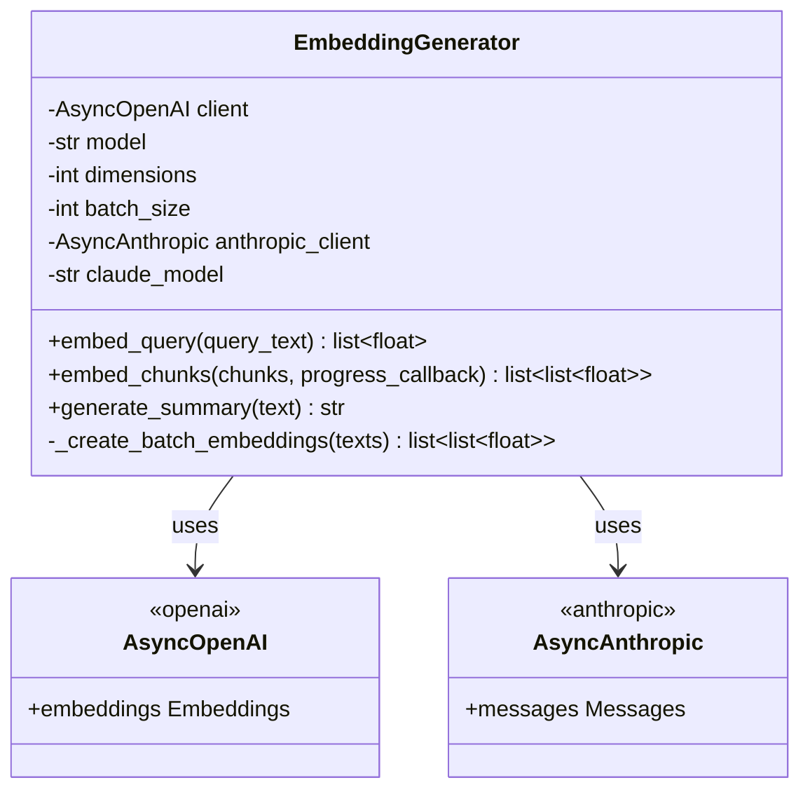

## GraphRAG Classes

### Graph Indexing

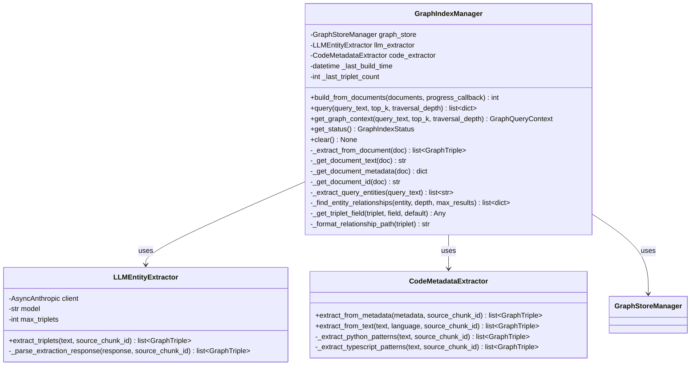

### Graph Models

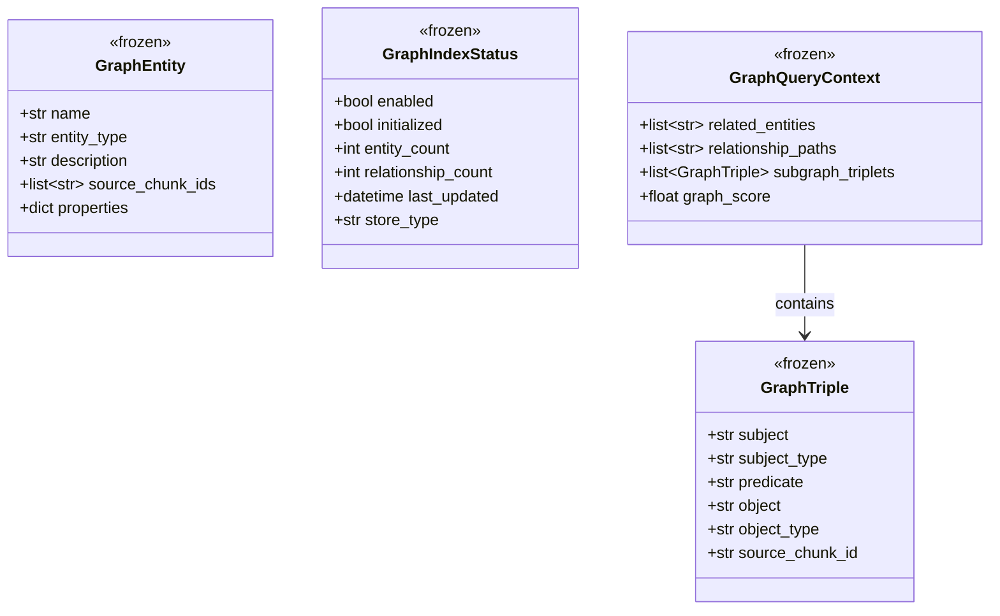

## API Layer Classes

### FastAPI Application

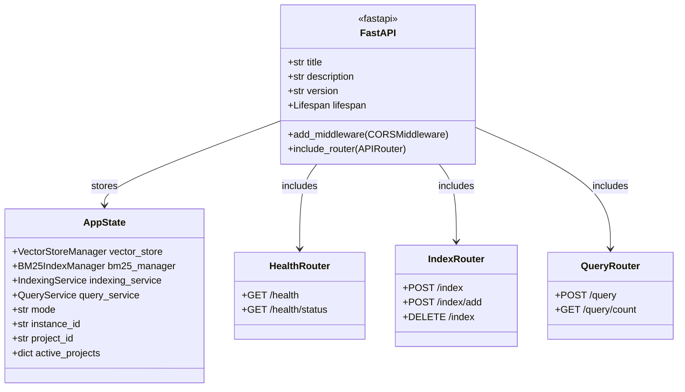

## CLI Classes

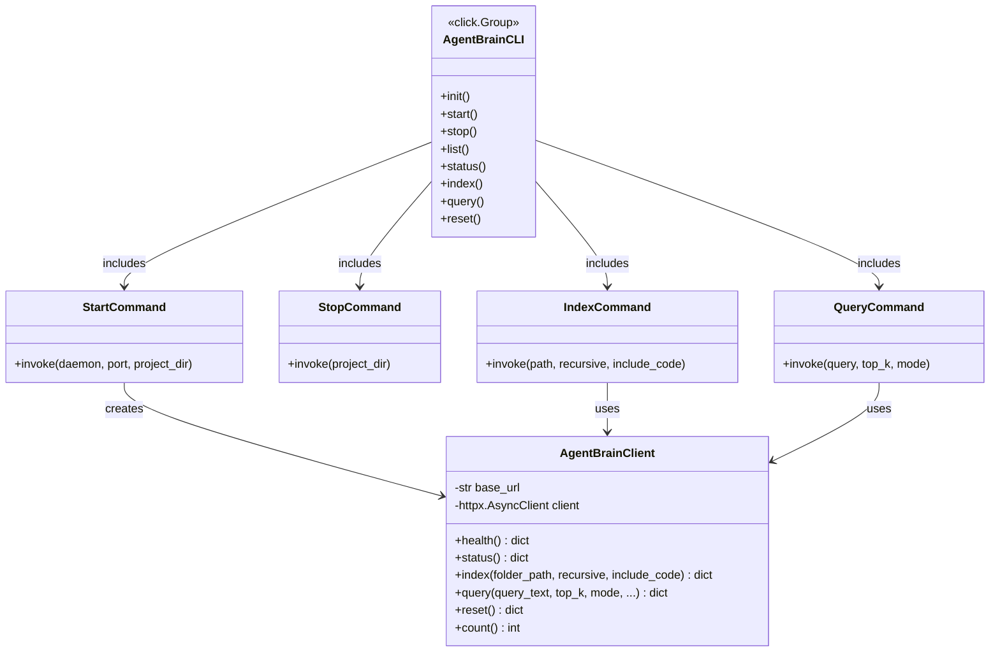

## Configuration Classes

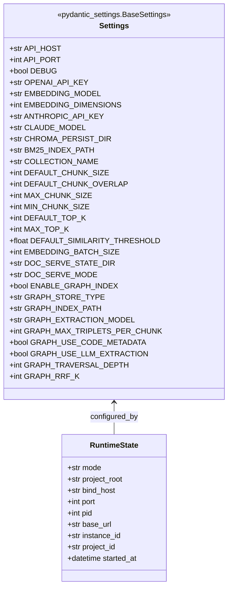

## Class Relationships Overview

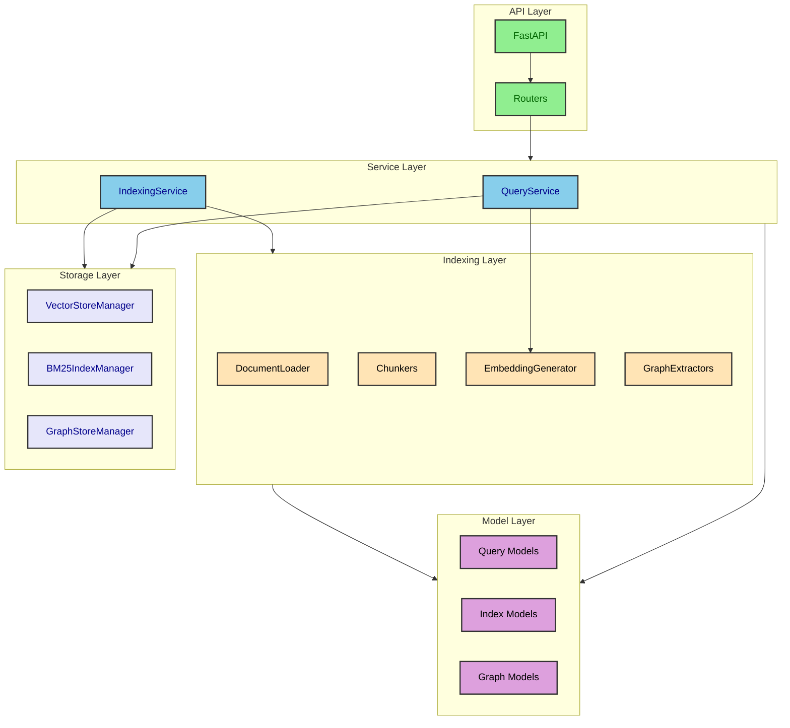
