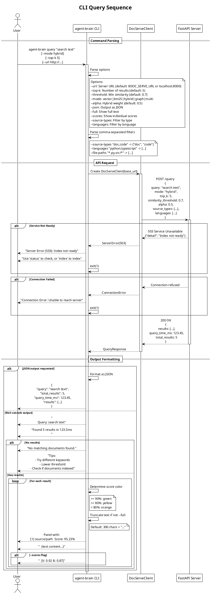
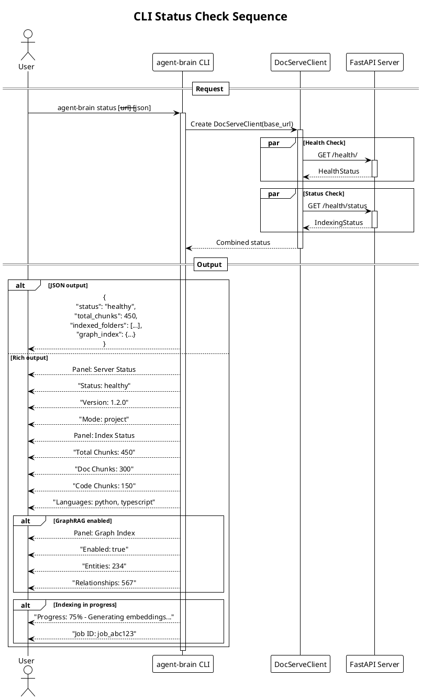
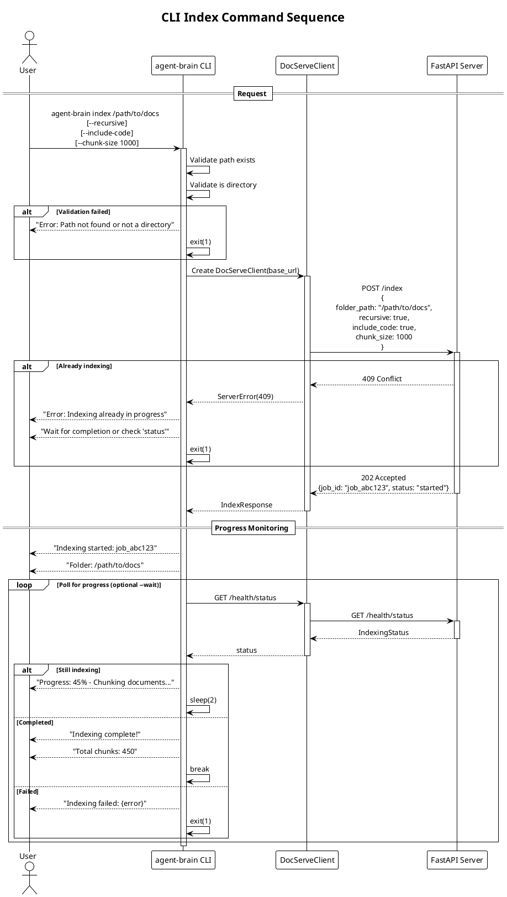

```plantuml
@startuml Server Start Sequence
!theme plain
skinparam sequenceMessageAlign center
skinparam responseMessageBelowArrow true

title CLI Server Start Sequence

actor User
participant "agent-brain CLI" as CLI
participant "File System" as FS
participant "Git" as Git
participant "Network\n(socket)" as Net
participant "uvicorn\nSubprocess" as Server
participant "Global Registry" as Registry

== Project Resolution ==

User -> CLI : agent-brain start [--port] [--path]
activate CLI

alt Explicit path provided
    CLI -> CLI : project_root = Path(path).resolve()
else Auto-detect project root
    CLI -> Git : git rev-parse --show-toplevel
    activate Git

    alt In git repository
        Git --> CLI : /path/to/git/root
    else Not in git repo
        Git --> CLI : error
        CLI -> CLI : Walk up directory tree
        CLI -> CLI : Look for .claude/ or pyproject.toml
    end
    deactivate Git
end

CLI -> CLI : state_dir = project_root / ".claude/doc-serve"

== Initialization Check ==

CLI -> FS : Check state_dir.exists()
activate FS
FS --> CLI : exists = true/false
deactivate FS

alt State dir doesn't exist
    CLI --> User : "Error: Project not initialized"
    CLI --> User : "Run 'agent-brain init' first"
    CLI -> CLI : exit(1)
end

== Existing Server Check ==

CLI -> FS : Read config.json
activate FS
FS --> CLI : {bind_host, port_range, auto_port, ...}
deactivate FS

CLI -> FS : Read runtime.json
activate FS
FS --> CLI : {pid, base_url, ...} or None
deactivate FS

alt runtime.json exists
    CLI -> CLI : Check process alive\nos.kill(pid, 0)

    alt Process alive
        CLI -> Net : Check health endpoint\nhttp://host:port/health/
        activate Net
        Net --> CLI : 200 OK
        deactivate Net

        CLI --> User : "Server already running!"
        CLI --> User : "URL: {base_url}"
        CLI --> User : "PID: {pid}"
        CLI -> CLI : return (success)
    else Process dead
        CLI --> User : "Cleaning up stale state..."
        CLI -> FS : Delete runtime.json, lock, pid files
    end
end

== Port Selection ==

alt Explicit port provided
    CLI -> CLI : bind_port = port
else Auto-port enabled (default)
    CLI -> CLI : port_range = config.port_range_start..end

    loop For each port in range
        CLI -> Net : Try socket.bind(host, port)
        activate Net

        alt Port available
            Net --> CLI : success
            CLI -> CLI : bind_port = port
        else Port in use
            Net --> CLI : OSError
            CLI -> CLI : continue to next port
        end
        deactivate Net
    end

    alt No port available
        CLI --> User : "No available port in range"
        CLI -> CLI : exit(1)
    end
else Fixed port from config
    CLI -> CLI : bind_port = config.port
end

== Server Spawn ==

CLI -> CLI : Build server command
note right of CLI
    Command:
    python -m uvicorn
      agent_brain_server.api.main:app
      --host {bind_host}
      --port {bind_port}
end note

CLI -> CLI : Set environment variables
note right of CLI
    DOC_SERVE_PROJECT_ROOT={project_root}
    DOC_SERVE_STATE_DIR={state_dir}
end note

alt Foreground mode (--foreground)
    CLI --> User : "Starting server in foreground..."
    CLI -> Server : os.execvpe(cmd, env)
    note right of Server: Takes over process
else Background mode (default)
    CLI -> FS : Create logs directory
    CLI -> FS : Open server.log, server.err

    CLI -> Server : subprocess.Popen(\n  cmd, env,\n  stdout=log,\n  stderr=err,\n  start_new_session=True)
    activate Server
    Server --> CLI : process handle
end

== Runtime State ==

CLI -> FS : Write runtime.json
activate FS
note right of FS
    {
      "schema_version": "1.0",
      "mode": "project",
      "project_root": "/path/to/project",
      "instance_id": "abc123...",
      "base_url": "http://127.0.0.1:8042",
      "bind_host": "127.0.0.1",
      "port": 8042,
      "pid": 12345,
      "started_at": "2024-01-15T..."
    }
end note
FS --> CLI : written
deactivate FS

CLI -> Registry : Update ~/.doc-serve/registry.json
activate Registry
Registry --> CLI : updated
deactivate Registry

== Health Wait ==

CLI -> CLI : start_time = now()

loop While time < timeout (30s)
    CLI -> Net : GET http://host:port/health/
    activate Net

    alt Health check passes
        Net --> CLI : 200 OK
        CLI -> CLI : ready = true
        CLI -> CLI : break loop
    else Not responding yet
        Net --> CLI : Connection refused / timeout
        deactivate Net

        CLI -> Server : Check process.poll()
        alt Process crashed
            Server --> CLI : exit_code != None
            CLI -> CLI : break loop (failure)
        else Still running
            Server --> CLI : None
        end

        CLI -> CLI : sleep(0.5)
    end
end

== Result ==

alt Server ready
    CLI --> User : "Server started successfully!"
    CLI --> User : "URL: http://127.0.0.1:8042"
    CLI --> User : "PID: 12345"
    CLI --> User : "Log: .claude/doc-serve/logs/server.log"
    deactivate Server
else Startup failed
    CLI -> Server : os.kill(pid, SIGTERM)
    CLI -> FS : Delete runtime.json
    CLI --> User : "Error: Server failed to start"
    CLI --> User : "Check logs: .../server.err"
    CLI -> CLI : exit(1)
end

deactivate CLI

@enduml
```

```plantuml
@startuml Server Stop Sequence
!theme plain
skinparam sequenceMessageAlign center
skinparam responseMessageBelowArrow true

title CLI Server Stop Sequence

actor User
participant "agent-brain CLI" as CLI
participant "File System" as FS
participant "Process\nManager" as PM
participant "Global Registry" as Registry

== Project Resolution ==

User -> CLI : agent-brain stop [--force] [--path]
activate CLI

CLI -> CLI : Resolve project root\n(same as start)

CLI -> CLI : state_dir = project_root / ".claude/doc-serve"

== State Check ==

CLI -> FS : Check state_dir.exists()
activate FS
FS --> CLI : exists = true/false
deactivate FS

alt State dir doesn't exist
    CLI --> User : "No doc-serve state found"
    CLI -> CLI : exit(1)
end

== Runtime Check ==

CLI -> FS : Read runtime.json
activate FS
FS --> CLI : runtime dict or None
deactivate FS

alt runtime.json doesn't exist
    CLI -> FS : Check for stale PID file
    activate FS
    FS --> CLI : pid or None
    deactivate FS

    alt Stale PID found and alive
        CLI --> User : "Found stale PID, stopping..."
        CLI -> CLI : runtime = {pid: stale_pid}
    else No runtime state
        CLI -> FS : Cleanup any remaining files
        CLI --> User : "No server running"
        CLI -> CLI : return (success)
    end
end

CLI -> CLI : pid = runtime.pid

alt No PID in runtime
    CLI -> FS : Cleanup state files
    CLI --> User : "No server PID found"
    CLI -> CLI : return
end

== Process Check ==

CLI -> PM : Check is_process_alive(pid)\nos.kill(pid, 0)
activate PM

alt Process not alive
    PM --> CLI : ProcessLookupError
    deactivate PM

    CLI -> FS : Cleanup state files
    CLI -> Registry : Remove from registry
    CLI --> User : "Server already stopped (PID {pid})"
    CLI --> User : "Cleaned up state files"
    CLI -> CLI : return
else Process alive
    PM --> CLI : alive = true
end

== Graceful Shutdown ==

CLI --> User : "Stopping server (PID {pid})..."

CLI -> PM : os.kill(pid, SIGTERM)
activate PM
PM --> CLI : signal sent
deactivate PM

loop Wait for exit (timeout: 10s)
    CLI -> PM : Check is_process_alive(pid)
    activate PM

    alt Process exited
        PM --> CLI : not alive
        deactivate PM
        CLI -> CLI : break loop (success)
    else Still running
        PM --> CLI : alive
        deactivate PM
        CLI -> CLI : sleep(0.2)
    end
end

alt Graceful exit succeeded
    CLI -> FS : Delete runtime.json, lock, pid
    CLI -> Registry : Remove project from registry
    CLI --> User : "Server stopped gracefully (PID {pid})"
    CLI -> CLI : return

else Graceful timeout
    alt Force flag provided
        CLI --> User : "Graceful timeout, sending SIGKILL..."

        CLI -> PM : os.kill(pid, SIGKILL)
        activate PM
        PM --> CLI : SIGKILL sent
        deactivate PM

        loop Wait for SIGKILL (5s)
            CLI -> PM : Check is_process_alive(pid)
            activate PM

            alt Process killed
                PM --> CLI : not alive
                deactivate PM
                CLI -> CLI : break
            else Still running
                PM --> CLI : alive
                deactivate PM
                CLI -> CLI : sleep(0.2)
            end
        end

        alt SIGKILL succeeded
            CLI -> FS : Cleanup state files
            CLI -> Registry : Remove from registry
            CLI --> User : "Server force killed (PID {pid})"
        else SIGKILL failed
            CLI --> User : "Failed to stop server"
            CLI -> CLI : exit(1)
        end

    else No force flag
        CLI --> User : "Graceful shutdown timeout"
        CLI --> User : "Use --force to send SIGKILL"
        CLI -> CLI : exit(1)
    end
end

deactivate CLI

@enduml
```

# CLI Command Sequence Diagrams

This document contains PlantUML sequence diagrams for Agent Brain CLI commands.
Each diagram shows the complete flow from command invocation to completion.

## Table of Contents

1. [Server Start Sequence](#1-server-start-sequence)
2. [Server Stop Sequence](#2-server-stop-sequence)
3. [Query Sequence](#3-query-sequence)
4. [Status Check Sequence](#4-status-check-sequence)
5. [Index Command Sequence](#5-index-command-sequence)

---

## 1. Server Start Sequence

### Diagram

### Walkthrough

1. **Project Resolution Phase**
   - Determines the project root directory
   - Tries git root first (`git rev-parse --show-toplevel`)
   - Falls back to walking up directory tree looking for markers
   - State directory is always `{project_root}/.claude/doc-serve`

2. **Initialization Check Phase**
   - Verifies the state directory exists (created by `init` command)
   - Returns error if project not initialized

3. **Existing Server Check Phase**
   - Reads runtime.json if it exists
   - Checks if the recorded PID is still alive
   - If alive, verifies health endpoint responds
   - If server running, reports URL and exits successfully
   - If stale state found, cleans up before proceeding

4. **Port Selection Phase**
   - Explicit port from `--port` flag takes precedence
   - Auto-port enabled by default: scans range 8000-8100
   - Fixed port from config.json as fallback
   - Fails if no port available

5. **Server Spawn Phase**
   - Builds uvicorn command with host and port
   - Sets environment variables for server configuration
   - **Foreground mode**: replaces CLI process with server
   - **Background mode**: spawns as detached subprocess

6. **Runtime State Phase**
   - Writes runtime.json with server details
   - Updates global registry for multi-project management

7. **Health Wait Phase**
   - Polls health endpoint until ready (default 30s timeout)
   - Checks for process crash during wait
   - Reports success or failure

### Error Scenarios

| Scenario | Exit Code | Message |
|----------|-----------|---------|
| Project not initialized | 1 | "Run 'agent-brain init' first" |
| No available port | 1 | "No available port in range" |
| Startup timeout | 1 | "Server failed to start" |
| Process crash | 1 | "Check logs: .../server.err" |

---

## 2. Server Stop Sequence

### Diagram

### Walkthrough

1. **Project Resolution Phase**
   - Same resolution logic as start command
   - Finds state directory for the project

2. **State Check Phase**
   - Verifies state directory exists
   - Returns error if no doc-serve configuration

3. **Runtime Check Phase**
   - Reads runtime.json for PID and URL
   - Handles stale PID files from crashed servers
   - If no runtime state, reports "No server running"

4. **Process Check Phase**
   - Verifies the recorded PID is still alive
   - Uses `os.kill(pid, 0)` for existence check
   - Cleans up if process already dead

5. **Graceful Shutdown Phase**
   - Sends SIGTERM for graceful shutdown
   - Waits up to 10 seconds (configurable with `--timeout`)
   - Polls every 200ms for process exit

6. **Force Kill Phase** (if needed)
   - Only if `--force` flag provided
   - Sends SIGKILL after graceful timeout
   - Waits additional 5 seconds for forced termination

### Cleanup Actions

| State | Files Removed |
|-------|---------------|
| Clean stop | runtime.json, doc-serve.lock, doc-serve.pid |
| Force kill | Same as clean stop |
| Already stopped | Same as clean stop |

---

## 3. Query Sequence

### Diagram

### Walkthrough

1. **Command Parsing Phase**
   - Parses query text and all options
   - URL defaults to DOC_SERVE_URL env var or localhost:8000
   - Comma-separated lists are parsed into arrays

2. **API Request Phase**
   - Creates DocServeClient with server URL
   - Sends POST /query with all parameters
   - Handles connection and server errors gracefully

3. **Output Formatting Phase**
   - **JSON mode**: Raw JSON output for scripting
   - **Rich mode**: Colored panels with formatted text
   - Score coloring: green (90%+), yellow (80%+), orange (below)
   - Text truncation at 300 chars unless `--full` flag

### Query Options

| Option | Default | Description |
|--------|---------|-------------|
| `--url` | env/localhost | Server URL |
| `--top-k` | 5 | Number of results |
| `--threshold` | 0.7 | Minimum similarity |
| `--mode` | hybrid | Retrieval mode |
| `--alpha` | 0.5 | Vector/BM25 weight |
| `--json` | false | JSON output |
| `--full` | false | Full text (no truncation) |
| `--scores` | false | Show V/B scores |
| `--source-types` | all | Filter by type |
| `--languages` | all | Filter by language |
| `--file-paths` | all | Filter by path pattern |

---

## 4. Status Check Sequence

### Diagram

### Walkthrough

1. **Request Phase**
   - Makes parallel requests to health and status endpoints
   - Combines results for comprehensive status

2. **Output Phase**
   - **JSON mode**: Complete status as JSON
   - **Rich mode**: Formatted panels with sections

### Status Information

| Section | Fields |
|---------|--------|
| Server | status, version, mode, instance_id |
| Index | total_chunks, doc_chunks, code_chunks, languages |
| Graph | enabled, entities, relationships, store_type |
| Progress | percent, job_id, current_stage (if indexing) |

---

## 5. Index Command Sequence

### Diagram

### Walkthrough

1. **Request Phase**
   - Validates folder path exists and is directory
   - Sends POST /index with configuration
   - Returns immediately with job ID (async operation)

2. **Progress Monitoring Phase** (with `--wait`)
   - Polls /health/status for progress updates
   - Displays progress percentage and stage
   - Reports completion or failure

### Index Options

| Option | Default | Description |
|--------|---------|-------------|
| `--recursive` | true | Include subdirectories |
| `--include-code` | true | Index code files |
| `--chunk-size` | 1000 | Characters per chunk |
| `--chunk-overlap` | 200 | Overlap between chunks |
| `--wait` | false | Wait for completion |
| `--generate-summaries` | false | Generate code summaries |

---

## Command Summary

| Command | Purpose | Key Parameters |
|---------|---------|----------------|
| `start` | Launch server | --port, --path, --foreground |
| `stop` | Stop server | --force, --timeout |
| `query` | Search documents | --mode, --top-k, --threshold |
| `status` | Check health | --json |
| `index` | Index documents | --recursive, --include-code |
| `reset` | Clear index | --yes (confirmation) |
| `init` | Initialize project | --port, --auto-port |
| `list` | List running servers | --json |
