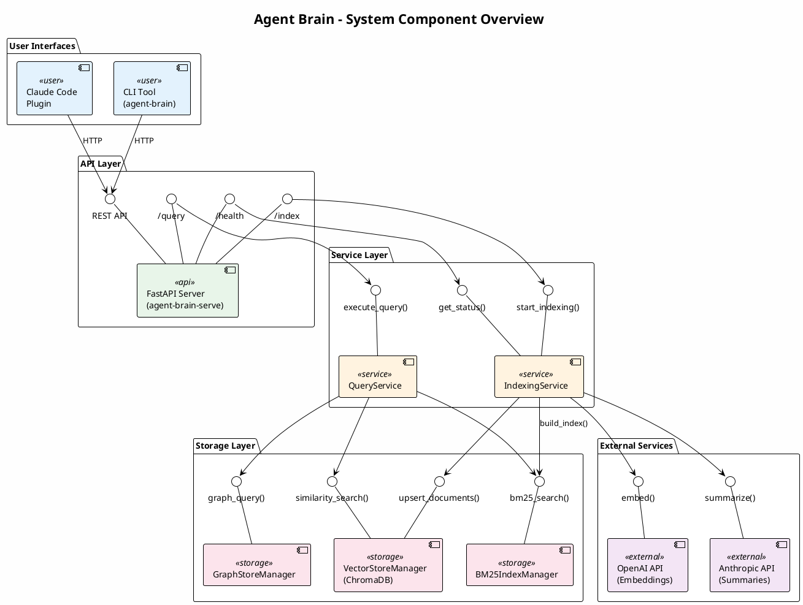
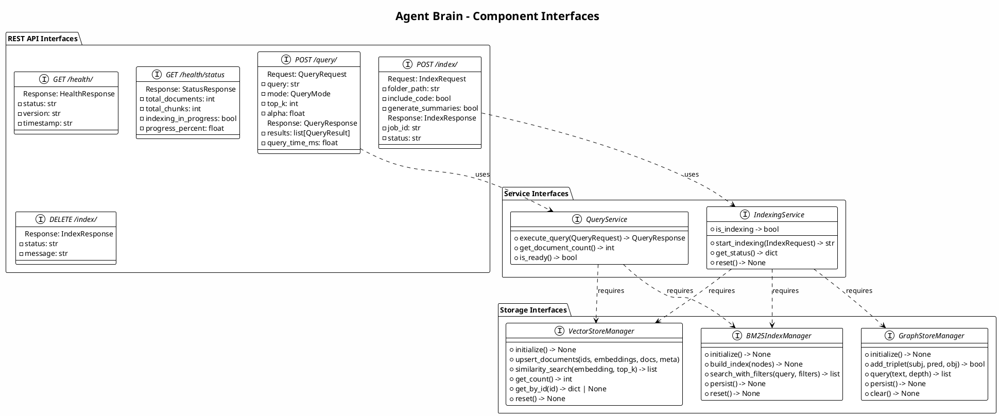

# Agent Brain Component Diagrams

This document contains PlantUML component diagrams showing the internal structure, interfaces, and component relationships within Agent Brain.

## System Component Overview



### Component Overview Description

The Agent Brain system follows a layered architecture with clear separation of concerns:

| Layer | Components | Responsibility |
|-------|------------|----------------|
| **User Interfaces** | Plugin, CLI | Human interaction and command execution |
| **API Layer** | FastAPI Server | REST API endpoints, request validation, response formatting |
| **Service Layer** | QueryService, IndexingService | Business logic, orchestration, state management |
| **Storage Layer** | VectorStore, BM25, GraphStore | Data persistence, search index management |
| **External Services** | OpenAI, Anthropic | AI model integration for embeddings and summaries |

---

## Server Component Diagram

```plantuml
@startuml Server Components
!theme plain
skinparam backgroundColor #FEFEFE

title agent-brain-server - Component Architecture

skinparam component {
    BackgroundColor<<router>> #E3F2FD
    BackgroundColor<<service>> #E8F5E9
    BackgroundColor<<indexing>> #FFF3E0
    BackgroundColor<<storage>> #FCE4EC
    BackgroundColor<<config>> #F3E5F5
}

' FastAPI Application
package "FastAPI Application" {

    component [main.py\n(Application Entry)] <<config>> as main

    ' Router Components
    package "API Routers" {
        component [HealthRouter] <<router>> as health_router {
            ..Endpoints..
            GET /health/
            GET /health/status
        }

        component [QueryRouter] <<router>> as query_router {
            ..Endpoints..
            POST /query/
            GET /query/count
        }

        component [IndexRouter] <<router>> as index_router {
            ..Endpoints..
            POST /index/
            POST /index/add
            DELETE /index/
        }
    }

    ' Service Components
    package "Business Services" {
        component [QueryService] <<service>> as query_svc {
            ..Methods..
            + execute_query()
            + _execute_vector_query()
            + _execute_bm25_query()
            + _execute_hybrid_query()
            + _execute_graph_query()
            + _execute_multi_query()
            + get_document_count()
        }

        component [IndexingService] <<service>> as index_svc {
            ..Methods..
            + start_indexing()
            + _run_indexing_pipeline()
            + get_status()
            + reset()
        }
    }

    ' Indexing Components
    package "Indexing Pipeline" {
        component [DocumentLoader] <<indexing>> as doc_loader {
            ..Capabilities..
            - Load Markdown
            - Load Text files
            - Load Source code
            - Detect language
        }

        component [ContextAwareChunker] <<indexing>> as text_chunker {
            ..Capabilities..
            - Semantic chunking
            - Section preservation
            - Overlap handling
        }

        component [CodeChunker] <<indexing>> as code_chunker {
            ..Capabilities..
            - AST-aware splitting
            - Function boundaries
            - Class preservation
        }

        component [EmbeddingGenerator] <<indexing>> as embedder {
            ..Capabilities..
            - Batch embedding
            - Rate limiting
            - OpenAI integration
        }

        component [GraphExtractor] <<indexing>> as graph_extractor {
            ..Capabilities..
            - Entity extraction
            - Relationship detection
            - Code symbol mapping
        }
    }

    ' Storage Components
    package "Storage Managers" {
        component [VectorStoreManager] <<storage>> as vector_mgr {
            ..Interface..
            + initialize()
            + add_documents()
            + upsert_documents()
            + similarity_search()
            + get_count()
            + reset()
            ----
            Backend: ChromaDB
        }

        component [BM25IndexManager] <<storage>> as bm25_mgr {
            ..Interface..
            + initialize()
            + build_index()
            + get_retriever()
            + search_with_filters()
            + persist()
            + reset()
            ----
            Backend: LlamaIndex BM25
        }

        component [GraphStoreManager] <<storage>> as graph_mgr {
            ..Interface..
            + initialize()
            + add_triplet()
            + query()
            + persist()
            + clear()
            ----
            Backend: Simple/Kuzu
        }
    }

    ' Configuration
    component [Settings\n(Pydantic)] <<config>> as settings {
        API_HOST
        API_PORT
        OPENAI_API_KEY
        CHROMA_PERSIST_DIR
        ENABLE_GRAPH_INDEX
    }
}

' Internal Connections
main --> health_router : registers
main --> query_router : registers
main --> index_router : registers

main ..> settings : configures

health_router --> index_svc : get_status()
query_router --> query_svc : execute_query()
index_router --> index_svc : start_indexing()

query_svc --> vector_mgr : similarity_search()
query_svc --> bm25_mgr : aretrieve()
query_svc --> graph_mgr : query()
query_svc --> embedder : embed_query()

index_svc --> doc_loader : load_files()
index_svc --> text_chunker : chunk_documents()
index_svc --> code_chunker : chunk_code_document()
index_svc --> embedder : embed_chunks()
index_svc --> vector_mgr : upsert_documents()
index_svc --> bm25_mgr : build_index()
index_svc --> graph_extractor : extract()
index_svc --> graph_mgr : add_triplet()

@enduml
```

### Server Component Descriptions

| Component | Purpose | Key Interfaces |
|-----------|---------|----------------|
| **HealthRouter** | Server health and status endpoints | `GET /health/`, `GET /health/status` |
| **QueryRouter** | Search query execution | `POST /query/`, `GET /query/count` |
| **IndexRouter** | Document indexing management | `POST /index/`, `DELETE /index/` |
| **QueryService** | Orchestrates all search modes | `execute_query()`, hybrid/vector/bm25/graph modes |
| **IndexingService** | Manages indexing pipeline | `start_indexing()`, `get_status()`, `reset()` |
| **DocumentLoader** | File loading and parsing | Multi-format support, language detection |
| **ContextAwareChunker** | Semantic text chunking | Section-aware, configurable overlap |
| **CodeChunker** | AST-aware code chunking | Multi-language support via tree-sitter |
| **EmbeddingGenerator** | OpenAI embedding generation | Batch processing, rate limiting |
| **VectorStoreManager** | ChromaDB wrapper | CRUD operations, similarity search |
| **BM25IndexManager** | Keyword index manager | Build, persist, search with filters |
| **GraphStoreManager** | Knowledge graph manager | Triplet storage, traversal queries |

---

## Query Service Component Diagram

```plantuml
@startuml Query Service Components
!theme plain
skinparam backgroundColor #FEFEFE

title QueryService - Internal Components

skinparam component {
    BackgroundColor<<mode>> #E3F2FD
    BackgroundColor<<fusion>> #E8F5E9
    BackgroundColor<<filter>> #FFF3E0
}

component [QueryService] as query_svc {

    ' Query Mode Handlers
    package "Query Mode Handlers" {
        component [VectorQueryHandler] <<mode>> as vector_handler {
            Executes pure semantic search
            using embedding similarity
        }

        component [BM25QueryHandler] <<mode>> as bm25_handler {
            Executes pure keyword search
            using BM25 algorithm
        }

        component [HybridQueryHandler] <<mode>> as hybrid_handler {
            Combines vector and BM25
            using Relative Score Fusion
        }

        component [GraphQueryHandler] <<mode>> as graph_handler {
            Traverses knowledge graph
            for entity relationships
        }

        component [MultiQueryHandler] <<mode>> as multi_handler {
            Combines all retrievers
            using Reciprocal Rank Fusion
        }
    }

    ' Score Fusion
    package "Score Fusion" {
        component [RelativeScoreFusion] <<fusion>> as rsf {
            ..Algorithm..
            1. Normalize scores to [0,1]
            2. Apply alpha weighting
            3. Combine: alpha*vector + (1-alpha)*bm25
        }

        component [ReciprocalRankFusion] <<fusion>> as rrf {
            ..Algorithm..
            1. Rank results per retriever
            2. RRF score = sum(1/(k+rank))
            3. k=60 (configurable)
        }
    }

    ' Result Processing
    package "Result Processing" {
        component [ResultFilter] <<filter>> as filter {
            ..Filters..
            - source_types
            - languages
            - file_paths (wildcards)
        }

        component [ResultFormatter] <<filter>> as formatter {
            ..Formats..
            - QueryResult objects
            - Include individual scores
            - Add graph metadata
        }
    }
}

' Internal connections
vector_handler --> rsf : normalized scores
bm25_handler --> rsf : normalized scores
hybrid_handler --> rsf : fusion

vector_handler --> rrf : ranked results
bm25_handler --> rrf : ranked results
graph_handler --> rrf : ranked results
multi_handler --> rrf : multi-fusion

rsf --> filter
rrf --> filter
filter --> formatter

' Interfaces
interface "QueryRequest" as req_if
interface "QueryResponse" as resp_if

req_if --> query_svc
query_svc --> resp_if

@enduml
```

### Query Mode Details

| Mode | Algorithm | Best For |
|------|-----------|----------|
| **vector** | Cosine similarity on embeddings | Conceptual/semantic queries |
| **bm25** | BM25 keyword matching | Exact terms, function names |
| **hybrid** | Relative Score Fusion (RSF) | General queries (recommended) |
| **graph** | Knowledge graph traversal | Entity relationships |
| **multi** | Reciprocal Rank Fusion (RRF) | Comprehensive search |

---

## Indexing Pipeline Component Diagram

```plantuml
@startuml Indexing Pipeline
!theme plain
skinparam backgroundColor #FEFEFE

title IndexingService - Pipeline Components

skinparam component {
    BackgroundColor<<load>> #E3F2FD
    BackgroundColor<<chunk>> #E8F5E9
    BackgroundColor<<embed>> #FFF3E0
    BackgroundColor<<store>> #FCE4EC
}

package "Indexing Pipeline" {

    ' Stage 1: Document Loading
    package "Stage 1: Load" {
        component [DocumentLoader] <<load>> as loader {
            ..Supported Formats..
            - Markdown (.md)
            - Text (.txt)
            - Source code (multi-lang)
            - Documentation files
        }

        component [LanguageDetector] <<load>> as lang_detect {
            ..Detection Methods..
            - File extension mapping
            - Shebang parsing
            - Content analysis
        }
    }

    ' Stage 2: Chunking
    package "Stage 2: Chunk" {
        component [ContextAwareChunker] <<chunk>> as text_chunk {
            ..Document Chunking..
            - Respect section boundaries
            - Semantic paragraph grouping
            - Configurable size/overlap
        }

        component [CodeChunker] <<chunk>> as code_chunk {
            ..Code Chunking..
            - AST parsing (tree-sitter)
            - Function/class boundaries
            - Import grouping
            - Comment preservation
        }

        component [ChunkMetadata] <<chunk>> as chunk_meta {
            ..Metadata Fields..
            - source (file path)
            - source_type (doc/code)
            - language
            - chunk_index
            - symbol_name
            - start_line/end_line
        }
    }

    ' Stage 3: Embedding
    package "Stage 3: Embed" {
        component [EmbeddingGenerator] <<embed>> as embedder {
            ..Configuration..
            - Model: text-embedding-3-large
            - Dimensions: 3072
            - Batch size: 100
        }

        component [BatchProcessor] <<embed>> as batcher {
            ..Optimizations..
            - Rate limiting
            - Retry with backoff
            - Progress tracking
        }

        component [SummaryGenerator] <<embed>> as summarizer {
            ..Code Summaries..
            - Claude Haiku model
            - Function descriptions
            - Class overviews
        }
    }

    ' Stage 4: Storage
    package "Stage 4: Store" {
        component [VectorStore\n(ChromaDB)] <<store>> as vector_db {
            ..Operations..
            - Upsert documents
            - HNSW index building
            - Cosine similarity
        }

        component [BM25Index] <<store>> as bm25_idx {
            ..Operations..
            - Build from nodes
            - Persist to JSON
            - Token-based scoring
        }

        component [GraphIndex] <<store>> as graph_idx {
            ..Operations..
            - Extract triplets
            - Build relationships
            - Persist graph
        }
    }
}

' Flow connections
loader --> lang_detect : detect language
lang_detect --> text_chunk : documents
lang_detect --> code_chunk : source code

text_chunk --> chunk_meta : add metadata
code_chunk --> chunk_meta : add metadata

chunk_meta --> embedder : chunks with metadata
embedder --> batcher : batch requests
batcher --> summarizer : optional summaries

batcher --> vector_db : embeddings
chunk_meta --> bm25_idx : text nodes
chunk_meta --> graph_idx : for extraction

' Pipeline interface
interface "IndexRequest" as idx_req
interface "IndexResponse" as idx_resp
interface "ProgressCallback" as progress

idx_req --> loader
graph_idx --> idx_resp
batcher ..> progress : status updates

@enduml
```

### Pipeline Stage Details

| Stage | Component | Output |
|-------|-----------|--------|
| **Load** | DocumentLoader | List of documents with metadata |
| **Detect** | LanguageDetector | Documents tagged with language |
| **Chunk (Text)** | ContextAwareChunker | TextChunk objects |
| **Chunk (Code)** | CodeChunker | CodeChunk objects with AST metadata |
| **Embed** | EmbeddingGenerator | 3072-dim vectors per chunk |
| **Summarize** | SummaryGenerator | LLM descriptions (optional) |
| **Store (Vector)** | VectorStoreManager | ChromaDB collection |
| **Store (BM25)** | BM25IndexManager | Persisted retriever |
| **Store (Graph)** | GraphIndexManager | Knowledge graph |

---

## Storage Components Diagram

```plantuml
@startuml Storage Components
!theme plain
skinparam backgroundColor #FEFEFE

title Storage Layer - Component Architecture

skinparam component {
    BackgroundColor<<manager>> #E3F2FD
    BackgroundColor<<backend>> #E8F5E9
    BackgroundColor<<persist>> #FFF3E0
}

package "Storage Layer" {

    ' Vector Storage
    package "Vector Storage" {
        component [VectorStoreManager] <<manager>> as vector_mgr {
            ..Configuration..
            - persist_dir: ./chroma_db
            - collection_name: doc_serve_collection
            - metric: cosine
        }

        component [ChromaDB\nPersistentClient] <<backend>> as chroma {
            ..Capabilities..
            - HNSW indexing
            - Metadata filtering
            - Batch operations
        }

        database "chroma_db/" <<persist>> as chroma_files {
            chroma.sqlite3
            embeddings/
        }

        interface "similarity_search()" as sim_if
        interface "upsert_documents()" as upsert_if
        interface "get_count()" as count_if
        interface "get_by_id()" as get_if

        vector_mgr -up- sim_if
        vector_mgr -up- upsert_if
        vector_mgr -up- count_if
        vector_mgr -up- get_if
        vector_mgr --> chroma
        chroma --> chroma_files
    }

    ' BM25 Storage
    package "BM25 Storage" {
        component [BM25IndexManager] <<manager>> as bm25_mgr {
            ..Configuration..
            - persist_dir: ./bm25_index
            - similarity_top_k: configurable
        }

        component [LlamaIndex\nBM25Retriever] <<backend>> as bm25_ret {
            ..Algorithm..
            - Token-based scoring
            - IDF weighting
            - Async retrieval
        }

        folder "bm25_index/" <<persist>> as bm25_files {
            file "retriever.json" as ret_json
            file "docstore.json" as doc_json
        }

        interface "build_index()" as build_if
        interface "search_with_filters()" as search_if
        interface "get_retriever()" as ret_if

        bm25_mgr -up- build_if
        bm25_mgr -up- search_if
        bm25_mgr -up- ret_if
        bm25_mgr --> bm25_ret
        bm25_ret --> bm25_files
    }

    ' Graph Storage
    package "Graph Storage" {
        component [GraphStoreManager] <<manager>> as graph_mgr {
            ..Configuration..
            - persist_dir: ./graph_index
            - store_type: simple | kuzu
            - enabled: ENABLE_GRAPH_INDEX
        }

        component [SimplePropertyGraphStore] <<backend>> as simple_graph {
            ..Features..
            - In-memory triplets
            - JSON serialization
            - Basic traversal
        }

        component [KuzuPropertyGraphStore] <<backend>> as kuzu_graph {
            ..Features..
            - Embedded graph DB
            - Cypher-like queries
            - Disk persistence
        }

        folder "graph_index/" <<persist>> as graph_files {
            file "graph_store.json" as graph_json
            file "graph_metadata.json" as meta_json
        }

        interface "add_triplet()" as triplet_if
        interface "query()" as gquery_if
        interface "persist()" as gpersist_if

        graph_mgr -up- triplet_if
        graph_mgr -up- gquery_if
        graph_mgr -up- gpersist_if
        graph_mgr --> simple_graph : default
        graph_mgr --> kuzu_graph : optional
        simple_graph --> graph_files
    }
}

' Notes
note right of chroma
    **ChromaDB Features**
    - HNSW (Hierarchical NSW)
    - Cosine distance
    - Metadata filtering
    - Persistence to SQLite
end note

note right of bm25_ret
    **BM25 Features**
    - TF-IDF variant
    - Stemming/tokenization
    - Language-aware
end note

note right of simple_graph
    **Graph Features**
    - Subject-Predicate-Object
    - Entity types
    - Source chunk linking
end note

@enduml
```

### Storage Backend Details

| Storage | Backend | Persistence | Use Case |
|---------|---------|-------------|----------|
| **Vector** | ChromaDB | SQLite + Parquet | Semantic similarity search |
| **BM25** | LlamaIndex BM25Retriever | JSON files | Keyword matching |
| **Graph** | Simple/Kuzu | JSON/Embedded DB | Entity relationships |

---

## Integration Component Diagram

```plantuml
@startuml Integration Components
!theme plain
skinparam backgroundColor #FEFEFE

title Agent Brain - Integration Architecture

skinparam component {
    BackgroundColor<<claude>> #E3F2FD
    BackgroundColor<<plugin>> #E8F5E9
    BackgroundColor<<cli>> #FFF3E0
    BackgroundColor<<server>> #FCE4EC
}

' Claude Code Environment
package "Claude Code Environment" <<claude>> {

    actor "User" as user
    component [Claude Code IDE] as ide

    package "agent-brain-plugin" <<plugin>> {
        component [Slash Commands\n(15 commands)] as commands {
            /agent-brain-search
            /agent-brain-semantic
            /agent-brain-keyword
            /agent-brain-start
            /agent-brain-stop
            ...
        }

        component [Skills\n(2 skills)] as skills {
            using-agent-brain
            agent-brain-setup
        }

        component [Agents\n(2 agents)] as agents {
            search-assistant
            setup-assistant
        }
    }

    user --> ide : Invokes /command
    ide --> commands : Routes command
    ide --> skills : Loads context
    ide --> agents : Activates agent
}

' CLI Layer
package "CLI Layer" <<cli>> {

    component [agent-brain CLI] as cli {
        ..Commands..
        init, start, stop, list
        status, query, index, reset
    }

    component [DocServeClient] as client {
        ..HTTP Client..
        - httpx backend
        - Error handling
        - Response parsing
    }

    commands --> cli : subprocess\ncall
    cli --> client : API calls
}

' Server Layer
package "Server Layer" <<server>> {

    component [FastAPI Server\n(agent-brain-serve)] as server {
        ..Endpoints..
        /health/*
        /query/*
        /index/*
    }

    component [Services] as services {
        QueryService
        IndexingService
    }

    component [Storage] as storage {
        VectorStore
        BM25Index
        GraphStore
    }

    client --> server : HTTP REST
    server --> services
    services --> storage
}

' External Services
cloud "OpenAI" as openai
cloud "Anthropic" as anthropic

services --> openai : Embeddings
services --> anthropic : Summaries

' Communication Flow
note bottom of client
    **CLI to Server Communication**
    - Discovers server via runtime.json
    - Connects via localhost:PORT
    - JSON request/response
end note

note bottom of commands
    **Plugin to CLI Communication**
    - Spawns subprocess
    - Passes arguments
    - Captures stdout/stderr
end note

@enduml
```

### Integration Flow Description

1. **User Interaction**: User types `/agent-brain-search "query"` in Claude Code
2. **Plugin Routing**: Plugin loads the command definition from `commands/agent-brain-search.md`
3. **CLI Invocation**: Plugin spawns `agent-brain query "query" --mode hybrid`
4. **Server Discovery**: CLI reads `runtime.json` to find server port
5. **HTTP Request**: DocServeClient sends POST to `/query/` endpoint
6. **Query Execution**: QueryService executes hybrid search
7. **Response Flow**: Results flow back through CLI to plugin to user

---

## Component Interface Summary



### Interface Documentation

| Interface | Methods | Purpose |
|-----------|---------|---------|
| **REST /query/** | POST | Execute semantic/keyword/hybrid search |
| **REST /index/** | POST, DELETE | Start indexing, reset index |
| **REST /health/** | GET | Server health and status |
| **QueryService** | execute_query, get_document_count | Search orchestration |
| **IndexingService** | start_indexing, get_status, reset | Index management |
| **VectorStoreManager** | upsert, search, count | ChromaDB operations |
| **BM25IndexManager** | build, search, persist | Keyword index operations |
| **GraphStoreManager** | add_triplet, query | Knowledge graph operations |

---

## Architectural Decisions

### Design Patterns Used

| Pattern | Component | Benefit |
|---------|-----------|---------|
| **Singleton** | VectorStoreManager, BM25IndexManager | Consistent state across requests |
| **Dependency Injection** | Services receive managers | Testability, flexibility |
| **Strategy** | QueryMode handlers | Easy to add new search modes |
| **Repository** | Storage managers | Abstracts persistence details |
| **Pipeline** | IndexingService | Clear processing stages |

### Key Design Decisions

1. **Layered Architecture**: Clear separation between API, Service, and Storage layers enables independent testing and modification.

2. **Async-First**: All I/O operations are async, enabling high concurrency and efficient resource usage.

3. **Pluggable Storage**: Storage managers abstract backend details, allowing ChromaDB to be replaced with other vector databases if needed.

4. **Multi-Instance Support**: Per-project state isolation enables running multiple Agent Brain instances simultaneously.

5. **Graceful Degradation**: GraphRAG is optional and can be disabled without affecting core functionality.
