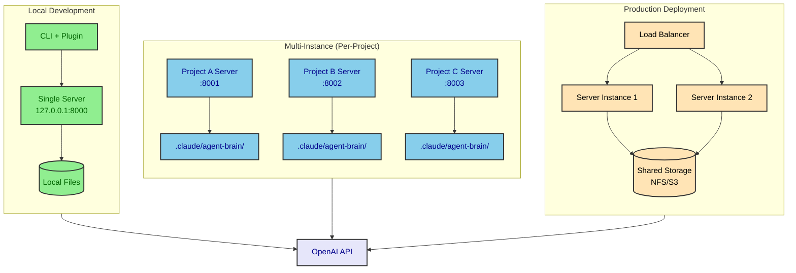
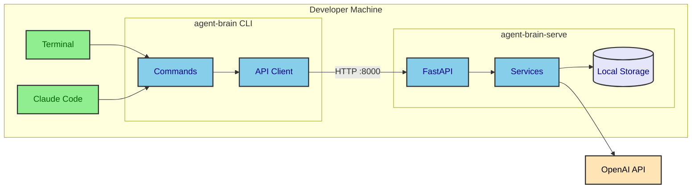
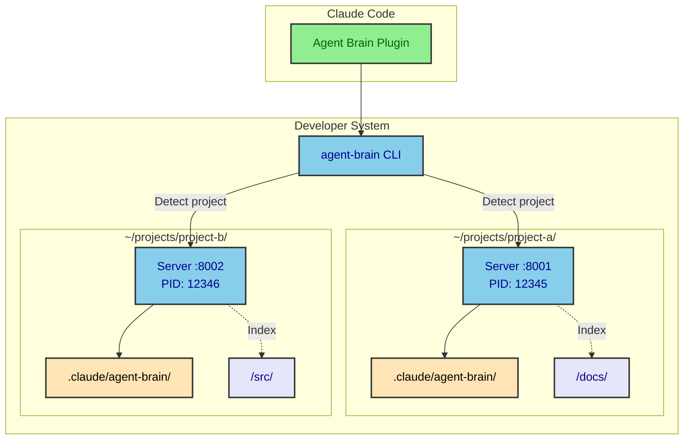
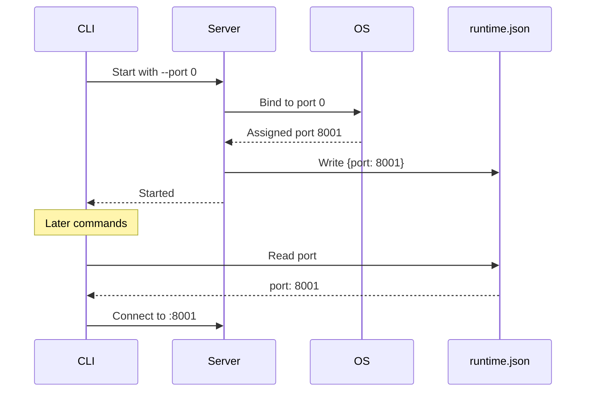
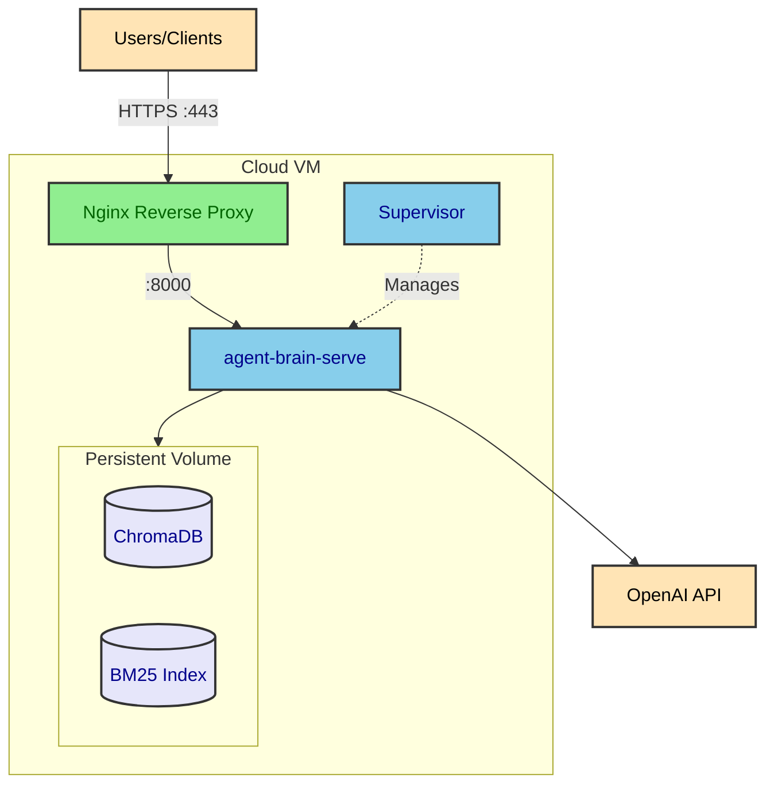
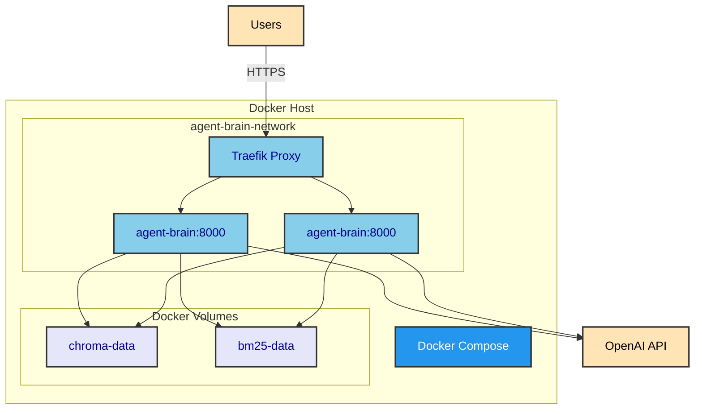
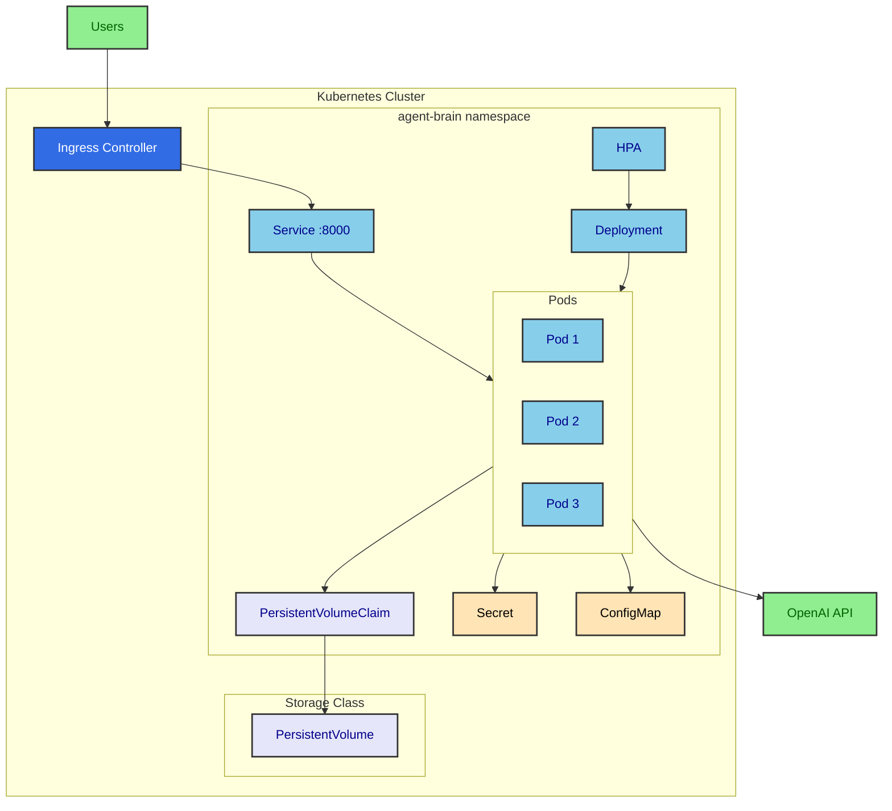
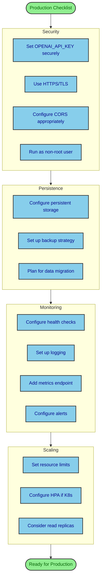
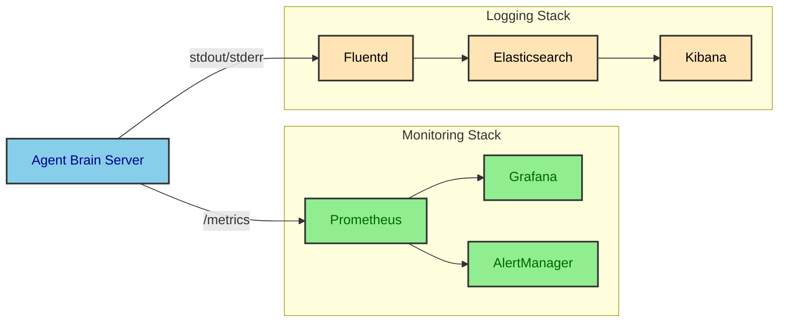

# Deployment Architecture

This document details Agent Brain's deployment options, from local development to production configurations.

## Deployment Overview

Agent Brain supports multiple deployment modes optimized for different use cases.



## Local Development Setup

The simplest deployment for individual developer use.

### Architecture



### Quick Start

```bash
# 1. Install packages
pip install agent-brain-rag agent-brain-cli

# 2. Configure API key
export OPENAI_API_KEY="sk-proj-..."

# 3. Start server
agent-brain-serve

# 4. Index documents (in another terminal)
agent-brain index /path/to/docs

# 5. Query
agent-brain query "how does authentication work"
```

### Directory Structure

```
./                           # Working directory
├── chroma_db/              # Vector database
├── bm25_index/             # Keyword index
├── graph_index/            # Graph store (if enabled)
└── .env                    # Environment variables
```

### Configuration

```bash
# .env file
OPENAI_API_KEY=sk-proj-...
ANTHROPIC_API_KEY=sk-ant-...  # Optional, for summaries
API_HOST=127.0.0.1
API_PORT=8000
DEBUG=false
```

## Multi-Instance Architecture

Recommended deployment for developers working on multiple projects.

### Architecture



### Per-Project State

Each project maintains isolated state:

```
~/projects/project-a/
├── .claude/
│   └── agent-brain/
│       ├── lock.json           # Instance lock
│       ├── runtime.json        # Server info
│       ├── config.json         # Project config
│       ├── chroma_db/          # Vector store
│       ├── bm25_index/         # Keyword index
│       └── graph_index/        # Graph store
├── src/
└── docs/
```

### Initialization

```bash
# Navigate to project
cd ~/projects/project-a

# Initialize Agent Brain for this project
agent-brain init

# Start server (auto-assigns port)
agent-brain start

# Check status
agent-brain status
```

### Port Allocation



### List All Instances

```bash
$ agent-brain list
Instance                     Port   PID    Status
~/projects/project-a         8001   12345  Running
~/projects/project-b         8002   12346  Running
~/projects/project-c         -      -      Stopped
```

## Production Deployment Options

### Option 1: Single Server with Persistence

Basic production setup for small teams.



#### Supervisor Configuration

```ini
# /etc/supervisor/conf.d/agent-brain.conf
[program:agent-brain]
command=/path/to/venv/bin/agent-brain-serve --host 0.0.0.0 --port 8000
directory=/opt/agent-brain
user=www-data
autostart=true
autorestart=true
stderr_logfile=/var/log/agent-brain/error.log
stdout_logfile=/var/log/agent-brain/output.log
environment=OPENAI_API_KEY="sk-...",CHROMA_PERSIST_DIR="/data/chroma_db"
```

#### Nginx Configuration

```nginx
# /etc/nginx/sites-available/agent-brain
server {
    listen 443 ssl;
    server_name agent-brain.example.com;

    ssl_certificate /etc/letsencrypt/live/agent-brain.example.com/fullchain.pem;
    ssl_certificate_key /etc/letsencrypt/live/agent-brain.example.com/privkey.pem;

    location / {
        proxy_pass http://127.0.0.1:8000;
        proxy_set_header Host $host;
        proxy_set_header X-Real-IP $remote_addr;
        proxy_set_header X-Forwarded-For $proxy_add_x_forwarded_for;
        proxy_set_header X-Forwarded-Proto $scheme;
    }
}
```

### Option 2: Docker Deployment

Containerized deployment for portability.



#### Dockerfile

```dockerfile
FROM python:3.11-slim

WORKDIR /app

# Install dependencies
COPY requirements.txt .
RUN pip install --no-cache-dir -r requirements.txt

# Copy application
COPY agent-brain-server ./agent-brain-server

# Create non-root user
RUN useradd -m -u 1000 appuser
USER appuser

# Expose port
EXPOSE 8000

# Health check
HEALTHCHECK --interval=30s --timeout=3s \
    CMD curl -f http://localhost:8000/health || exit 1

# Run server
CMD ["agent-brain-serve", "--host", "0.0.0.0", "--port", "8000"]
```

#### Docker Compose

```yaml
# docker-compose.yml
version: "3.8"

services:
  agent-brain:
    build: .
    ports:
      - "8000:8000"
    environment:
      - OPENAI_API_KEY=${OPENAI_API_KEY}
      - ANTHROPIC_API_KEY=${ANTHROPIC_API_KEY}
      - CHROMA_PERSIST_DIR=/data/chroma_db
      - BM25_INDEX_PATH=/data/bm25_index
    volumes:
      - chroma-data:/data/chroma_db
      - bm25-data:/data/bm25_index
      - ./docs:/docs:ro
    healthcheck:
      test: ["CMD", "curl", "-f", "http://localhost:8000/health"]
      interval: 30s
      timeout: 3s
      retries: 3
    restart: unless-stopped

volumes:
  chroma-data:
  bm25-data:
```

### Option 3: Kubernetes Deployment

Enterprise-grade deployment with auto-scaling.



#### Kubernetes Manifests

```yaml
# deployment.yaml
apiVersion: apps/v1
kind: Deployment
metadata:
  name: agent-brain
  namespace: agent-brain
spec:
  replicas: 2
  selector:
    matchLabels:
      app: agent-brain
  template:
    metadata:
      labels:
        app: agent-brain
    spec:
      containers:
        - name: agent-brain
          image: agent-brain:latest
          ports:
            - containerPort: 8000
          envFrom:
            - secretRef:
                name: agent-brain-secrets
            - configMapRef:
                name: agent-brain-config
          volumeMounts:
            - name: data
              mountPath: /data
          resources:
            requests:
              memory: "512Mi"
              cpu: "250m"
            limits:
              memory: "2Gi"
              cpu: "1000m"
          livenessProbe:
            httpGet:
              path: /health
              port: 8000
            initialDelaySeconds: 10
            periodSeconds: 10
          readinessProbe:
            httpGet:
              path: /health/status
              port: 8000
            initialDelaySeconds: 5
            periodSeconds: 5
      volumes:
        - name: data
          persistentVolumeClaim:
            claimName: agent-brain-pvc
---
# service.yaml
apiVersion: v1
kind: Service
metadata:
  name: agent-brain
  namespace: agent-brain
spec:
  selector:
    app: agent-brain
  ports:
    - port: 8000
      targetPort: 8000
  type: ClusterIP
---
# ingress.yaml
apiVersion: networking.k8s.io/v1
kind: Ingress
metadata:
  name: agent-brain
  namespace: agent-brain
  annotations:
    kubernetes.io/ingress.class: nginx
    cert-manager.io/cluster-issuer: letsencrypt-prod
spec:
  tls:
    - hosts:
        - agent-brain.example.com
      secretName: agent-brain-tls
  rules:
    - host: agent-brain.example.com
      http:
        paths:
          - path: /
            pathType: Prefix
            backend:
              service:
                name: agent-brain
                port:
                  number: 8000
```

## Environment Configuration

### Environment Variables

| Variable | Required | Default | Description |
|----------|----------|---------|-------------|
| `OPENAI_API_KEY` | Yes | - | OpenAI API key for embeddings |
| `ANTHROPIC_API_KEY` | No | - | Anthropic key for summaries |
| `API_HOST` | No | 127.0.0.1 | Server bind address |
| `API_PORT` | No | 8000 | Server port |
| `DEBUG` | No | false | Enable debug logging |
| `CHROMA_PERSIST_DIR` | No | ./chroma_db | Vector DB path |
| `BM25_INDEX_PATH` | No | ./bm25_index | BM25 index path |
| `DOC_SERVE_STATE_DIR` | No | - | Override state directory |
| `DOC_SERVE_MODE` | No | project | project or shared |
| `ENABLE_GRAPH_INDEX` | No | false | Enable GraphRAG |
| `GRAPH_STORE_TYPE` | No | simple | simple or kuzu |

### Production Checklist



## Resource Requirements

### Minimum Requirements

| Resource | Development | Production |
|----------|-------------|------------|
| **CPU** | 1 core | 2 cores |
| **Memory** | 512 MB | 2 GB |
| **Disk** | 1 GB | 10 GB+ |
| **Network** | Local | Low latency to OpenAI |

### Sizing Guidelines

| Document Count | ChromaDB | BM25 | Memory | Recommended |
|----------------|----------|------|--------|-------------|
| < 1,000 | 50 MB | 5 MB | 512 MB | Single instance |
| 1,000 - 10,000 | 500 MB | 50 MB | 2 GB | Single instance |
| 10,000 - 100,000 | 5 GB | 500 MB | 8 GB | Consider scaling |
| > 100,000 | 50 GB+ | 5 GB+ | 32 GB+ | Distributed storage |

## Monitoring and Health Checks

### Health Endpoints

| Endpoint | Method | Purpose |
|----------|--------|---------|
| `/health` | GET | Basic liveness check |
| `/health/status` | GET | Detailed status with indexing info |

### Health Check Response

```json
{
  "status": "healthy",
  "version": "1.2.0",
  "mode": "project",
  "instance_id": "abc123",
  "indexing": {
    "status": "completed",
    "total_chunks": 1500,
    "folder_path": "/docs"
  }
}
```

### Monitoring Integration



## Backup and Recovery

### Backup Strategy

```bash
#!/bin/bash
# backup.sh

BACKUP_DIR="/backups/agent-brain/$(date +%Y%m%d)"
STATE_DIR="/data/agent-brain"

mkdir -p "$BACKUP_DIR"

# Stop writes (optional, for consistency)
# curl -X POST http://localhost:8000/admin/pause

# Backup ChromaDB
tar -czf "$BACKUP_DIR/chroma_db.tar.gz" -C "$STATE_DIR" chroma_db

# Backup BM25 index
tar -czf "$BACKUP_DIR/bm25_index.tar.gz" -C "$STATE_DIR" bm25_index

# Backup graph index (if enabled)
if [ -d "$STATE_DIR/graph_index" ]; then
    tar -czf "$BACKUP_DIR/graph_index.tar.gz" -C "$STATE_DIR" graph_index
fi

# Resume writes
# curl -X POST http://localhost:8000/admin/resume

echo "Backup completed: $BACKUP_DIR"
```

### Recovery Procedure

```bash
#!/bin/bash
# restore.sh

BACKUP_DIR="/backups/agent-brain/20240115"
STATE_DIR="/data/agent-brain"

# Stop server
systemctl stop agent-brain

# Clear existing data
rm -rf "$STATE_DIR/chroma_db" "$STATE_DIR/bm25_index" "$STATE_DIR/graph_index"

# Restore from backup
tar -xzf "$BACKUP_DIR/chroma_db.tar.gz" -C "$STATE_DIR"
tar -xzf "$BACKUP_DIR/bm25_index.tar.gz" -C "$STATE_DIR"
[ -f "$BACKUP_DIR/graph_index.tar.gz" ] && tar -xzf "$BACKUP_DIR/graph_index.tar.gz" -C "$STATE_DIR"

# Start server
systemctl start agent-brain

echo "Recovery completed from: $BACKUP_DIR"
```
