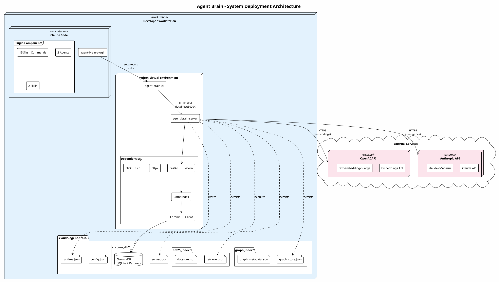
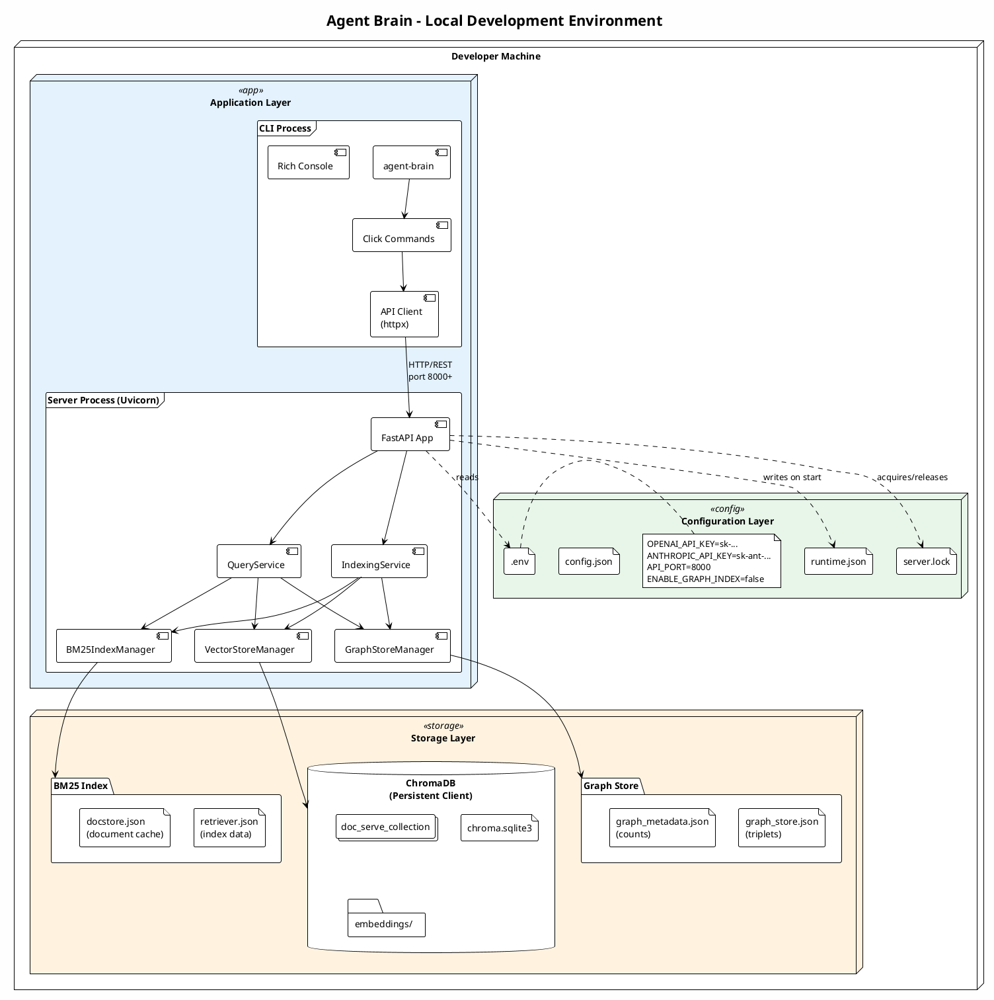
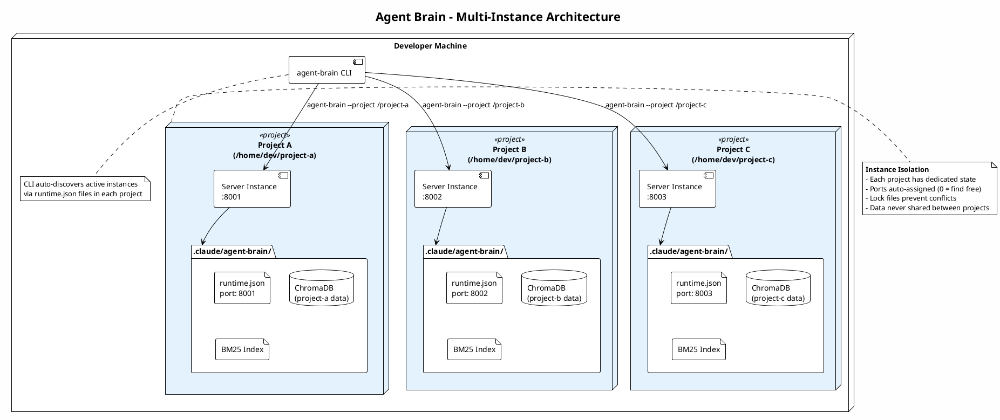
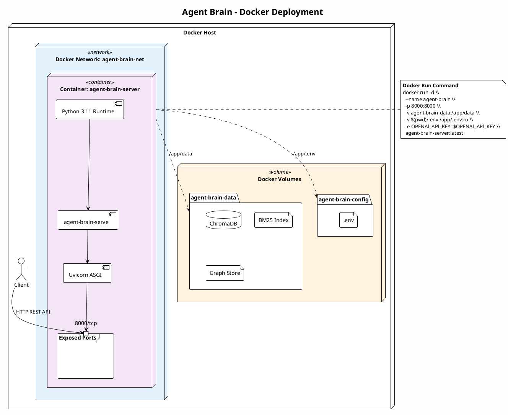
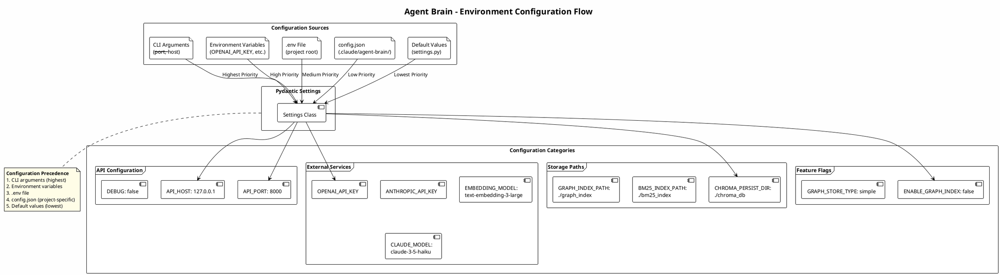

# Agent Brain Deployment Diagram

This document contains PlantUML deployment diagrams showing how Agent Brain components are deployed across different environments.

## System Deployment Overview



### Deployment Overview Description

The Agent Brain system is deployed primarily as a local development tool with the following key components:

1. **Developer Workstation**: The primary deployment target where all components run
2. **Python Virtual Environment**: Isolates dependencies for agent-brain-cli and agent-brain-server
3. **Claude Code**: The IDE integration point via the agent-brain-plugin
4. **State Directory**: Project-specific state stored in `.claude/agent-brain/`
5. **External Services**: Cloud APIs for embeddings (OpenAI) and summarization (Anthropic)

---

## Local Development Environment



### Local Development Components

| Component | Purpose | Technology |
|-----------|---------|------------|
| **CLI Process** | User interaction and server management | Click, Rich, httpx |
| **Server Process** | REST API and RAG pipeline | FastAPI, Uvicorn |
| **ChromaDB** | Vector storage with HNSW indexing | SQLite + Parquet files |
| **BM25 Index** | Keyword search index | JSON-serialized LlamaIndex BM25Retriever |
| **Graph Store** | Knowledge graph for GraphRAG | JSON-serialized triplets |

---

## Multi-Instance Architecture



### Multi-Instance Features

| Feature | Description |
|---------|-------------|
| **Project Isolation** | Each project gets its own state directory, database, and server instance |
| **Auto Port Assignment** | Use `--port 0` to auto-assign an available port |
| **Lock Files** | Prevent multiple servers from running for the same project |
| **Instance Discovery** | CLI can list and manage all running instances via `agent-brain list` |

---

## Docker Deployment



### Docker Configuration

```yaml
# docker-compose.yml example
version: '3.8'
services:
  agent-brain-server:
    image: agent-brain-server:latest
    container_name: agent-brain
    ports:
      - "8000:8000"
    volumes:
      - agent-brain-data:/app/data
      - ./.env:/app/.env:ro
    environment:
      - OPENAI_API_KEY=${OPENAI_API_KEY}
      - ANTHROPIC_API_KEY=${ANTHROPIC_API_KEY}
      - CHROMA_PERSIST_DIR=/app/data/chroma_db
      - BM25_INDEX_PATH=/app/data/bm25_index
      - GRAPH_INDEX_PATH=/app/data/graph_index
    restart: unless-stopped

volumes:
  agent-brain-data:
```

---

## Environment Configuration



### Environment Variables Reference

| Variable | Required | Default | Description |
|----------|----------|---------|-------------|
| `OPENAI_API_KEY` | Yes | - | OpenAI API key for embeddings |
| `ANTHROPIC_API_KEY` | No | - | Anthropic API key for code summarization |
| `API_HOST` | No | `127.0.0.1` | Server bind address |
| `API_PORT` | No | `8000` | Server port (0 = auto-assign) |
| `DEBUG` | No | `false` | Enable debug logging |
| `EMBEDDING_MODEL` | No | `text-embedding-3-large` | OpenAI embedding model |
| `CLAUDE_MODEL` | No | `claude-3-5-haiku-20241022` | Claude model for summaries |
| `CHROMA_PERSIST_DIR` | No | `./chroma_db` | ChromaDB storage path |
| `BM25_INDEX_PATH` | No | `./bm25_index` | BM25 index storage path |
| `ENABLE_GRAPH_INDEX` | No | `false` | Enable GraphRAG feature |
| `DOC_SERVE_STATE_DIR` | No | - | Override state directory |
| `DOC_SERVE_MODE` | No | `project` | Instance mode: project or shared |

---

## Deployment Benefits

### Local Development Mode
- **Zero Configuration**: Works out of the box with minimal setup
- **Project Isolation**: Each project has independent state and data
- **Fast Iteration**: Hot reload in debug mode for rapid development

### Docker Mode
- **Reproducibility**: Consistent environment across machines
- **Persistence**: Volume mounts preserve data across container restarts
- **Portability**: Easy deployment to any Docker-capable host

### Multi-Instance Mode
- **Parallel Projects**: Work on multiple projects simultaneously
- **Resource Isolation**: Each instance has dedicated resources
- **Auto-Discovery**: CLI automatically finds and manages instances
