# Software Design Document (SDD)
# Doc-Serve: RAG-Based Document Indexing and Query System

**Project**: Doc-Serve
**Version**: 1.0
**Date**: December 15, 2024
**Author**: Spillwave Team
**Status**: Draft

---

## Document Approval

| Role | Name | Signature | Date |
|------|------|-----------|------|
| Technical Lead | | | |
| Product Owner | | | |
| Architecture Lead | | | |

---

## Revision History

| Version | Date | Author | Description of Changes |
|---------|------|--------|------------------------|
| 0.1 | 2024-12-15 | Spillwave Team | Initial draft - Phase 1 design |
| 1.0 | TBD | | First approved version |

---

## Table of Contents

1. [Introduction](#1-introduction)
   - 1.1 [Purpose](#11-purpose)
   - 1.2 [Scope](#12-scope)
   - 1.3 [Definitions, Acronyms, and Abbreviations](#13-definitions-acronyms-and-abbreviations)
   - 1.4 [References](#14-references)
   - 1.5 [Overview](#15-overview)
2. [System Overview](#2-system-overview)
   - 2.1 [System Context](#21-system-context)
   - 2.2 [Design Goals](#22-design-goals)
   - 2.3 [Assumptions and Constraints](#23-assumptions-and-constraints)
3. [Architectural Design](#3-architectural-design)
   - 3.1 [Architecture Style](#31-architecture-style)
   - 3.2 [Component Architecture](#32-component-architecture)
   - 3.3 [Data Architecture](#33-data-architecture)
   - 3.4 [Technology Stack](#34-technology-stack)
4. [Detailed Component Design](#4-detailed-component-design)
   - 4.1 [Doc-Serve-Server](#41-doc-serve-server)
   - 4.2 [Doc-Svr-Ctl (CLI)](#42-doc-svr-ctl-cli)
   - 4.3 [Doc-Serve-Skill](#43-doc-serve-skill)
   - 4.4 [Indexing Pipeline](#44-indexing-pipeline)
   - 4.5 [Query Engine](#45-query-engine)
5. [API Design](#5-api-design)
   - 5.1 [REST API Endpoints](#51-rest-api-endpoints)
   - 5.2 [OpenAPI Specification](#52-openapi-specification)
   - 5.3 [Request/Response Models](#53-requestresponse-models)
6. [Data Design](#6-data-design)
   - 6.1 [Vector Store Schema](#61-vector-store-schema)
   - 6.2 [Document Metadata](#62-document-metadata)
   - 6.3 [Chunking Strategy](#63-chunking-strategy)
7. [Interface Design](#7-interface-design)
   - 7.1 [External Interfaces](#71-external-interfaces)
   - 7.2 [Internal Interfaces](#72-internal-interfaces)
8. [Security Design](#8-security-design)
   - 8.1 [Authentication and Authorization](#81-authentication-and-authorization)
   - 8.2 [Data Security](#82-data-security)
   - 8.3 [API Security](#83-api-security)
9. [Performance and Scalability](#9-performance-and-scalability)
   - 9.1 [Performance Requirements](#91-performance-requirements)
   - 9.2 [Scalability Strategy](#92-scalability-strategy)
   - 9.3 [Caching Strategy](#93-caching-strategy)
10. [Deployment Architecture](#10-deployment-architecture)
    - 10.1 [Environment Setup](#101-environment-setup)
    - 10.2 [Dependencies](#102-dependencies)
    - 10.3 [Configuration Management](#103-configuration-management)
11. [Error Handling and Logging](#11-error-handling-and-logging)
    - 11.1 [Error Handling Strategy](#111-error-handling-strategy)
    - 11.2 [Logging Design](#112-logging-design)
12. [Testing Strategy](#12-testing-strategy)
    - 12.1 [Unit Testing](#121-unit-testing)
    - 12.2 [Integration Testing](#122-integration-testing)
    - 12.3 [Performance Testing](#123-performance-testing)
13. [Future Enhancements (Phase 2)](#13-future-enhancements-phase-2)
14. [Appendices](#14-appendices)

---

## 1. Introduction

### 1.1 Purpose

This Software Design Document (SDD) describes the technical design for **Doc-Serve**, a Retrieval-Augmented Generation (RAG) based document indexing and query system. This document is intended for:

- **Developers**: To understand the system architecture and implementation details
- **DevOps Engineers**: To understand deployment and operational requirements
- **Technical Leads**: To review architecture decisions and trade-offs
- **QA Engineers**: To understand system components for testing

### 1.2 Scope

**Product Name**: Doc-Serve

**Product Description**: Doc-Serve is a self-contained, locally-running document indexing and retrieval system that uses vector embeddings and semantic search to enable context-aware querying of document collections. The system consists of three main components:

1. **Doc-Serve-Server**: A FastAPI-based REST service for document indexing and querying
2. **Doc-Svr-Ctl**: A command-line interface for managing the server and testing queries
3. **Doc-Serve-Skill**: A Claude Code skill for seamless integration with AI-assisted workflows

**Phase 1 Goals**:
- Enable local document indexing with OpenAI embeddings
- Provide REST API for semantic search queries
- Support context-aware chunking with RecursiveCharacterTextSplitter
- Achieve thread-safe concurrent query handling
- Deliver <2 second query response time for typical document collections
- Integrate with Claude Code workflow via custom skill

**Out of Scope (Phase 1)**:
- BM25 keyword search (planned for Phase 2)
- Hybrid retrieval (planned for Phase 2)
- Multi-user authentication
- Distributed deployment
- Document modification/deletion (append-only in Phase 1)

### 1.3 Definitions, Acronyms, and Abbreviations

| Term | Definition |
|------|------------|
| RAG | Retrieval-Augmented Generation - AI technique combining retrieval with generation |
| LLM | Large Language Model |
| API | Application Programming Interface |
| CLI | Command-Line Interface |
| REST | Representational State Transfer |
| CRUD | Create, Read, Update, Delete |
| BM25 | Best Matching 25 - ranking function for keyword search |
| TOTP | Time-based One-Time Password |
| JWT | JSON Web Token |
| Chroma | Vector database for storing embeddings |
| LlamaIndex | Framework for LLM-based indexing and retrieval |
| OpenAPI | API specification standard (formerly Swagger) |
| tiktoken | OpenAI's tokenization library |
| Embedding | Vector representation of text for semantic similarity |
| Chunking | Process of splitting documents into manageable segments |
| Vector Store | Database optimized for similarity search on embeddings |

### 1.4 References

- [LlamaIndex Documentation](https://docs.llamaindex.ai/)
- [Chroma Documentation](https://docs.trychroma.com/)
- [FastAPI Documentation](https://fastapi.tiangolo.com/)
- [OpenAI Embedding Models](https://platform.openai.com/docs/guides/embeddings)
- [Poetry Documentation](https://python-poetry.org/docs/)
- [Claude 3.5 Haiku Documentation](https://docs.anthropic.com/claude/docs)

### 1.5 Overview

This SDD is organized as follows:
- **Section 2** provides a high-level system overview
- **Section 3** details the architectural design and patterns
- **Section 4** describes each component in detail
- **Section 5** specifies the REST API design
- **Section 6** covers data models and storage
- **Section 7** describes interface specifications
- **Sections 8-11** cover cross-cutting concerns (security, performance, deployment, error handling)
- **Section 12** outlines the testing strategy
- **Section 13** previews Phase 2 enhancements

---

## 2. System Overview

### 2.1 System Context

Doc-Serve operates as a local service that bridges document collections with AI-assisted workflows. The system fits into the following context:

**Primary Use Case**: Enable Claude Code skills to query indexed documentation during code generation, providing context-aware assistance based on project-specific documentation.

**System Actors**:
- **Claude Code Skill**: Programmatic client that queries the vector store
- **CLI User**: Developer using doc-svr-ctl to manage and test the system
- **FastAPI Server**: Core service handling indexing and queries
- **OpenAI API**: External service providing embeddings and summarization
- **Anthropic API**: External service for Claude 3.5 Haiku summarization

**System Context Diagram**:

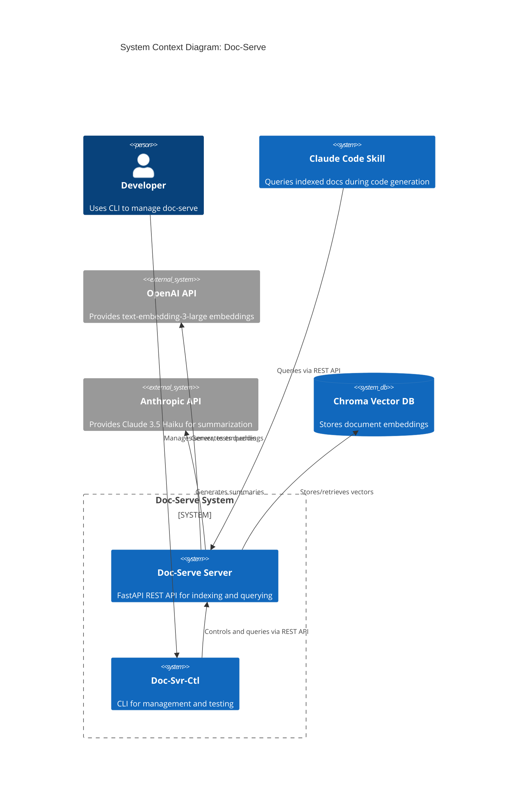

### 2.2 Design Goals

1. **Simplicity**: Self-contained, easy to start and stop, minimal configuration
2. **Performance**: Sub-2-second query response for typical document collections
3. **Thread Safety**: Support concurrent queries without data corruption
4. **Local-First**: All processing and storage happens locally (except embedding/LLM APIs)
5. **Extensibility**: Modular design to support Phase 2 enhancements (BM25, hybrid search)
6. **Developer Experience**: Intuitive CLI and clear API for easy integration
7. **Reliability**: Graceful error handling and comprehensive health checks

### 2.3 Assumptions and Constraints

**Assumptions**:
- Documents are primarily text-based (PDF, Markdown, TXT, DOCX)
- Document collections fit in local storage (no distributed storage needed in Phase 1)
- OpenAI API and Anthropic API are available and responsive
- Users have stable internet connectivity for API calls
- System runs on Unix-like OS (macOS, Linux) with Python 3.10+

**Constraints**:
- Must use Poetry for dependency management
- Must use FastAPI for REST API
- Must use LlamaIndex for indexing orchestration
- Must use Chroma for vector storage
- Must use OpenAI text-embedding-3-large for embeddings
- Must use Claude 3.5 Haiku for summarization
- Must be thread-safe for concurrent access
- Must expose OpenAPI schema for API documentation

---

## 3. Architectural Design

### 3.1 Architecture Style

**Architectural Pattern**: **Monolithic Microservice with Layered Architecture**

The system follows a layered architecture within a single deployable unit:

```
┌─────────────────────────────────────────────┐
│         Presentation Layer                  │
│  (FastAPI REST Endpoints, CLI Interface)    │
└─────────────────────────────────────────────┘
                    ↓
┌─────────────────────────────────────────────┐
│         Application Layer                   │
│  (Business Logic, Query Orchestration)      │
└─────────────────────────────────────────────┘
                    ↓
┌─────────────────────────────────────────────┐
│         Domain Layer                        │
│  (LlamaIndex, Document Processing)          │
└─────────────────────────────────────────────┘
                    ↓
┌─────────────────────────────────────────────┐
│      Infrastructure Layer                   │
│  (Chroma, OpenAI, Anthropic, File I/O)     │
└─────────────────────────────────────────────┘
```

**Key Architectural Principles**:
- **Separation of Concerns**: Each layer has distinct responsibilities
- **Dependency Inversion**: Higher layers depend on abstractions, not concrete implementations
- **Single Responsibility**: Each component has one reason to change
- **Open/Closed**: System is open for extension (Phase 2) but closed for modification

### 3.2 Component Architecture

**Monorepo Structure**:

```
doc-serve/
├── docs/                          # Documentation
│   ├── design/                    # Design documents
│   └── requirements/              # Requirements
├── doc-serve-server/              # FastAPI server component
│   ├── doc_serve_server/
│   │   ├── api/                   # REST API endpoints
│   │   ├── services/              # Business logic
│   │   ├── models/                # Data models
│   │   ├── indexing/              # Indexing pipeline
│   │   └── config/                # Configuration
│   ├── tests/
│   ├── pyproject.toml             # Poetry dependencies
│   └── README.md
├── doc-svr-ctl/                   # CLI component
│   ├── doc_serve_server/
│   │   ├── commands/              # CLI commands
│   │   └── client/                # HTTP client
│   ├── tests/
│   ├── pyproject.toml
│   └── README.md
├── doc-serve-skill/               # Claude Code skill
│   ├── SKILL.md                   # Skill documentation
│   ├── examples/                  # Usage examples
│   └── README.md
└── README.md                      # Root documentation
```

**Component Diagram (C4 Level 2)**:

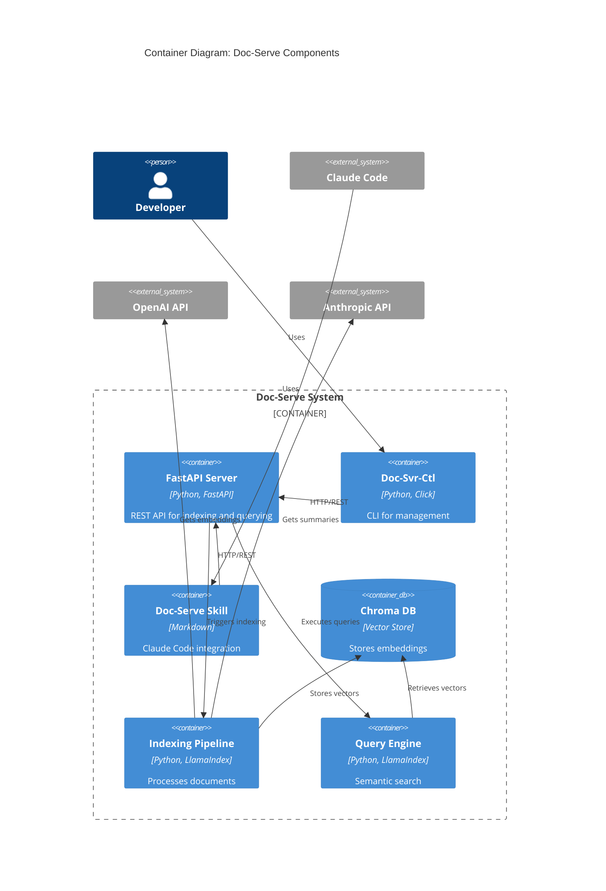

### 3.3 Data Architecture

**Data Flow for Indexing**:

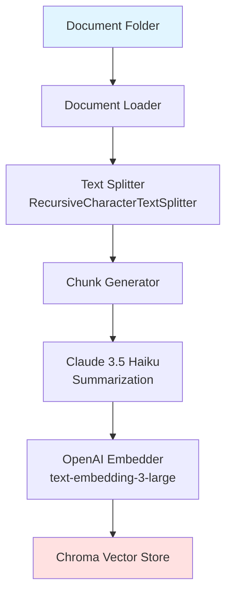

**Data Flow for Querying**:

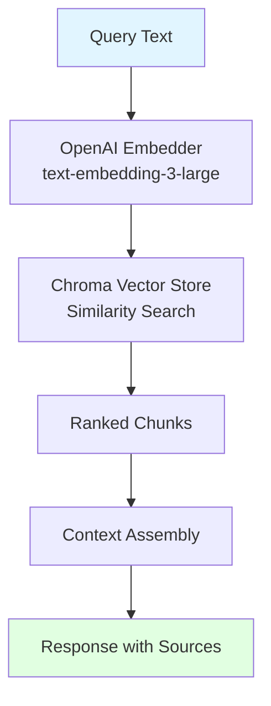

### 3.4 Technology Stack

| Layer | Technology | Version | Purpose |
|-------|-----------|---------|---------|
| **Build & Dependency Management** | Poetry | 1.7+ | Python dependency and environment management |
| **REST API Framework** | FastAPI | 0.104+ | High-performance async REST API |
| **Indexing Framework** | LlamaIndex | 0.9+ | Document indexing and query orchestration |
| **Vector Store** | Chroma | 0.4+ | Thread-safe vector database |
| **Embedding Model** | OpenAI text-embedding-3-large | Latest | High-quality text embeddings (3072 dimensions) |
| **Summarization LLM** | Claude 3.5 Haiku | Latest | Fast, cost-effective summarization |
| **Tokenizer** | tiktoken | 0.5+ | OpenAI-compatible tokenization |
| **Text Splitter** | RecursiveCharacterTextSplitter | (LlamaIndex) | Context-aware chunking |
| **CLI Framework** | Click | 8.1+ | Command-line interface |
| **HTTP Client** | httpx | 0.25+ | Async HTTP client for CLI |
| **API Documentation** | OpenAPI (Swagger) | 3.1 | Auto-generated from FastAPI |
| **Testing Framework** | pytest | 7.4+ | Unit and integration testing |
| **Type Checking** | mypy | 1.7+ | Static type checking |
| **Code Formatting** | black | 23.11+ | Opinionated code formatting |
| **Linting** | ruff | 0.1+ | Fast Python linter |

---

## 4. Detailed Component Design

### 4.1 Doc-Serve-Server

**Responsibility**: Core REST API service for document indexing, querying, and health monitoring.

**Key Modules**:

#### 4.1.1 API Layer (`doc_serve_server/api/`)

**`main.py`**: FastAPI application entry point
```python
from fastapi import FastAPI
from contextlib import asynccontextmanager

@asynccontextmanager
async def lifespan(app: FastAPI):
    # Startup: Initialize services, load existing index
    await startup_event()
    yield
    # Shutdown: Cleanup resources
    await shutdown_event()

app = FastAPI(
    title="Doc-Serve API",
    version="1.0.0",
    lifespan=lifespan
)

# Include routers
app.include_router(health_router, prefix="/health", tags=["health"])
app.include_router(index_router, prefix="/index", tags=["indexing"])
app.include_router(query_router, prefix="/query", tags=["querying"])
```

**`routers/health.py`**: Health check endpoints
```python
from fastapi import APIRouter, status
from ..models.health import HealthStatus, IndexingStatus

router = APIRouter()

@router.get("/", response_model=HealthStatus)
async def health_check():
    """
    Returns server health status.
    
    Status codes:
    - healthy: Server is running and ready for queries
    - indexing: Server is indexing documents
    - degraded: Server is up but some services are unavailable
    - unhealthy: Server is not operational
    """
    return await get_health_status()

@router.get("/status", response_model=IndexingStatus)
async def indexing_status():
    """
    Returns detailed indexing status.
    
    Returns:
    - total_documents: Number of documents indexed
    - total_chunks: Number of chunks in vector store
    - indexing_in_progress: Boolean indicating active indexing
    - last_indexed_at: Timestamp of last indexing operation
    """
    return await get_indexing_status()
```

**`routers/index.py`**: Indexing endpoints
```python
from fastapi import APIRouter, BackgroundTasks, HTTPException
from ..models.index import IndexRequest, IndexResponse
from ..services.indexing_service import IndexingService

router = APIRouter()
indexing_service = IndexingService()

@router.post("/", response_model=IndexResponse, status_code=status.HTTP_202_ACCEPTED)
async def index_documents(
    request: IndexRequest,
    background_tasks: BackgroundTasks
):
    """
    Starts indexing documents from the specified folder.
    
    Args:
        request: IndexRequest containing folder_path and optional config
        background_tasks: FastAPI background task handler
    
    Returns:
        IndexResponse with job_id and status
    
    Raises:
        HTTPException 400: Invalid folder path
        HTTPException 409: Indexing already in progress
    """
    if not await validate_folder_path(request.folder_path):
        raise HTTPException(400, "Invalid folder path")
    
    if indexing_service.is_indexing():
        raise HTTPException(409, "Indexing already in progress")
    
    job_id = await indexing_service.start_indexing(request, background_tasks)
    return IndexResponse(job_id=job_id, status="started")

@router.post("/add", response_model=IndexResponse)
async def add_documents(
    request: IndexRequest,
    background_tasks: BackgroundTasks
):
    """
    Adds documents from a new folder to the existing index.
    """
    job_id = await indexing_service.add_to_index(request, background_tasks)
    return IndexResponse(job_id=job_id, status="started")
```

**`routers/query.py`**: Query endpoints
```python
from fastapi import APIRouter, HTTPException
from ..models.query import QueryRequest, QueryResponse
from ..services.query_service import QueryService

router = APIRouter()
query_service = QueryService()

@router.post("/", response_model=QueryResponse)
async def query_documents(request: QueryRequest):
    """
    Performs semantic search on indexed documents.
    
    Args:
        request: QueryRequest containing:
            - query: The search query string
            - top_k: Number of results to return (default: 5)
            - similarity_threshold: Minimum similarity score (default: 0.7)
    
    Returns:
        QueryResponse containing:
            - results: List of matching chunks with sources and scores
            - query_time_ms: Query execution time in milliseconds
    
    Raises:
        HTTPException 400: Invalid query
        HTTPException 503: Index not ready
    """
    if not query_service.is_ready():
        raise HTTPException(503, "Index not ready. Please wait for indexing to complete.")
    
    if not request.query.strip():
        raise HTTPException(400, "Query cannot be empty")
    
    return await query_service.execute_query(request)
```

#### 4.1.2 Service Layer (`doc_serve_server/services/`)

**`indexing_service.py`**: Business logic for indexing
```python
from typing import Optional
import asyncio
from datetime import datetime
from ..models.index import IndexRequest, IndexingState
from ..indexing.document_loader import DocumentLoader
from ..indexing.chunking import ContextAwareChunker
from ..indexing.embedding import EmbeddingGenerator
from ..storage.vector_store import VectorStoreManager

class IndexingService:
    def __init__(self):
        self.state: IndexingState = IndexingState()
        self.lock = asyncio.Lock()
        self.document_loader = DocumentLoader()
        self.chunker = ContextAwareChunker()
        self.embedder = EmbeddingGenerator()
        self.vector_store = VectorStoreManager()
    
    async def start_indexing(self, request: IndexRequest, background_tasks):
        """Starts a new indexing job."""
        async with self.lock:
            job_id = self._generate_job_id()
            self.state.current_job_id = job_id
            self.state.is_indexing = True
            self.state.started_at = datetime.utcnow()
        
        background_tasks.add_task(self._index_documents, request, job_id)
        return job_id
    
    async def _index_documents(self, request: IndexRequest, job_id: str):
        """Background task for indexing documents."""
        try:
            # Load documents
            documents = await self.document_loader.load_from_folder(
                request.folder_path
            )
            self.state.total_documents = len(documents)
            
            # Chunk documents
            chunks = await self.chunker.chunk_documents(documents)
            self.state.total_chunks = len(chunks)
            
            # Generate embeddings and store
            await self.embedder.generate_and_store(
                chunks, 
                self.vector_store,
                progress_callback=self._update_progress
            )
            
            self.state.status = "completed"
        except Exception as e:
            self.state.status = "failed"
            self.state.error = str(e)
            raise
        finally:
            self.state.is_indexing = False
            self.state.completed_at = datetime.utcnow()
```

**`query_service.py`**: Business logic for querying
```python
from typing import List
import time
from ..models.query import QueryRequest, QueryResponse, QueryResult
from ..storage.vector_store import VectorStoreManager
from ..indexing.embedding import EmbeddingGenerator

class QueryService:
    def __init__(self):
        self.vector_store = VectorStoreManager()
        self.embedder = EmbeddingGenerator()
    
    def is_ready(self) -> bool:
        """Check if the index is ready for queries."""
        return self.vector_store.is_initialized() and not self._is_indexing()
    
    async def execute_query(self, request: QueryRequest) -> QueryResponse:
        """Execute a semantic search query."""
        start_time = time.time()
        
        # Generate query embedding
        query_embedding = await self.embedder.embed_query(request.query)
        
        # Search vector store
        results = await self.vector_store.similarity_search(
            query_embedding=query_embedding,
            top_k=request.top_k,
            similarity_threshold=request.similarity_threshold
        )
        
        # Format results
        query_results = [
            QueryResult(
                text=result.text,
                source=result.metadata.source,
                score=result.score,
                chunk_id=result.chunk_id
            )
            for result in results
        ]
        
        query_time_ms = (time.time() - start_time) * 1000
        
        return QueryResponse(
            results=query_results,
            query_time_ms=query_time_ms
        )
```

#### 4.1.3 Indexing Layer (`doc_serve_server/indexing/`)

**`document_loader.py`**: Document loading and parsing
```python
from pathlib import Path
from typing import List
from llama_index.core import SimpleDirectoryReader, Document

class DocumentLoader:
    SUPPORTED_EXTENSIONS = {'.txt', '.md', '.pdf', '.docx', '.html'}
    
    async def load_from_folder(self, folder_path: str) -> List[Document]:
        """
        Load all supported documents from a folder recursively.
        
        Args:
            folder_path: Path to folder containing documents
        
        Returns:
            List of LlamaIndex Document objects
        """
        path = Path(folder_path)
        if not path.exists() or not path.is_dir():
            raise ValueError(f"Invalid folder path: {folder_path}")
        
        # Use LlamaIndex's SimpleDirectoryReader
        reader = SimpleDirectoryReader(
            input_dir=str(path),
            recursive=True,
            required_exts=list(self.SUPPORTED_EXTENSIONS)
        )
        
        documents = reader.load_data()
        return documents
```

**`chunking.py`**: Context-aware chunking
```python
from typing import List
from llama_index.core import Document
from llama_index.core.node_parser import SentenceSplitter
from llama_index.core.schema import TextNode
import tiktoken

class ContextAwareChunker:
    def __init__(
        self,
        chunk_size: int = 512,
        chunk_overlap: int = 50,
        separator: str = "\n\n"
    ):
        self.chunk_size = chunk_size
        self.chunk_overlap = chunk_overlap
        self.tokenizer = tiktoken.get_encoding("cl100k_base")
        
        # Use LlamaIndex's SentenceSplitter
        self.splitter = SentenceSplitter(
            chunk_size=chunk_size,
            chunk_overlap=chunk_overlap,
            separator=separator
        )
    
    async def chunk_documents(self, documents: List[Document]) -> List[TextNode]:
        """
        Chunk documents with context-aware splitting.
        
        Uses RecursiveCharacterTextSplitter strategy:
        1. Split by paragraphs
        2. If too large, split by sentences
        3. If still too large, split by words
        
        Each chunk includes:
        - Original text
        - Source metadata
        - Position in document
        - Token count
        """
        nodes = []
        
        for doc in documents:
            # Split document into nodes
            doc_nodes = self.splitter.get_nodes_from_documents([doc])
            
            # Add metadata to each node
            for idx, node in enumerate(doc_nodes):
                node.metadata.update({
                    "source": doc.metadata.get("file_name", "unknown"),
                    "chunk_index": idx,
                    "total_chunks": len(doc_nodes),
                    "token_count": len(self.tokenizer.encode(node.text))
                })
                nodes.append(node)
        
        return nodes
```

**`embedding.py`**: Embedding generation
```python
from typing import List
import openai
from llama_index.core.schema import TextNode
from ..config.settings import settings

class EmbeddingGenerator:
    def __init__(self):
        self.model = settings.EMBEDDING_MODEL  # "text-embedding-3-large"
        self.client = openai.AsyncOpenAI(api_key=settings.OPENAI_API_KEY)
    
    async def embed_query(self, query: str) -> List[float]:
        """Generate embedding for a query string."""
        response = await self.client.embeddings.create(
            model=self.model,
            input=query
        )
        return response.data[0].embedding
    
    async def embed_nodes(self, nodes: List[TextNode]) -> List[List[float]]:
        """Generate embeddings for multiple nodes."""
        texts = [node.text for node in nodes]
        
        # Batch process for efficiency
        response = await self.client.embeddings.create(
            model=self.model,
            input=texts
        )
        
        return [item.embedding for item in response.data]
    
    async def generate_and_store(
        self, 
        nodes: List[TextNode], 
        vector_store,
        progress_callback=None
    ):
        """Generate embeddings and store in vector store."""
        batch_size = 100  # Process in batches to avoid API limits
        
        for i in range(0, len(nodes), batch_size):
            batch = nodes[i:i + batch_size]
            embeddings = await self.embed_nodes(batch)
            
            # Store in vector store
            await vector_store.add_nodes(batch, embeddings)
            
            if progress_callback:
                await progress_callback(i + len(batch), len(nodes))
```

#### 4.1.4 Storage Layer (`doc_serve_server/storage/`)

**`vector_store.py`**: Chroma vector store management
```python
from typing import List, Optional
import chromadb
from chromadb.config import Settings
from llama_index.core.schema import TextNode
from ..config.settings import settings

class VectorStoreManager:
    def __init__(self):
        self.client = chromadb.PersistentClient(
            path=settings.CHROMA_PERSIST_DIR,
            settings=Settings(
                anonymized_telemetry=False,
                allow_reset=True
            )
        )
        self.collection_name = settings.COLLECTION_NAME
        self.collection = None
    
    def is_initialized(self) -> bool:
        """Check if vector store is initialized."""
        return self.collection is not None
    
    async def initialize(self):
        """Initialize or load existing collection."""
        try:
            # Try to get existing collection
            self.collection = self.client.get_collection(self.collection_name)
        except:
            # Create new collection if it doesn't exist
            self.collection = self.client.create_collection(
                name=self.collection_name,
                metadata={"hnsw:space": "cosine"}
            )
    
    async def add_nodes(
        self, 
        nodes: List[TextNode], 
        embeddings: List[List[float]]
    ):
        """Add nodes with embeddings to vector store."""
        ids = [f"chunk_{node.id_}" for node in nodes]
        documents = [node.text for node in nodes]
        metadatas = [node.metadata for node in nodes]
        
        self.collection.add(
            ids=ids,
            embeddings=embeddings,
            documents=documents,
            metadatas=metadatas
        )
    
    async def similarity_search(
        self,
        query_embedding: List[float],
        top_k: int = 5,
        similarity_threshold: float = 0.7
    ) -> List[dict]:
        """Perform similarity search."""
        results = self.collection.query(
            query_embeddings=[query_embedding],
            n_results=top_k
        )
        
        # Filter by similarity threshold
        filtered_results = []
        for idx, score in enumerate(results['distances'][0]):
            # Chroma returns distance, convert to similarity
            similarity = 1 - score
            if similarity >= similarity_threshold:
                filtered_results.append({
                    'text': results['documents'][0][idx],
                    'metadata': results['metadatas'][0][idx],
                    'score': similarity,
                    'chunk_id': results['ids'][0][idx]
                })
        
        return filtered_results
```

#### 4.1.5 Models Layer (`doc_serve_server/models/`)

**`query.py`**: Query request/response models
```python
from pydantic import BaseModel, Field
from typing import List

class QueryRequest(BaseModel):
    query: str = Field(..., min_length=1, description="The search query")
    top_k: int = Field(5, ge=1, le=50, description="Number of results to return")
    similarity_threshold: float = Field(
        0.7, 
        ge=0.0, 
        le=1.0, 
        description="Minimum similarity score (0-1)"
    )

class QueryResult(BaseModel):
    text: str = Field(..., description="The chunk text")
    source: str = Field(..., description="Source file name")
    score: float = Field(..., description="Similarity score (0-1)")
    chunk_id: str = Field(..., description="Unique chunk identifier")

class QueryResponse(BaseModel):
    results: List[QueryResult] = Field(default_factory=list)
    query_time_ms: float = Field(..., description="Query execution time in ms")
```

**`health.py`**: Health status models
```python
from pydantic import BaseModel
from typing import Literal, Optional
from datetime import datetime

class HealthStatus(BaseModel):
    status: Literal["healthy", "indexing", "degraded", "unhealthy"]
    message: Optional[str] = None
    timestamp: datetime = Field(default_factory=datetime.utcnow)

class IndexingStatus(BaseModel):
    total_documents: int = 0
    total_chunks: int = 0
    indexing_in_progress: bool = False
    last_indexed_at: Optional[datetime] = None
    current_job_id: Optional[str] = None
```

**`index.py`**: Indexing request/response models
```python
from pydantic import BaseModel, Field, DirectoryPath
from typing import Optional

class IndexRequest(BaseModel):
    folder_path: str = Field(..., description="Path to folder containing documents")
    chunk_size: Optional[int] = Field(512, ge=128, le=2048)
    chunk_overlap: Optional[int] = Field(50, ge=0, le=200)

class IndexResponse(BaseModel):
    job_id: str
    status: str
    message: Optional[str] = None
```

#### 4.1.6 Configuration (`doc_serve_server/config/`)

**`settings.py`**: Application configuration
```python
from pydantic_settings import BaseSettings
from typing import Optional

class Settings(BaseSettings):
    # API Configuration
    API_HOST: str = "127.0.0.1"
    API_PORT: int = 8000
    
    # OpenAI Configuration
    OPENAI_API_KEY: str
    EMBEDDING_MODEL: str = "text-embedding-3-large"
    
    # Anthropic Configuration
    ANTHROPIC_API_KEY: str
    CLAUDE_MODEL: str = "claude-3-5-haiku-20241022"
    
    # Chroma Configuration
    CHROMA_PERSIST_DIR: str = "./chroma_db"
    COLLECTION_NAME: str = "doc_serve_collection"
    
    # Chunking Configuration
    DEFAULT_CHUNK_SIZE: int = 512
    DEFAULT_CHUNK_OVERLAP: int = 50
    
    # Query Configuration
    DEFAULT_TOP_K: int = 5
    DEFAULT_SIMILARITY_THRESHOLD: float = 0.7
    
    class Config:
        env_file = ".env"
        case_sensitive = True

settings = Settings()
```

### 4.2 Doc-Svr-Ctl (CLI)

**Responsibility**: Command-line interface for managing the doc-serve server and testing queries.

**Key Features**:
- Start/stop the server
- Check server status
- Trigger indexing jobs
- Execute test queries
- View indexed documents

**CLI Structure**:

```python
# doc_svr_ctl/cli.py
import click
from .commands import server, index, query, status

@click.group()
def cli():
    """Doc-Serve CLI - Manage and query your document server."""
    pass

cli.add_command(server.server)
cli.add_command(index.index)
cli.add_command(query.query)
cli.add_command(status.status)

if __name__ == "__main__":
    cli()
```

**Example Commands**:

```python
# src/commands/server.py
import click
import subprocess
from ..client.api_client import DocServeClient

@click.group()
def server():
    """Server management commands."""
    pass

@server.command()
@click.option('--port', default=8000, help='Port to run on')
@click.option('--host', default='127.0.0.1', help='Host to bind to')
def start(port, host):
    """Start the doc-serve server."""
    click.echo(f"Starting doc-serve on {host}:{port}...")
    subprocess.Popen([
        "uvicorn",
        "doc_serve_server.api.main:app",
        "--host", host,
        "--port", str(port)
    ])

@server.command()
def stop():
    """Stop the doc-serve server."""
    click.echo("Stopping doc-serve server...")
    # Implementation: find and kill process

@server.command()
def restart():
    """Restart the doc-serve server."""
    click.echo("Restarting doc-serve server...")
    # Implementation: stop then start
```

```python
# src/commands/index.py
import click
from ..client.api_client import DocServeClient

@click.group()
def index():
    """Indexing commands."""
    pass

@index.command()
@click.argument('folder_path')
@click.option('--chunk-size', default=512)
@click.option('--chunk-overlap', default=50)
def add(folder_path, chunk_size, chunk_overlap):
    """Index documents from a folder."""
    client = DocServeClient()
    
    click.echo(f"Indexing documents from {folder_path}...")
    
    response = client.index_documents(
        folder_path=folder_path,
        chunk_size=chunk_size,
        chunk_overlap=chunk_overlap
    )
    
    click.echo(f"✓ Indexing started. Job ID: {response['job_id']}")

@index.command()
def status():
    """Check indexing status."""
    client = DocServeClient()
    status = client.get_indexing_status()
    
    click.echo(f"Documents indexed: {status['total_documents']}")
    click.echo(f"Chunks created: {status['total_chunks']}")
    click.echo(f"Indexing in progress: {status['indexing_in_progress']}")
```

```python
# src/commands/query.py
import click
from ..client.api_client import DocServeClient

@click.command()
@click.argument('query_text')
@click.option('--top-k', default=5, help='Number of results')
@click.option('--threshold', default=0.7, help='Similarity threshold')
def query(query_text, top_k, threshold):
    """Query indexed documents."""
    client = DocServeClient()
    
    click.echo(f"Searching for: {query_text}")
    
    response = client.query_documents(
        query=query_text,
        top_k=top_k,
        similarity_threshold=threshold
    )
    
    click.echo(f"\nFound {len(response['results'])} results in {response['query_time_ms']:.2f}ms:\n")
    
    for idx, result in enumerate(response['results'], 1):
        click.echo(f"{idx}. [{result['source']}] (score: {result['score']:.3f})")
        click.echo(f"   {result['text'][:200]}...")
        click.echo()
```

### 4.3 Doc-Serve-Skill

**Responsibility**: Claude Code skill that enables AI-assisted workflows to query indexed documentation.

**Skill Structure**:

```markdown
# Doc-Serve Skill

## Overview

Query locally indexed documentation during code generation to provide context-aware assistance.

## Capabilities

1. **Check Server Status**: Verify if doc-serve is running
2. **Start Server**: Launch doc-serve with specified configuration
3. **Query Documents**: Search indexed documents for relevant context
4. **Health Monitoring**: Ensure server is ready before querying

## Usage

### Automatic Integration

The skill automatically:
1. Checks if doc-serve is running when documentation context is needed
2. Starts the server if not running (with user confirmation)
3. Queries relevant documentation based on current task
4. Integrates retrieved context into code generation

### Manual Commands

**Check Status**:
```
Is doc-serve running?
```

**Start Server**:
```
Start doc-serve with /path/to/docs on port 8000
```

**Query Documentation**:
```
Query doc-serve: How do I configure authentication?
```

## Configuration

Set environment variables:
- `DOC_SERVE_URL`: Server URL (default: http://localhost:8000)
- `DOC_SERVE_AUTO_START`: Auto-start server (default: true)

## Examples

See [examples/](examples/) for detailed usage scenarios.
```

**Skill Implementation (Pseudo-code)**:

```python
# SKILL.md workflow logic

async def query_documentation(query: str, context: dict) -> dict:
    """
    Query doc-serve for relevant documentation.
    
    Workflow:
    1. Check if doc-serve is running
    2. If not running and auto_start enabled, start server
    3. Wait for server to be ready
    4. Execute query
    5. Return results formatted for Claude
    """
    
    # Check server health
    is_running = await check_server_health()
    
    if not is_running:
        if settings.auto_start:
            await start_server(context.get('docs_path'))
            await wait_for_ready()
        else:
            return {"error": "doc-serve not running"}
    
    # Execute query
    results = await http_client.post(
        f"{settings.server_url}/query",
        json={
            "query": query,
            "top_k": 5,
            "similarity_threshold": 0.7
        }
    )
    
    # Format for Claude
    return format_results_for_context(results)
```

### 4.4 Indexing Pipeline

**Component Diagram**:

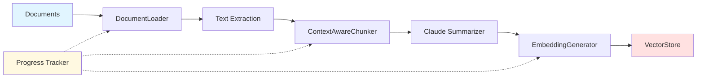

**Pipeline Stages**:

1. **Document Loading**:
   - Scan folder recursively
   - Filter by supported file types
   - Extract raw text using LlamaIndex readers

2. **Text Splitting**:
   - Apply RecursiveCharacterTextSplitter
   - Target: 512 tokens per chunk
   - Overlap: 50 tokens
   - Preserve sentence boundaries

3. **Summarization** (Optional for large chunks):
   - Use Claude 3.5 Haiku
   - Generate concise summaries for context
   - Attach summaries as metadata

4. **Embedding Generation**:
   - Batch process chunks (100 at a time)
   - Use OpenAI text-embedding-3-large
   - 3072-dimensional vectors

5. **Vector Storage**:
   - Store in Chroma with metadata
   - Build HNSW index for fast retrieval
   - Persist to disk

### 4.5 Query Engine

**Query Flow**:

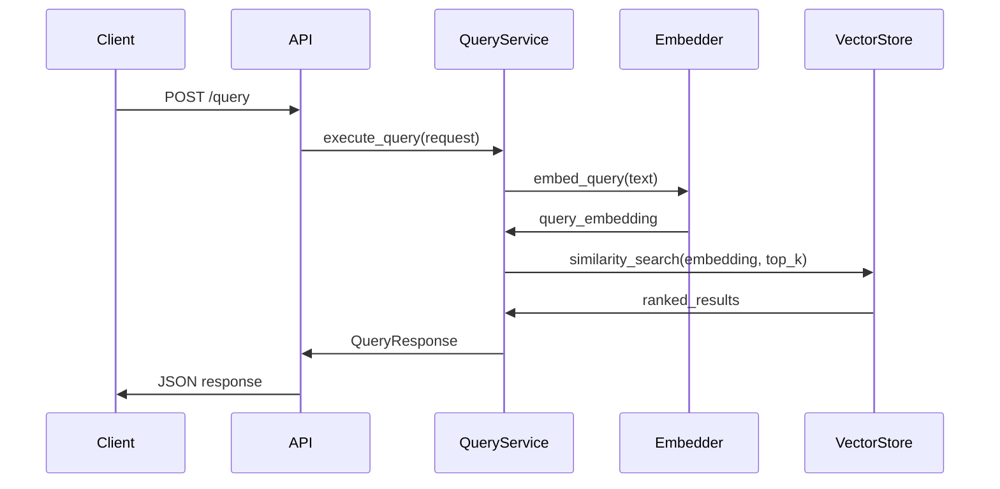

**Query Optimization**:

1. **Embedding Caching**: Cache embeddings for common queries
2. **Result Reranking**: Optional reranking with Claude for relevance
3. **Metadata Filtering**: Filter by source, date, or custom metadata
4. **Similarity Threshold**: Filter low-confidence results

---

## 5. API Design

### 5.1 REST API Endpoints

| Method | Endpoint | Description | Request Body | Response |
|--------|----------|-------------|--------------|----------|
| GET | `/health` | Server health check | - | HealthStatus |
| GET | `/health/status` | Detailed indexing status | - | IndexingStatus |
| POST | `/index` | Start indexing documents | IndexRequest | IndexResponse |
| POST | `/index/add` | Add documents to index | IndexRequest | IndexResponse |
| POST | `/query` | Query indexed documents | QueryRequest | QueryResponse |
| GET | `/docs` | OpenAPI documentation | - | HTML (Swagger UI) |
| GET | `/openapi.json` | OpenAPI schema | - | JSON |

### 5.2 OpenAPI Specification

**Excerpt** (full spec auto-generated by FastAPI):

```yaml
openapi: 3.1.0
info:
  title: Doc-Serve API
  description: REST API for document indexing and semantic search
  version: 1.0.0
servers:
  - url: http://localhost:8000
    description: Local development server

paths:
  /health:
    get:
      summary: Health Check
      tags:
        - health
      responses:
        '200':
          description: Server health status
          content:
            application/json:
              schema:
                $ref: '#/components/schemas/HealthStatus'

  /query:
    post:
      summary: Query Documents
      tags:
        - querying
      requestBody:
        required: true
        content:
          application/json:
            schema:
              $ref: '#/components/schemas/QueryRequest'
      responses:
        '200':
          description: Query results
          content:
            application/json:
              schema:
                $ref: '#/components/schemas/QueryResponse'
        '400':
          description: Invalid query
        '503':
          description: Index not ready

components:
  schemas:
    HealthStatus:
      type: object
      properties:
        status:
          type: string
          enum: [healthy, indexing, degraded, unhealthy]
        message:
          type: string
        timestamp:
          type: string
          format: date-time
    
    QueryRequest:
      type: object
      required:
        - query
      properties:
        query:
          type: string
          minLength: 1
        top_k:
          type: integer
          minimum: 1
          maximum: 50
          default: 5
        similarity_threshold:
          type: number
          minimum: 0.0
          maximum: 1.0
          default: 0.7
    
    QueryResponse:
      type: object
      properties:
        results:
          type: array
          items:
            $ref: '#/components/schemas/QueryResult'
        query_time_ms:
          type: number
    
    QueryResult:
      type: object
      properties:
        text:
          type: string
        source:
          type: string
        score:
          type: number
        chunk_id:
          type: string
```

### 5.3 Request/Response Models

See [Section 4.1.5](#415-models-layer-srcmodels) for detailed Pydantic models.

---

## 6. Data Design

### 6.1 Vector Store Schema

**Chroma Collection Structure**:

```python
{
    "collection_name": "doc_serve_collection",
    "metadata": {
        "hnsw:space": "cosine",  # Similarity metric
        "dimension": 3072         # OpenAI text-embedding-3-large
    },
    "documents": [
        {
            "id": "chunk_uuid_1",
            "embedding": [0.123, -0.456, ...],  # 3072 dimensions
            "text": "The actual chunk text...",
            "metadata": {
                "source": "docs/guide.md",
                "chunk_index": 0,
                "total_chunks": 10,
                "token_count": 485,
                "created_at": "2024-12-15T10:30:00Z"
            }
        }
    ]
}
```

### 6.2 Document Metadata

**Metadata Fields**:

| Field | Type | Description | Example |
|-------|------|-------------|---------|
| `source` | string | Original file path | `docs/api/authentication.md` |
| `chunk_index` | integer | Position in document | `3` |
| `total_chunks` | integer | Total chunks in document | `10` |
| `token_count` | integer | Number of tokens in chunk | `485` |
| `created_at` | datetime | Indexing timestamp | `2024-12-15T10:30:00Z` |
| `file_hash` | string | SHA256 of source file | `abc123...` |
| `summary` | string (optional) | Claude-generated summary | `This section describes...` |

### 6.3 Chunking Strategy

**RecursiveCharacterTextSplitter Strategy**:

1. **Primary Split**: Split by `\n\n` (paragraphs)
2. **Secondary Split**: If chunk > 512 tokens, split by `\n` (lines)
3. **Tertiary Split**: If still > 512 tokens, split by ` ` (words)
4. **Final Split**: If still > 512 tokens, split by character

**Overlap Strategy**:
- 50 tokens overlap between consecutive chunks
- Overlap includes complete sentences when possible
- Preserves context across chunk boundaries

**Example**:

```
Document: "Section 1: Introduction\n\nThis is the first paragraph...\n\nSection 2: Details\n\nThis is the second paragraph..."

Chunk 1 (tokens 1-512):
  "Section 1: Introduction\n\nThis is the first paragraph..."
  
Chunk 2 (tokens 463-974): [50 token overlap]
  "...first paragraph...\n\nSection 2: Details\n\nThis is the second paragraph..."
```

---

## 7. Interface Design

### 7.1 External Interfaces

#### 7.1.1 OpenAI API

**Interface**: REST API (HTTPS)
**Endpoint**: `https://api.openai.com/v1/embeddings`
**Authentication**: Bearer token (API key)

**Request**:
```json
{
  "model": "text-embedding-3-large",
  "input": ["text to embed", "another text"]
}
```

**Response**:
```json
{
  "data": [
    {
      "embedding": [0.123, -0.456, ...],
      "index": 0
    }
  ],
  "model": "text-embedding-3-large",
  "usage": {
    "prompt_tokens": 10,
    "total_tokens": 10
  }
}
```

**Error Handling**:
- Retry on 429 (rate limit) with exponential backoff
- Fail fast on 401 (auth error)
- Batch requests to stay under rate limits

#### 7.1.2 Anthropic API

**Interface**: REST API (HTTPS)
**Endpoint**: `https://api.anthropic.com/v1/messages`
**Authentication**: x-api-key header

**Request** (for summarization):
```json
{
  "model": "claude-3-5-haiku-20241022",
  "max_tokens": 200,
  "messages": [
    {
      "role": "user",
      "content": "Summarize this text in 2-3 sentences: ..."
    }
  ]
}
```

**Response**:
```json
{
  "id": "msg_123",
  "type": "message",
  "role": "assistant",
  "content": [
    {
      "type": "text",
      "text": "This section describes..."
    }
  ]
}
```

### 7.2 Internal Interfaces

#### 7.2.1 Service Layer Interface

```python
from abc import ABC, abstractmethod
from typing import List

class IIndexingService(ABC):
    @abstractmethod
    async def start_indexing(self, request: IndexRequest) -> str:
        """Start a new indexing job. Returns job_id."""
        pass
    
    @abstractmethod
    async def get_status(self) -> IndexingStatus:
        """Get current indexing status."""
        pass

class IQueryService(ABC):
    @abstractmethod
    async def execute_query(self, request: QueryRequest) -> QueryResponse:
        """Execute a semantic search query."""
        pass
    
    @abstractmethod
    def is_ready(self) -> bool:
        """Check if the system is ready for queries."""
        pass
```

#### 7.2.2 Storage Interface

```python
from abc import ABC, abstractmethod
from typing import List

class IVectorStore(ABC):
    @abstractmethod
    async def add_nodes(self, nodes: List[TextNode], embeddings: List[List[float]]):
        """Add nodes with embeddings to the store."""
        pass
    
    @abstractmethod
    async def similarity_search(
        self, 
        query_embedding: List[float], 
        top_k: int
    ) -> List[dict]:
        """Perform similarity search."""
        pass
    
    @abstractmethod
    def is_initialized(self) -> bool:
        """Check if the store is initialized."""
        pass
```

---

## 8. Security Design

### 8.1 Authentication and Authorization

**Phase 1 Security Model**: **No Authentication**

- System runs locally on `127.0.0.1` (localhost only)
- No external network access required
- Access control via OS-level permissions (file system)

**Phase 2 Considerations** (Future):
- API key authentication for remote access
- JWT tokens for stateful sessions
- Role-based access control (RBAC)

### 8.2 Data Security

**Data at Rest**:
- Vector store persisted to local file system
- No encryption in Phase 1 (local-only access)
- Rely on OS-level encryption (FileVault, LUKS)

**Data in Transit**:
- OpenAI API: HTTPS with TLS 1.2+
- Anthropic API: HTTPS with TLS 1.2+
- Local API: HTTP (localhost only)

**API Key Management**:
- Store API keys in `.env` file (not committed to Git)
- Use environment variables for secrets
- No hardcoded credentials

**Example `.env`**:
```bash
OPENAI_API_KEY=sk-...
ANTHROPIC_API_KEY=sk-ant-...
```

### 8.3 API Security

**Input Validation**:
- Pydantic models validate all request data
- Path traversal prevention in folder paths
- Query length limits (max 1000 characters)
- Rate limiting (future consideration)

**Error Handling**:
- No sensitive information in error messages
- Generic errors for client (detailed logs for server)
- Stack traces only in debug mode

---

## 9. Performance and Scalability

### 9.1 Performance Requirements

| Metric | Target | Measurement |
|--------|--------|-------------|
| Query Response Time (p95) | < 2 seconds | End-to-end from HTTP request to response |
| Query Response Time (p99) | < 5 seconds | Includes OpenAI API latency |
| Indexing Throughput | > 100 docs/min | For average document size (10KB) |
| Concurrent Queries | 10 simultaneous | Without performance degradation |
| Memory Usage | < 2GB | For 10,000 indexed documents |
| Startup Time | < 5 seconds | From process start to ready state |

### 9.2 Scalability Strategy

**Vertical Scaling** (Phase 1):
- Single-process, multi-threaded
- Thread-safe Chroma operations
- Async I/O with FastAPI

**Horizontal Scaling** (Phase 2):
- Multiple server instances behind load balancer
- Shared Chroma instance or distributed vector store
- Stateless API design

**Bottleneck Analysis**:
1. **OpenAI API**: Rate limits (3000 RPM for embeddings)
   - Mitigation: Batch requests, caching
2. **Chroma Search**: O(log n) search complexity
   - Mitigation: Index optimization, HNSW tuning
3. **Disk I/O**: Chroma persistence
   - Mitigation: SSD storage, in-memory caching

### 9.3 Caching Strategy

**Embedding Cache**:
- Cache query embeddings for common queries
- LRU cache with 1000 entry limit
- Cache invalidation on index updates

**Query Result Cache**:
- Cache top results for identical queries
- TTL: 5 minutes
- Invalidate on new document indexing

**Implementation**:
```python
from functools import lru_cache
import hashlib

@lru_cache(maxsize=1000)
async def get_cached_embedding(query: str) -> List[float]:
    """Cache embeddings for repeated queries."""
    return await embedder.embed_query(query)
```

---

## 10. Deployment Architecture

### 10.1 Environment Setup

**Local Development**:
```bash
# Clone repository
git clone <repo-url>
cd doc-serve

# Install Poetry
curl -sSL https://install.python-poetry.org | python3 -

# Install dependencies
cd doc-serve-server
poetry install

# Set up environment
cp .env.example .env
# Edit .env with API keys

# Run server
poetry run uvicorn doc_serve_server.api.main:app --reload
```

**Production** (Local Deployment):
```bash
# Install as system service (systemd)
sudo cp doc-serve.service /etc/systemd/system/
sudo systemctl enable doc-serve
sudo systemctl start doc-serve

# Verify
curl http://localhost:8000/health
```

### 10.2 Dependencies

**Runtime Dependencies**:
```toml
[tool.poetry.dependencies]
python = "^3.10"
fastapi = "^0.104.0"
uvicorn = {extras = ["standard"], version = "^0.24.0"}
llama-index-core = "^0.9.0"
chromadb = "^0.4.0"
openai = "^1.3.0"
anthropic = "^0.7.0"
tiktoken = "^0.5.0"
pydantic = "^2.5.0"
pydantic-settings = "^2.1.0"
click = "^8.1.0"
httpx = "^0.25.0"
```

**Development Dependencies**:
```toml
[tool.poetry.group.dev.dependencies]
pytest = "^7.4.0"
pytest-asyncio = "^0.21.0"
black = "^23.11.0"
ruff = "^0.1.0"
mypy = "^1.7.0"
```

### 10.3 Configuration Management

**Configuration Hierarchy**:
1. Environment variables (highest priority)
2. `.env` file
3. Default values in `settings.py`

**Environment Variables**:
```bash
# API Configuration
API_HOST=127.0.0.1
API_PORT=8000

# OpenAI
OPENAI_API_KEY=sk-...
EMBEDDING_MODEL=text-embedding-3-large

# Anthropic
ANTHROPIC_API_KEY=sk-ant-...
CLAUDE_MODEL=claude-3-5-haiku-20241022

# Chroma
CHROMA_PERSIST_DIR=./chroma_db
COLLECTION_NAME=doc_serve_collection

# Chunking
DEFAULT_CHUNK_SIZE=512
DEFAULT_CHUNK_OVERLAP=50
```

---

## 11. Error Handling and Logging

### 11.1 Error Handling Strategy

**Error Categories**:

1. **Client Errors (4xx)**:
   - 400 Bad Request: Invalid input
   - 404 Not Found: Resource not found
   - 409 Conflict: Indexing already in progress

2. **Server Errors (5xx)**:
   - 500 Internal Server Error: Unexpected error
   - 503 Service Unavailable: Index not ready

**Error Response Format**:
```json
{
  "error": {
    "code": "INVALID_QUERY",
    "message": "Query cannot be empty",
    "details": {
      "field": "query",
      "constraint": "min_length"
    }
  }
}
```

**Exception Handling**:
```python
from fastapi import HTTPException, Request
from fastapi.responses import JSONResponse

@app.exception_handler(Exception)
async def global_exception_handler(request: Request, exc: Exception):
    logger.error(f"Unhandled exception: {exc}", exc_info=True)
    return JSONResponse(
        status_code=500,
        content={
            "error": {
                "code": "INTERNAL_ERROR",
                "message": "An unexpected error occurred"
            }
        }
    )
```

### 11.2 Logging Design

**Logging Levels**:
- **DEBUG**: Detailed diagnostic information
- **INFO**: General informational messages
- **WARNING**: Warning messages (recoverable errors)
- **ERROR**: Error messages (non-critical failures)
- **CRITICAL**: Critical errors (system failure)

**Log Format**:
```
[2024-12-15 10:30:45] [INFO] [indexing_service] Starting indexing job job_123 for folder /docs
[2024-12-15 10:30:46] [DEBUG] [document_loader] Loaded 150 documents from /docs
[2024-12-15 10:30:50] [INFO] [chunking] Created 1200 chunks (avg 485 tokens/chunk)
[2024-12-15 10:31:10] [INFO] [embedding] Generated embeddings for 1200 chunks
[2024-12-15 10:31:12] [INFO] [vector_store] Stored 1200 chunks in Chroma
[2024-12-15 10:31:12] [INFO] [indexing_service] Completed indexing job job_123 (26.5s)
```

**Structured Logging** (JSON):
```python
import structlog

logger = structlog.get_logger()

logger.info(
    "indexing_completed",
    job_id="job_123",
    documents=150,
    chunks=1200,
    duration_seconds=26.5
)
```

**Log Rotation**:
- Daily rotation
- Keep 30 days of logs
- Max 100MB per file

---

## 12. Testing Strategy

### 12.1 Unit Testing

**Test Coverage Target**: > 80%

**Key Test Areas**:
1. **Document Loading**: Test various file formats
2. **Chunking**: Verify chunk sizes, overlaps
3. **Embedding**: Mock OpenAI API responses
4. **Vector Store**: Test CRUD operations
5. **Query Logic**: Test ranking, filtering

**Example Unit Test**:
```python
import pytest
from src.indexing.chunking import ContextAwareChunker

@pytest.mark.asyncio
async def test_chunking_respects_token_limit():
    chunker = ContextAwareChunker(chunk_size=512, chunk_overlap=50)
    
    # Create a large document
    large_text = "This is a test. " * 1000
    doc = Document(text=large_text)
    
    chunks = await chunker.chunk_documents([doc])
    
    # Verify all chunks are within token limit
    for chunk in chunks:
        assert chunk.metadata["token_count"] <= 512
    
    # Verify overlap
    assert len(chunks) > 1
```

### 12.2 Integration Testing

**Test Scenarios**:
1. **End-to-End Indexing**: Index sample documents, verify in Chroma
2. **Query Accuracy**: Verify relevant results for known queries
3. **API Endpoints**: Test all REST endpoints with various inputs
4. **Error Handling**: Test error cases (invalid paths, API failures)

**Example Integration Test**:
```python
import pytest
from httpx import AsyncClient
from src.api.main import app

@pytest.mark.asyncio
async def test_indexing_and_query_workflow():
    async with AsyncClient(app=app, base_url="http://test") as client:
        # 1. Check health
        response = await client.get("/health")
        assert response.status_code == 200
        
        # 2. Start indexing
        response = await client.post(
            "/index",
            json={"folder_path": "./tests/fixtures/docs"}
        )
        assert response.status_code == 202
        job_id = response.json()["job_id"]
        
        # 3. Wait for indexing to complete
        await wait_for_indexing_complete(client)
        
        # 4. Query documents
        response = await client.post(
            "/query",
            json={"query": "authentication", "top_k": 5}
        )
        assert response.status_code == 200
        results = response.json()["results"]
        assert len(results) > 0
        assert "auth" in results[0]["text"].lower()
```

### 12.3 Performance Testing

**Test Scenarios**:
1. **Load Testing**: 100 concurrent queries
2. **Stress Testing**: Indexing 10,000 documents
3. **Response Time**: p95 and p99 latency under load

**Tools**:
- `locust` for load testing
- `pytest-benchmark` for micro-benchmarks

**Example Load Test**:
```python
from locust import HttpUser, task, between

class DocServeUser(HttpUser):
    wait_time = between(1, 3)
    
    @task
    def query_documents(self):
        self.client.post("/query", json={
            "query": "How do I configure the system?",
            "top_k": 5
        })
```

**Run Load Test**:
```bash
locust -f tests/performance/locustfile.py --host http://localhost:8000
# Visit http://localhost:8089 for UI
```

---

## 13. Future Enhancements (Phase 2)

### 13.1 BM25 Keyword Search

**Goal**: Add classic keyword search alongside vector search.

**Design**:
- Implement `BM25Retriever` from LlamaIndex
- Maintain separate BM25 index over the same documents
- Expose `/query?mode=bm25` endpoint

**Architecture Change**:
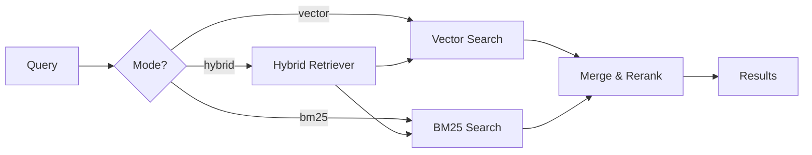

### 13.2 Hybrid Retrieval

**Goal**: Combine vector and BM25 results for better accuracy.

**Fusion Strategy**:
- **Reciprocal Rank Fusion (RRF)**:
  ```
  score(doc) = Σ 1 / (k + rank_i(doc))
  ```
  where `rank_i(doc)` is the rank from retriever `i`

**API Enhancement**:
```json
POST /query
{
  "query": "authentication",
  "mode": "hybrid",
  "vector_weight": 0.7,
  "bm25_weight": 0.3,
  "top_k": 10
}
```

### 13.3 Multi-Tenancy

**Goal**: Support multiple isolated document collections.

**Design**:
- One Chroma collection per tenant
- Tenant ID in API requests
- Namespace isolation

**API Change**:
```json
POST /query
{
  "tenant_id": "project_a",
  "query": "authentication"
}
```

### 13.4 Document Updates & Deletion

**Goal**: Support document modification and removal.

**Design**:
- Track document hashes to detect changes
- Implement `/index/update` endpoint
- Implement `/index/delete` endpoint
- Incremental re-indexing

---

## 14. Appendices

### 14.1 Glossary

See [Section 1.3](#13-definitions-acronyms-and-abbreviations)

### 14.2 Architecture Decision Records (ADRs)

**ADR-001: Why FastAPI over Flask?**
- **Decision**: Use FastAPI for REST API
- **Rationale**: 
  - Async/await support for better concurrency
  - Automatic OpenAPI schema generation
  - Pydantic integration for validation
  - Better performance for I/O-bound operations
- **Alternatives Considered**: Flask, Django REST Framework
- **Trade-offs**: Slightly steeper learning curve

**ADR-002: Why Chroma over Pinecone/Weaviate?**
- **Decision**: Use Chroma for vector storage
- **Rationale**:
  - Fully local, no external dependencies
  - Thread-safe for concurrent access
  - Simple API, easy integration with LlamaIndex
  - Persistent storage to disk
- **Alternatives Considered**: Pinecone (cloud), Weaviate, FAISS
- **Trade-offs**: Not suitable for distributed deployments (Phase 1 only)

**ADR-003: Why LlamaIndex over LangChain?**
- **Decision**: Use LlamaIndex for indexing orchestration
- **Rationale**:
  - Purpose-built for RAG use cases
  - Better integration with vector stores
  - Simpler API for document indexing
  - First-class support for BM25 and hybrid retrieval
- **Alternatives Considered**: LangChain, custom implementation
- **Trade-offs**: Less general-purpose than LangChain

**ADR-004: Why Claude 3.5 Haiku for Summarization?**
- **Decision**: Use Claude 3.5 Haiku instead of GPT-4
- **Rationale**:
  - Faster response time (important for indexing pipeline)
  - Lower cost per token
  - High-quality summaries for RAG context
  - Consistent with user's Claude ecosystem
- **Alternatives Considered**: GPT-4, GPT-3.5-turbo
- **Trade-offs**: Requires Anthropic API key in addition to OpenAI

### 14.3 Component Diagram (C4 Level 3)

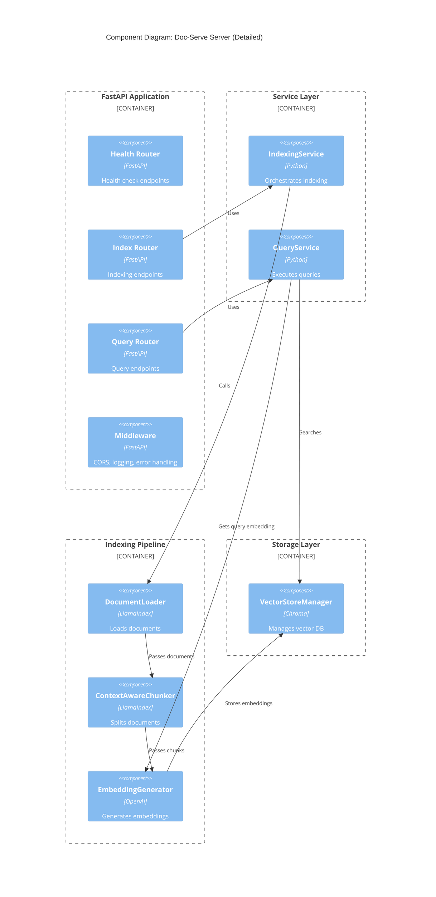

### 14.4 Deployment Diagram

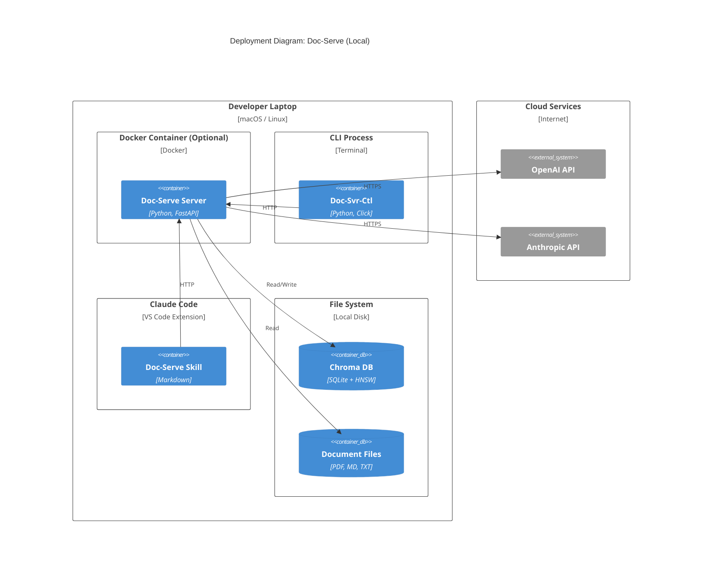

### 14.5 Sequence Diagram: Complete Indexing Flow

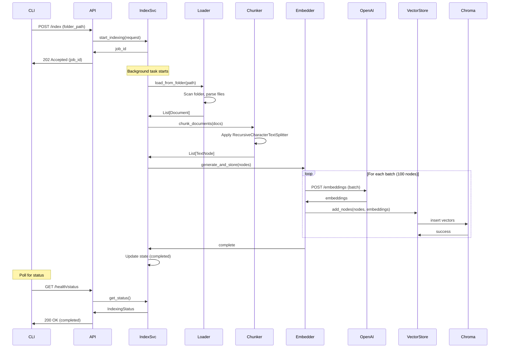

### 14.6 Class Diagram: Core Domain Models

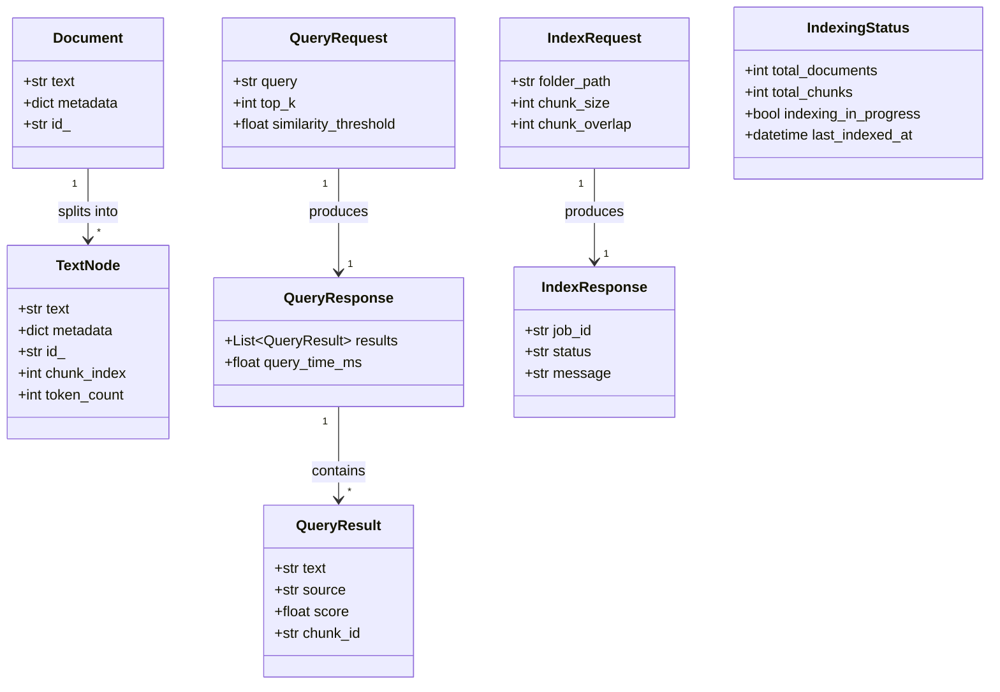

---

**End of Software Design Document**

**Approval Signatures:**

___________________________
Technical Lead
Date: ___________

___________________________
Product Owner
Date: ___________

___________________________
Architecture Lead
Date: ___________

---

*This document is a living artifact and will be updated as the design evolves. All changes must be reviewed and approved through the formal change control process.*

**Next Steps:**
1. Review and approve this SDD
2. Create detailed implementation tasks
3. Set up development environment
4. Begin Phase 1 implementation
5. Implement testing strategy
6. Deploy and validate

**Questions or Feedback?**
Contact the Spillwave Team for clarification or suggestions.
