# Indexing Pipeline Architecture

This document details how Agent Brain processes, chunks, embeds, and stores documents and source code.

## Pipeline Overview

The indexing pipeline transforms raw files into searchable vector embeddings with rich metadata.

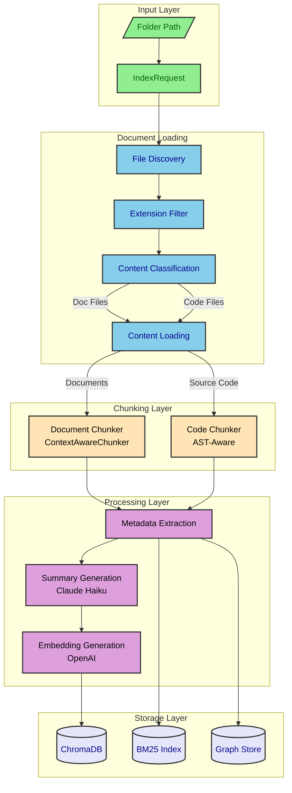

## Indexing Service Orchestration

The IndexingService coordinates the entire pipeline with progress tracking.

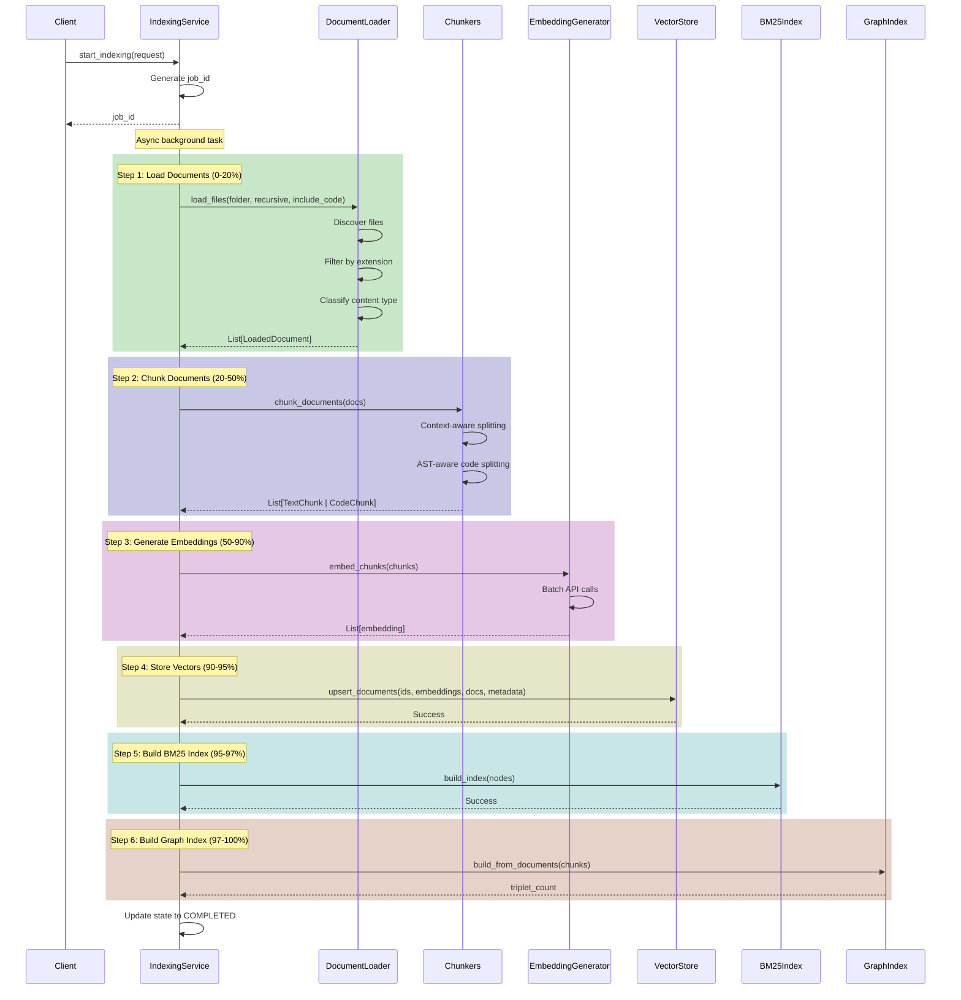

## Document Loading

The DocumentLoader discovers and classifies files for processing.

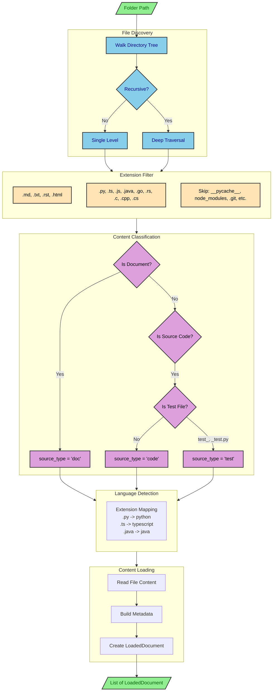

### Supported File Types

| Category | Extensions | Language |
|----------|------------|----------|
| **Documentation** | .md, .txt, .rst, .html | markdown, plaintext, rst, html |
| **Python** | .py | python |
| **TypeScript** | .ts, .tsx | typescript, tsx |
| **JavaScript** | .js, .jsx | javascript, jsx |
| **Java** | .java | java |
| **Go** | .go | go |
| **Rust** | .rs | rust |
| **C/C++** | .c, .cpp, .h, .hpp | c, cpp |
| **C#** | .cs | csharp |

### Ignored Patterns

```python
IGNORED_DIRS = {
    "__pycache__", ".git", ".svn", ".hg",
    "node_modules", ".next", ".nuxt",
    "venv", ".venv", "env", ".env",
    "dist", "build", "target", "out",
    ".pytest_cache", ".mypy_cache", ".ruff_cache",
    "coverage", ".coverage", "htmlcov",
}

IGNORED_FILES = {
    ".DS_Store", "Thumbs.db",
    "*.pyc", "*.pyo", "*.class",
    "*.lock", "*.log",
}
```

## Document Chunking

The ContextAwareChunker splits text documents using semantic boundaries.

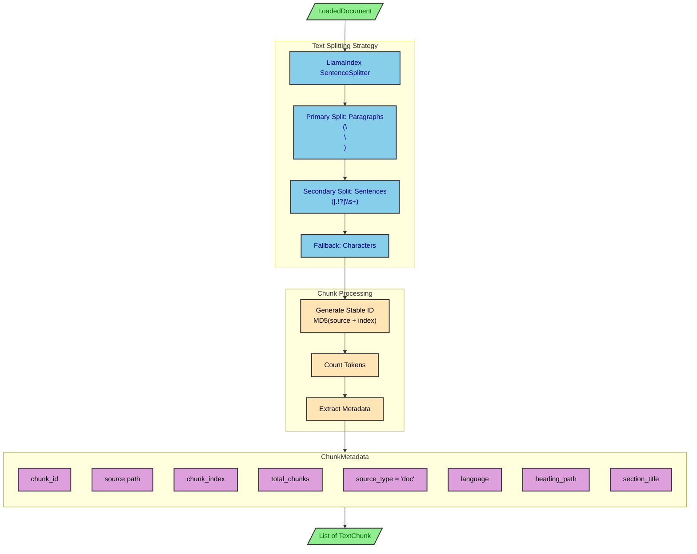

### Chunking Configuration

| Setting | Default | Description |
|---------|---------|-------------|
| `DEFAULT_CHUNK_SIZE` | 512 | Target tokens per chunk |
| `DEFAULT_CHUNK_OVERLAP` | 50 | Overlap between chunks |
| `MAX_CHUNK_SIZE` | 2048 | Maximum allowed chunk size |
| `MIN_CHUNK_SIZE` | 128 | Minimum chunk size |

### Stable Chunk IDs

Chunk IDs are deterministic based on file path and index:

```python
id_seed = f"{document.source}_{chunk_index}"
stable_id = hashlib.md5(id_seed.encode()).hexdigest()
chunk_id = f"chunk_{stable_id[:16]}"
```

This ensures:
- Re-indexing the same file produces the same IDs
- Chunks can be updated rather than duplicated
- Consistent references across sessions

## Code Chunking (AST-Aware)

The CodeChunker uses tree-sitter for AST-aware splitting.

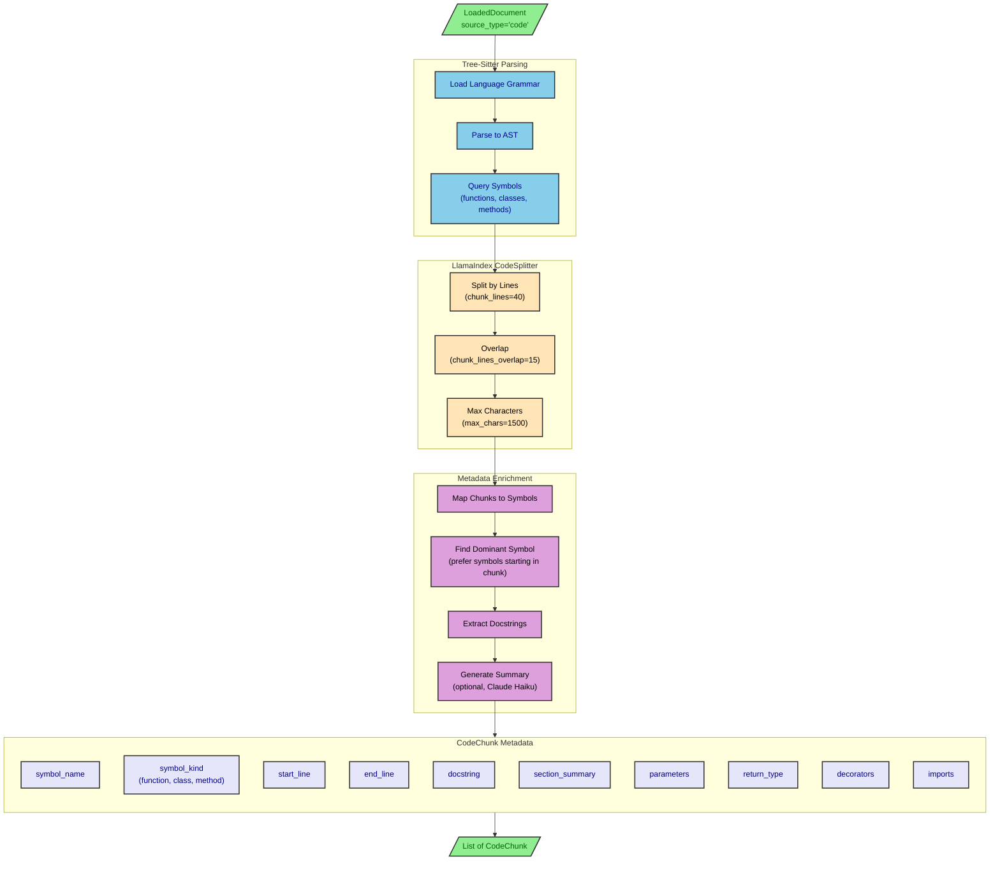

### AST Query Patterns by Language

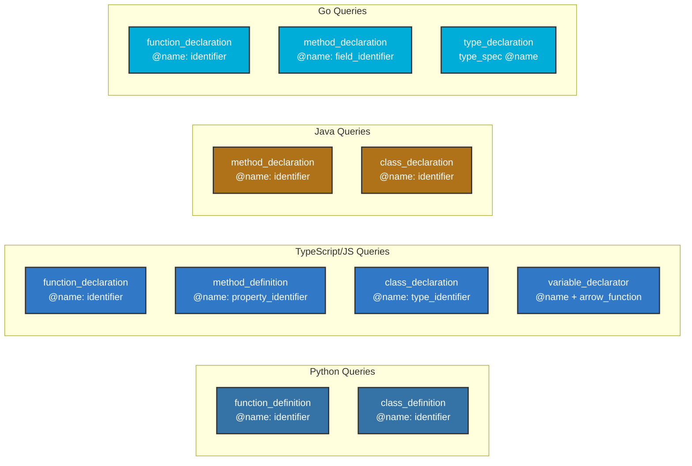

### Symbol Selection Strategy

When multiple symbols overlap a chunk:

1. **Prefer symbols that START within the chunk** - These are the primary content
2. **Pick the most specific (latest start line)** - Nested functions/methods over classes
3. **If none start in chunk, use the enclosing symbol** - Maintains context

## Embedding Generation

Batch embedding generation with rate limiting and progress tracking.

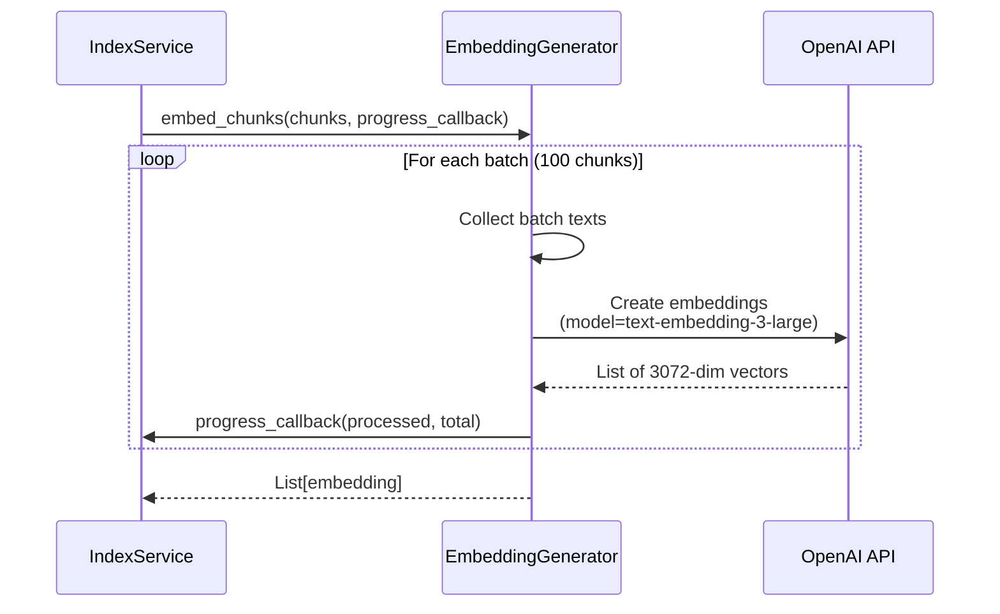

### Embedding Configuration

| Setting | Value | Description |
|---------|-------|-------------|
| `EMBEDDING_MODEL` | text-embedding-3-large | OpenAI model |
| `EMBEDDING_DIMENSIONS` | 3072 | Vector dimensions |
| `EMBEDDING_BATCH_SIZE` | 100 | Chunks per API call |

### Batch Processing

```python
async def embed_chunks(self, chunks: list[TextChunk], progress_callback):
    embeddings = []
    batch_size = settings.EMBEDDING_BATCH_SIZE  # 100

    for i in range(0, len(chunks), batch_size):
        batch = chunks[i:i + batch_size]
        batch_texts = [chunk.text for chunk in batch]

        response = await self.client.embeddings.create(
            input=batch_texts,
            model=settings.EMBEDDING_MODEL,
        )

        batch_embeddings = [e.embedding for e in response.data]
        embeddings.extend(batch_embeddings)

        if progress_callback:
            await progress_callback(i + len(batch), len(chunks))

    return embeddings
```

## Graph Extraction Pipeline

Knowledge graph construction from documents and code.

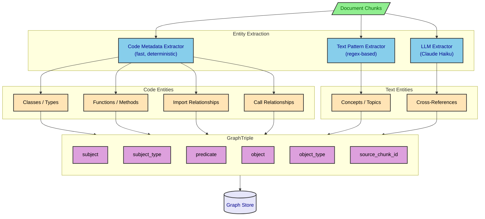

### Example Triplets

| Source | Subject | Predicate | Object | Type |
|--------|---------|-----------|--------|------|
| Code | `QueryService` | `uses` | `VectorStoreManager` | Class dependency |
| Code | `execute_query` | `defined_in` | `query_service.py` | Function location |
| Code | `agent_brain_server` | `imports` | `chromadb` | Import |
| Doc | `Hybrid Search` | `combines` | `BM25` | Concept relation |

### Graph Configuration

| Setting | Default | Description |
|---------|---------|-------------|
| `ENABLE_GRAPH_INDEX` | false | Master switch |
| `GRAPH_STORE_TYPE` | "simple" | Backend (simple or kuzu) |
| `GRAPH_MAX_TRIPLETS_PER_CHUNK` | 10 | Triplet limit per chunk |
| `GRAPH_USE_CODE_METADATA` | true | Use AST metadata |
| `GRAPH_USE_LLM_EXTRACTION` | true | Use LLM extraction |

## Storage Operations

Final storage across all backends.

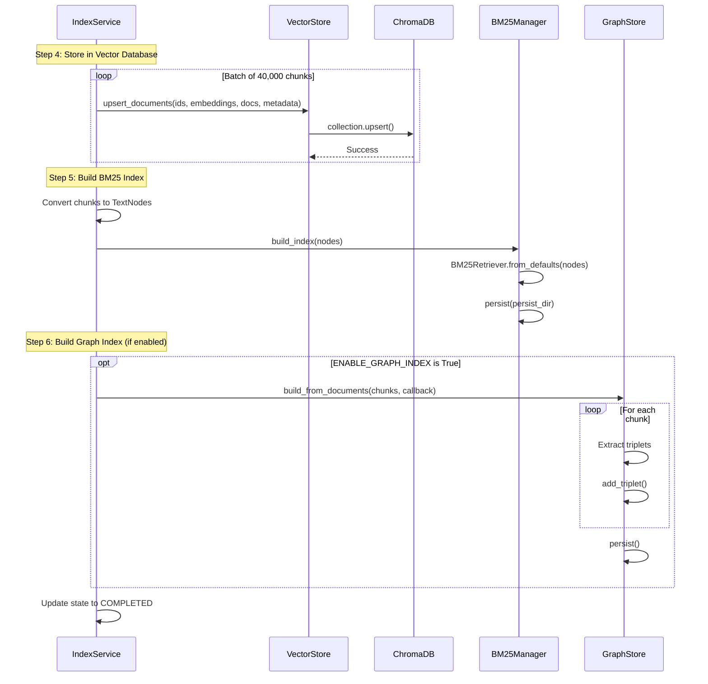

### ChromaDB Batch Size

ChromaDB has a maximum batch size of ~41,666 items. Agent Brain uses batches of 40,000 for safety:

```python
chroma_batch_size = 40000

for batch_start in range(0, len(chunks), chroma_batch_size):
    batch_end = min(batch_start + chroma_batch_size, len(chunks))
    batch_chunks = chunks[batch_start:batch_end]
    batch_embeddings = embeddings[batch_start:batch_end]

    await self.vector_store.upsert_documents(
        ids=[chunk.chunk_id for chunk in batch_chunks],
        embeddings=batch_embeddings,
        documents=[chunk.text for chunk in batch_chunks],
        metadatas=[chunk.metadata.to_dict() for chunk in batch_chunks],
    )
```

## Complete Pipeline Timing

Typical timing for indexing 1000 documents:

```mermaid
gantt
    title Indexing Pipeline Timing (1000 docs)
    dateFormat X
    axisFormat %s

    section Loading
    File Discovery     :0, 2
    Content Loading    :2, 5

    section Chunking
    Document Chunking  :5, 8
    Code Chunking      :8, 15

    section Embedding
    Batch 1-10        :15, 25
    Batch 11-20       :25, 35
    Batch 21-30       :35, 45

    section Storage
    Vector Upsert      :45, 48
    BM25 Build         :48, 50
    Graph Build        :50, 55
```

| Phase | Typical Time | Dominant Factor |
|-------|--------------|-----------------|
| Loading | 5-10s | Disk I/O |
| Chunking | 10-30s | AST parsing |
| Embedding | 30-60s | OpenAI API rate limits |
| Vector Storage | 3-5s | ChromaDB batch insert |
| BM25 Build | 2-5s | Tokenization |
| Graph Build | 5-15s | LLM extraction |

## Error Handling

The pipeline handles failures gracefully:

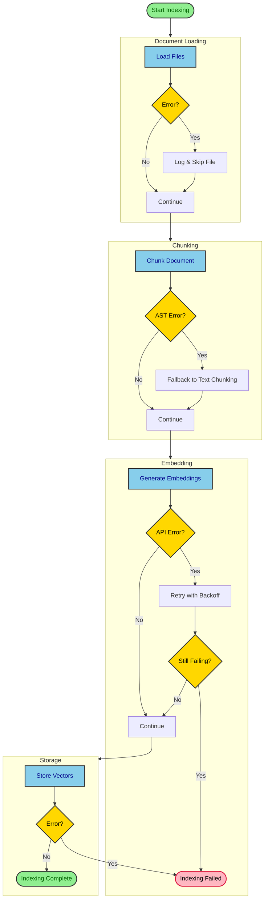

### Fallback Strategies

1. **AST Parsing Failure**: Fall back to text-based chunking
2. **Language Detection Failure**: Skip code-specific metadata
3. **Embedding API Failure**: Exponential backoff retry
4. **Graph Extraction Failure**: Continue without graph (non-critical)
