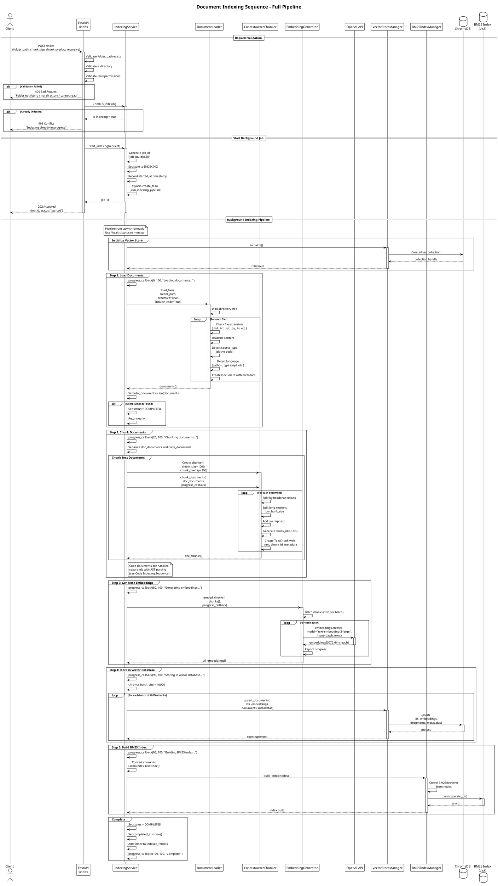
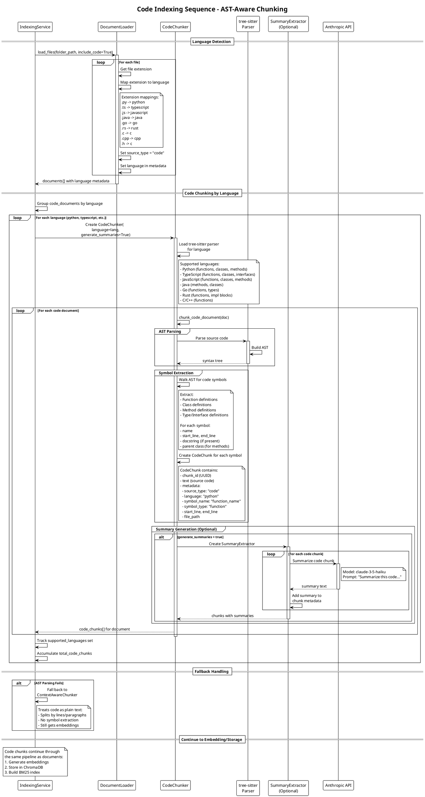
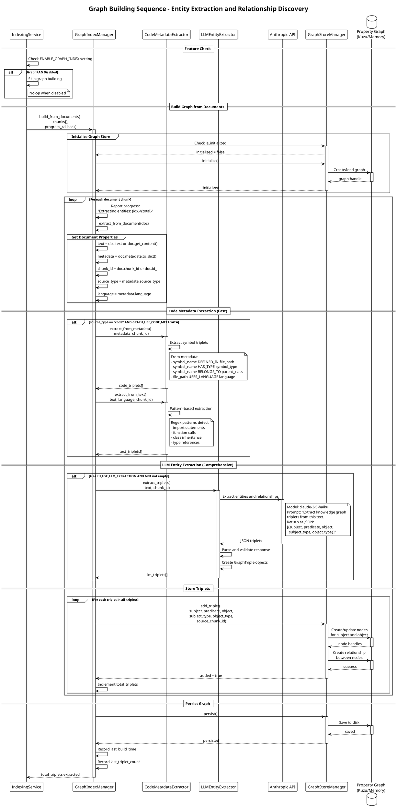
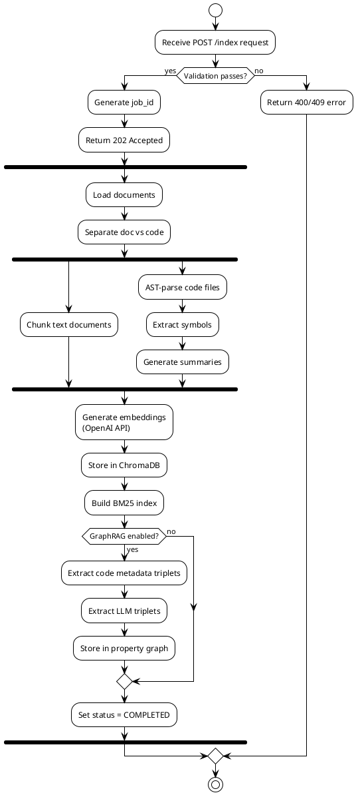

# Indexing Sequence Diagrams

This document contains PlantUML sequence diagrams for all indexing operations in Agent Brain.
Each diagram shows the complete flow from request to completion.

## Table of Contents

1. [Document Indexing Sequence](#1-document-indexing-sequence)
2. [Code Indexing Sequence](#2-code-indexing-sequence)
3. [Graph Building Sequence](#3-graph-building-sequence)

---

## 1. Document Indexing Sequence

### Diagram



### Walkthrough

1. **Request Validation Phase**
   - Client sends POST to `/index` with folder_path and optional parameters
   - API validates: folder exists, is a directory, has read permissions
   - Returns 400 if validation fails
   - Returns 409 if indexing already in progress

2. **Start Background Job Phase**
   - IndexingService generates a unique job_id using UUID
   - Sets state to INDEXING with started_at timestamp
   - Creates async task for the pipeline
   - **Returns immediately** with 202 Accepted (non-blocking)

3. **Document Loading Phase**
   - DocumentLoader walks the directory tree
   - Identifies files by extension (.md, .txt, .py, .ts, etc.)
   - Reads content and detects source_type (doc vs code)
   - For code files, detects programming language
   - Returns list of Document objects with metadata

4. **Chunking Phase**
   - ContextAwareChunker splits documents into chunks
   - Respects section boundaries (headers, paragraphs)
   - Configurable chunk_size (default 1000 chars)
   - Adds chunk_overlap (default 200 chars) for context
   - Each chunk gets a unique UUID-based chunk_id

5. **Embedding Generation Phase**
   - EmbeddingGenerator batches chunks (100 per batch)
   - Calls OpenAI API with text-embedding-3-large model
   - Returns 3072-dimensional vectors
   - **Performance**: ~1-2 seconds per 100 chunks (API latency)

6. **Vector Storage Phase**
   - VectorStoreManager upserts to ChromaDB
   - Batched at 40,000 chunks (ChromaDB limit)
   - Uses cosine distance metric
   - HNSW index is updated automatically

7. **BM25 Index Building Phase**
   - Chunks are converted to LlamaIndex TextNode format
   - BM25Retriever is built from nodes
   - Index is persisted to disk for durability

8. **Completion Phase**
   - State is set to COMPLETED
   - Folder path is added to indexed_folders set
   - Progress callback reports 100%

### Error Handling

| Error | HTTP Status | Message |
|-------|-------------|---------|
| Folder not found | 400 | "Folder not found: {path}" |
| Not a directory | 400 | "Path is not a directory" |
| Permission denied | 400 | "Cannot read folder" |
| Already indexing | 409 | "Indexing already in progress" |
| Pipeline failure | 500 | "Failed to start indexing: {error}" |

### Performance Considerations

- **Embedding generation** is the bottleneck (API calls)
- Consider rate limiting for large corpora
- BM25 index building is CPU-bound but fast
- ChromaDB persistence is automatic but disk I/O bound

---

## 2. Code Indexing Sequence

### Diagram



### Walkthrough

1. **Language Detection Phase**
   - DocumentLoader identifies code files by extension
   - Maps extensions to programming languages
   - Sets `source_type: "code"` and `language` in metadata

2. **Code Chunking by Language Phase**
   - Documents are grouped by programming language
   - Each language uses a specialized CodeChunker
   - Loads the appropriate tree-sitter parser

3. **AST Parsing Phase**
   - tree-sitter parses source code into an AST
   - Provides accurate code structure recognition
   - Handles syntax variations and edge cases

4. **Symbol Extraction Phase**
   - AST is walked to find code symbols:
     - Functions and methods
     - Classes and types
     - Interfaces (TypeScript)
     - Impl blocks (Rust)
   - Each symbol becomes a separate CodeChunk
   - Metadata includes: name, type, line numbers, parent class

5. **Summary Generation Phase (Optional)**
   - If `generate_summaries=True`, chunks are summarized
   - Uses Claude Haiku for fast, cheap summaries
   - Summaries are added to chunk metadata
   - Useful for improving semantic search quality

6. **Fallback Handling**
   - If AST parsing fails, falls back to text chunking
   - Code is treated as plain text
   - Still gets embedded and indexed

### Supported Languages

| Language | Parser | Extracted Symbols |
|----------|--------|-------------------|
| Python | tree-sitter-python | functions, classes, methods |
| TypeScript | tree-sitter-typescript | functions, classes, interfaces, methods |
| JavaScript | tree-sitter-javascript | functions, classes, methods |
| Java | tree-sitter-java | classes, methods |
| Go | tree-sitter-go | functions, types |
| Rust | tree-sitter-rust | functions, impl blocks |
| C | tree-sitter-c | functions |
| C++ | tree-sitter-cpp | functions, classes |

### CodeChunk Metadata

```python
{
    "chunk_id": "abc123...",
    "source_type": "code",
    "language": "python",
    "symbol_name": "process_data",
    "symbol_type": "function",
    "start_line": 45,
    "end_line": 78,
    "file_path": "/src/processor.py",
    "parent_class": null,  # or "DataProcessor" for methods
    "docstring": "Process input data...",
    "summary": "This function processes..."  # if generate_summaries
}
```

### Performance Considerations

- tree-sitter parsing is very fast (~1ms per file)
- Summary generation adds significant latency (Claude API calls)
- Consider disabling summaries for large codebases
- Batch summary generation where possible

---

## 3. Graph Building Sequence

### Diagram



### Walkthrough

1. **Feature Check Phase**
   - Verifies ENABLE_GRAPH_INDEX environment variable
   - Graph building is a no-op when disabled
   - Allows Agent Brain to run without GraphRAG overhead

2. **Graph Store Initialization Phase**
   - GraphStoreManager initializes if not already done
   - Creates or loads the property graph database
   - Supports in-memory or Kuzu persistent storage

3. **Document Iteration Phase**
   - Processes each document chunk from the indexing pipeline
   - Extracts document properties (text, metadata, chunk_id)
   - Reports progress via callback

4. **Code Metadata Extraction Phase** (Fast, Deterministic)
   - Uses CodeMetadataExtractor for structured extraction
   - Creates triplets from code metadata:
     - `function_name DEFINED_IN file.py`
     - `ClassName HAS_TYPE class`
     - `method BELONGS_TO ClassName`
     - `file.py USES_LANGUAGE python`
   - Pattern-based extraction from code text:
     - Import statements
     - Function calls
     - Class inheritance
     - Type references

5. **LLM Entity Extraction Phase** (Comprehensive, Slower)
   - Uses Claude Haiku for intelligent extraction
   - Discovers conceptual relationships not visible in syntax
   - Returns structured JSON triplets
   - Validates and converts to GraphTriple objects

6. **Triplet Storage Phase**
   - Each triplet is added to the property graph
   - Creates nodes for subject and object entities
   - Creates typed relationship between nodes
   - Links triplet to source_chunk_id for retrieval

7. **Persistence Phase**
   - Graph is saved to disk for durability
   - Records build timestamp and triplet count

### GraphTriple Structure

```python
class GraphTriple:
    subject: str           # "QueryService"
    predicate: str         # "uses"
    object: str            # "VectorStoreManager"
    subject_type: str      # "class"
    object_type: str       # "class"
    source_chunk_id: str   # "abc123..."
```

### Extraction Examples

**Code Metadata Extraction**:
```
# From: def process_data(input: DataFrame) -> Result:
Triplets:
- process_data DEFINED_IN utils.py
- process_data HAS_TYPE function
- process_data ACCEPTS DataFrame
- process_data RETURNS Result
```

**LLM Entity Extraction**:
```
# From: "The QueryService orchestrates search operations
#        by coordinating between the embedding generator
#        and vector store for semantic retrieval."
Triplets:
- QueryService orchestrates search_operations
- QueryService coordinates embedding_generator
- QueryService coordinates vector_store
- embedding_generator enables semantic_retrieval
```

### Configuration Settings

| Setting | Default | Description |
|---------|---------|-------------|
| ENABLE_GRAPH_INDEX | false | Enable/disable GraphRAG |
| GRAPH_USE_CODE_METADATA | true | Extract from code metadata |
| GRAPH_USE_LLM_EXTRACTION | true | Use LLM for extraction |
| GRAPH_STORE_TYPE | "memory" | Storage backend |

### Performance Considerations

- Code metadata extraction is fast (~1ms per chunk)
- LLM extraction adds ~200-500ms per chunk (Claude API)
- Consider disabling LLM extraction for large codebases
- Memory graph store is faster but not persistent
- Kuzu provides persistence but adds I/O overhead

---

## Index Status Monitoring

The `/health/status` endpoint provides real-time indexing status:

```json
{
    "status": "indexing",
    "is_indexing": true,
    "current_job_id": "job_a1b2c3d4e5f6",
    "folder_path": "/path/to/docs",
    "total_documents": 150,
    "processed_documents": 75,
    "total_chunks": 450,
    "total_doc_chunks": 300,
    "total_code_chunks": 150,
    "supported_languages": ["python", "typescript"],
    "progress_percent": 50,
    "started_at": "2024-01-15T10:30:00Z",
    "completed_at": null,
    "error": null,
    "indexed_folders": ["/path/to/docs"],
    "graph_index": {
        "enabled": true,
        "initialized": true,
        "entity_count": 234,
        "relationship_count": 567,
        "store_type": "memory"
    }
}
```

---

## Complete Indexing Flow Summary


