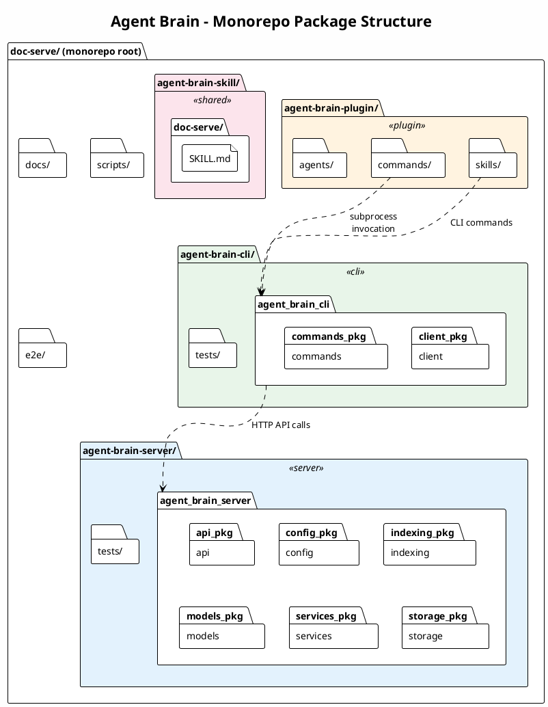
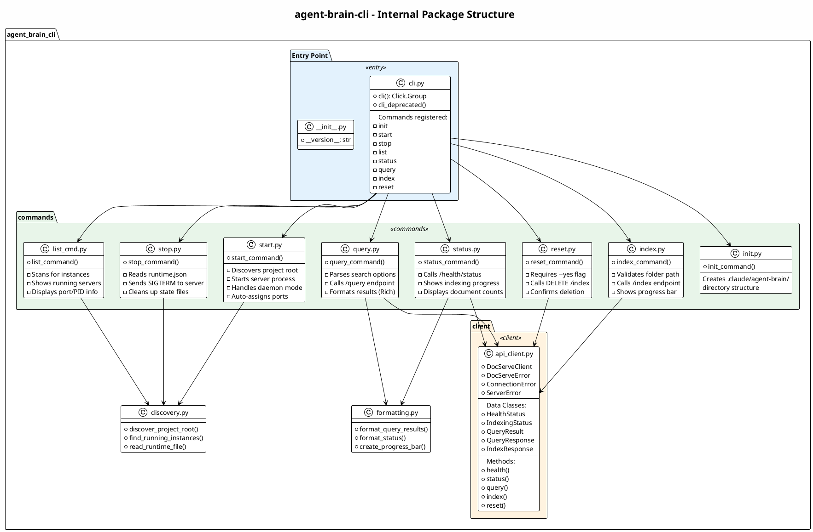
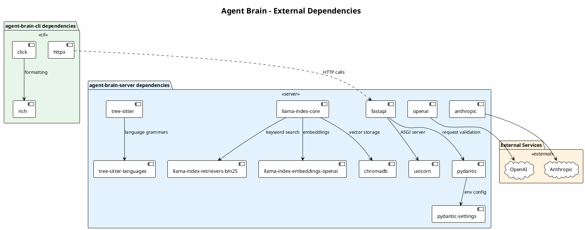
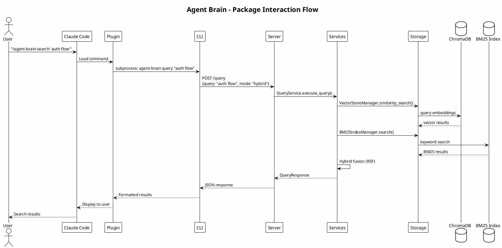

# Agent Brain Package Diagrams

This document contains PlantUML package diagrams showing the internal structure of Agent Brain components and their dependencies.

## Monorepo Package Structure



### Monorepo Structure Description

| Package | Purpose | Technology |
|---------|---------|------------|
| **agent-brain-server** | FastAPI REST API server | Python, FastAPI, LlamaIndex, ChromaDB |
| **agent-brain-cli** | Command-line management tool | Python, Click, Rich, httpx |
| **agent-brain-plugin** | Claude Code integration | Markdown (Claude plugin format) |
| **agent-brain-skill** | Legacy skill definition | Markdown |
| **docs/** | User and developer documentation | Markdown |
| **scripts/** | Automation and testing scripts | Bash |
| **e2e/** | End-to-end integration tests | Python, pytest |

---

## Server Package Structure

```plantuml
@startuml Server Package Structure
!theme plain
skinparam backgroundColor #FEFEFE

title agent-brain-server - Internal Package Structure

skinparam package {
    BackgroundColor<<api>> #E3F2FD
    BackgroundColor<<core>> #E8F5E9
    BackgroundColor<<data>> #FFF3E0
    BackgroundColor<<external>> #FCE4EC
}

package "agent_brain_server" {

    ' API Layer
    package "api" <<api>> {
        class "main.py" as main {
            + app: FastAPI
            + lifespan()
            + run()
            + cli()
        }

        package "routers" {
            class "health.py" as health_router {
                + router: APIRouter
                + health_check()
                + get_status()
            }

            class "query.py" as query_router {
                + router: APIRouter
                + query_documents()
                + get_document_count()
            }

            class "index.py" as index_router {
                + router: APIRouter
                + index_documents()
                + add_documents()
                + reset_index()
            }
        }
    }

    ' Configuration
    package "config" <<core>> {
        class "settings.py" as settings {
            + Settings: BaseSettings
            + API_HOST: str
            + API_PORT: int
            + OPENAI_API_KEY: str
            + ANTHROPIC_API_KEY: str
            + EMBEDDING_MODEL: str
            + CHROMA_PERSIST_DIR: str
            + ENABLE_GRAPH_INDEX: bool
            --
            + get_settings(): Settings
        }
    }

    ' Models Layer
    package "models" <<data>> {
        class "query.py" as query_models {
            + QueryMode: Enum
            + QueryRequest: BaseModel
            + QueryResponse: BaseModel
            + QueryResult: BaseModel
        }

        class "index.py" as index_models {
            + IndexRequest: BaseModel
            + IndexResponse: BaseModel
            + IndexingState: BaseModel
            + IndexingStatusEnum: Enum
        }

        class "health.py" as health_models {
            + HealthResponse: BaseModel
            + StatusResponse: BaseModel
        }

        class "graph.py" as graph_models {
            + GraphIndexStatus: BaseModel
            + EntityInfo: BaseModel
            + RelationshipInfo: BaseModel
        }
    }

    ' Services Layer
    package "services" <<core>> {
        class "query_service.py" as query_service {
            + QueryService
            - vector_store: VectorStoreManager
            - bm25_manager: BM25IndexManager
            - graph_index_manager: GraphIndexManager
            --
            + execute_query()
            + _execute_vector_query()
            + _execute_bm25_query()
            + _execute_hybrid_query()
            + _execute_graph_query()
            + _execute_multi_query()
        }

        class "indexing_service.py" as indexing_service {
            + IndexingService
            - vector_store: VectorStoreManager
            - document_loader: DocumentLoader
            - chunker: ContextAwareChunker
            - bm25_manager: BM25IndexManager
            --
            + start_indexing()
            + _run_indexing_pipeline()
            + get_status()
            + reset()
        }
    }

    ' Indexing Layer
    package "indexing" <<core>> {
        class "document_loader.py" as doc_loader {
            + DocumentLoader
            + SUPPORTED_EXTENSIONS
            --
            + load_files()
            + _load_document()
            + _detect_language()
        }

        class "chunking.py" as chunking {
            + TextChunk
            + CodeChunk
            + ChunkMetadata
            + ContextAwareChunker
            + CodeChunker
            --
            + chunk_documents()
            + chunk_code_document()
        }

        class "embedding.py" as embedding {
            + EmbeddingGenerator
            --
            + embed_query()
            + embed_chunks()
        }

        class "bm25_index.py" as bm25 {
            + BM25IndexManager
            --
            + initialize()
            + build_index()
            + get_retriever()
            + search_with_filters()
        }

        class "graph_index.py" as graph_index {
            + GraphIndexManager
            --
            + build_from_documents()
            + query()
            + get_status()
        }

        class "graph_extractors.py" as extractors {
            + EntityExtractor
            + RelationshipExtractor
            --
            + extract_from_code()
            + extract_from_text()
        }
    }

    ' Storage Layer
    package "storage" <<data>> {
        class "vector_store.py" as vector_store {
            + VectorStoreManager
            + SearchResult
            --
            + initialize()
            + add_documents()
            + upsert_documents()
            + similarity_search()
            + get_count()
            + reset()
        }

        class "graph_store.py" as graph_store {
            + GraphStoreManager
            + _MinimalGraphStore
            --
            + initialize()
            + add_triplet()
            + persist()
            + load()
            + clear()
        }
    }

    ' Utility Modules
    class "runtime.py" as runtime {
        + RuntimeState
        + write_runtime()
        + read_runtime()
        + delete_runtime()
    }

    class "locking.py" as locking {
        + acquire_lock()
        + release_lock()
        + is_stale()
        + cleanup_stale()
    }

    class "storage_paths.py" as paths {
        + resolve_state_dir()
        + resolve_storage_paths()
    }

    class "project_root.py" as project_root {
        + resolve_project_root()
    }
}

' Dependencies within server
main --> health_router
main --> query_router
main --> index_router

main --> settings
main --> query_service
main --> indexing_service
main --> locking
main --> runtime
main --> paths

query_router --> query_service
query_router --> query_models
index_router --> indexing_service
index_router --> index_models
health_router --> health_models

query_service --> vector_store
query_service --> bm25
query_service --> graph_index
query_service --> embedding
query_service --> query_models

indexing_service --> vector_store
indexing_service --> bm25
indexing_service --> graph_index
indexing_service --> doc_loader
indexing_service --> chunking
indexing_service --> embedding
indexing_service --> index_models

graph_index --> graph_store
graph_index --> extractors
graph_index --> graph_models

@enduml
```



### Server Package Descriptions

| Package | Purpose | Key Classes |
|---------|---------|-------------|
| **api** | REST API endpoints and FastAPI app | `main.py`, routers |
| **api.routers** | Route handlers for each endpoint group | `health`, `query`, `index` |
| **config** | Pydantic settings and configuration | `Settings` |
| **models** | Pydantic request/response models | `QueryRequest`, `IndexRequest` |
| **services** | Business logic orchestration | `QueryService`, `IndexingService` |
| **indexing** | Document processing pipeline | `DocumentLoader`, `Chunker`, `Embedding` |
| **storage** | Persistence layer abstractions | `VectorStoreManager`, `GraphStoreManager` |

---

## CLI Package Structure



### CLI Package Descriptions

| Package/Module | Purpose | Key Functions |
|----------------|---------|---------------|
| **cli.py** | Click group entry point | `cli()` - main command group |
| **commands/** | Individual CLI commands | One module per command |
| **commands/init.py** | Initialize project structure | Creates `.claude/agent-brain/` |
| **commands/start.py** | Start server process | Spawns uvicorn, handles daemon mode |
| **commands/stop.py** | Stop running server | Reads PID, sends SIGTERM |
| **commands/list_cmd.py** | List running instances | Scans for runtime.json files |
| **commands/status.py** | Check server status | Calls health endpoints |
| **commands/query.py** | Execute search queries | Formats results with Rich |
| **commands/index.py** | Index documents | Shows progress, handles errors |
| **commands/reset.py** | Clear index | Requires confirmation |
| **client/** | HTTP client for server API | `DocServeClient` class |

---

## Plugin Package Structure

```plantuml
@startuml Plugin Package Structure
!theme plain
skinparam backgroundColor #FEFEFE

title agent-brain-plugin - Internal Structure

skinparam package {
    BackgroundColor<<commands>> #E3F2FD
    BackgroundColor<<skills>> #E8F5E9
    BackgroundColor<<agents>> #FFF3E0
    BackgroundColor<<config>> #FCE4EC
}

package "agent-brain-plugin" {

    ' Configuration
    package ".claude-plugin/" <<config>> {
        file "marketplace.json" as marketplace {
            name: "agent-brain"
            version: "1.0.0"
            description: "..."
            commands: [...]
            skills: [...]
            agents: [...]
        }
    }

    ' Commands
    package "commands/" <<commands>> {

        frame "Search Commands" {
            file "agent-brain-search.md" as search_cmd
            note right: "Hybrid BM25 + semantic"

            file "agent-brain-semantic.md" as semantic_cmd
            note right: "Vector-only search"

            file "agent-brain-keyword.md" as keyword_cmd
            note right: "BM25-only search"
        }

        frame "Setup Commands" {
            file "agent-brain-install.md" as install_cmd
            file "agent-brain-setup.md" as setup_cmd
            file "agent-brain-config.md" as config_cmd
            file "agent-brain-init.md" as init_cmd
            file "agent-brain-verify.md" as verify_cmd
        }

        frame "Server Commands" {
            file "agent-brain-start.md" as start_cmd
            file "agent-brain-stop.md" as stop_cmd
            file "agent-brain-status.md" as status_cmd
            file "agent-brain-list.md" as list_cmd
        }

        frame "Indexing Commands" {
            file "agent-brain-index.md" as index_cmd
            file "agent-brain-reset.md" as reset_cmd
        }

        frame "Help" {
            file "agent-brain-help.md" as help_cmd
        }
    }

    ' Skills
    package "skills/" <<skills>> {

        package "using-agent-brain/" as using_skill {
            file "SKILL.md" as using_main
            note right
                Search mode guidance
                When to use each mode
            end note

            folder "references/" {
                file "api_reference.md" as api_ref
                file "hybrid-search-guide.md" as hybrid_guide
                file "bm25-search-guide.md" as bm25_guide
                file "vector-search-guide.md" as vector_guide
            }
        }

        package "agent-brain-setup/" as setup_skill {
            file "SKILL.md" as setup_main
            note right
                Installation guidance
                Configuration help
            end note

            folder "references/" {
                file "installation-guide.md" as install_guide
                file "configuration-guide.md" as config_guide
                file "troubleshooting-guide.md" as trouble_guide
            }
        }
    }

    ' Agents
    package "agents/" <<agents>> {
        file "search-assistant.md" as search_agent
        note right
            Helps users find relevant
            documents and code
        end note

        file "setup-assistant.md" as setup_agent
        note right
            Guides installation
            and configuration
        end note
    }
}

' Relationships
marketplace ..> search_cmd : registers
marketplace ..> using_skill : registers
marketplace ..> search_agent : registers

@enduml
```

### Plugin Components

| Component Type | Count | Purpose |
|----------------|-------|---------|
| **Commands** | 15 | Slash commands for Claude Code |
| **Skills** | 2 | Reference documentation for Claude |
| **Agents** | 2 | Specialized Claude assistants |

### Command Categories

| Category | Commands | Description |
|----------|----------|-------------|
| **Search** | `search`, `semantic`, `keyword` | Execute different search modes |
| **Setup** | `install`, `setup`, `config`, `init`, `verify` | Installation and configuration |
| **Server** | `start`, `stop`, `status`, `list` | Server lifecycle management |
| **Indexing** | `index`, `reset` | Document management |
| **Help** | `help` | Command reference |

---

## Package Dependencies (External)



### Dependency Summary

| Package | Key Dependencies | Purpose |
|---------|-----------------|---------|
| **Server** | FastAPI, LlamaIndex, ChromaDB | REST API, RAG pipeline, vector storage |
| **CLI** | Click, Rich, httpx | CLI framework, formatting, HTTP client |
| **Both** | Pydantic | Data validation and settings |

### Version Requirements

```
# Server (pyproject.toml)
python = "^3.10"
fastapi = "^0.109.0"
uvicorn = "^0.27.0"
llama-index-core = "^0.14.0"
chromadb = "^0.4.22"
openai = "^1.12.0"

# CLI (pyproject.toml)
python = "^3.10"
click = "^8.1.0"
rich = "^13.7.0"
httpx = "^0.26.0"
```

---

## Package Interaction Flow



This diagram shows the complete flow from user interaction through Claude Code, the plugin, CLI, server, and storage layers.
