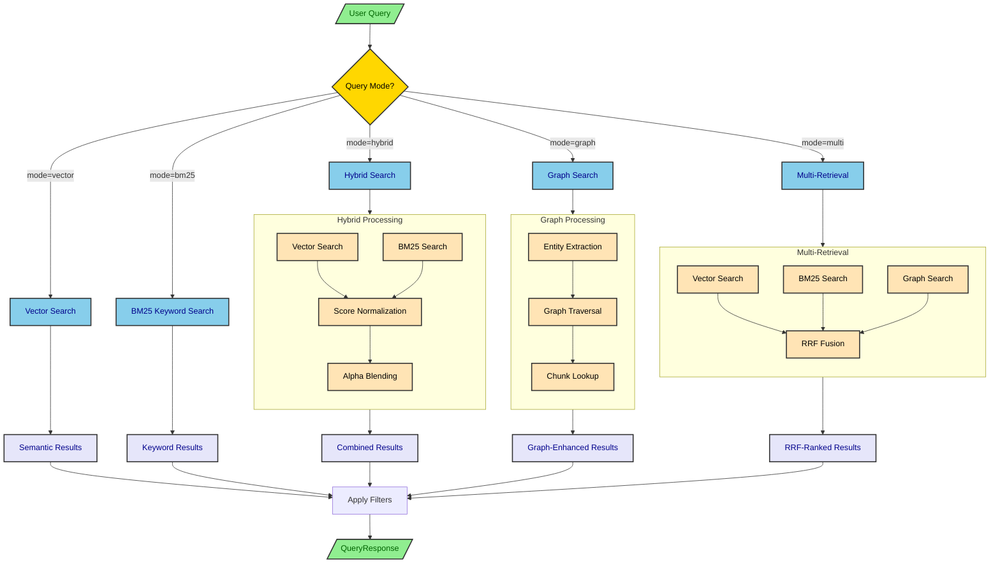
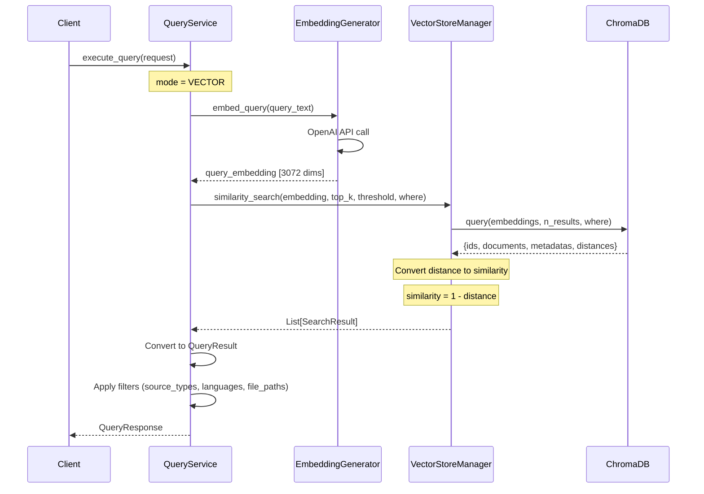
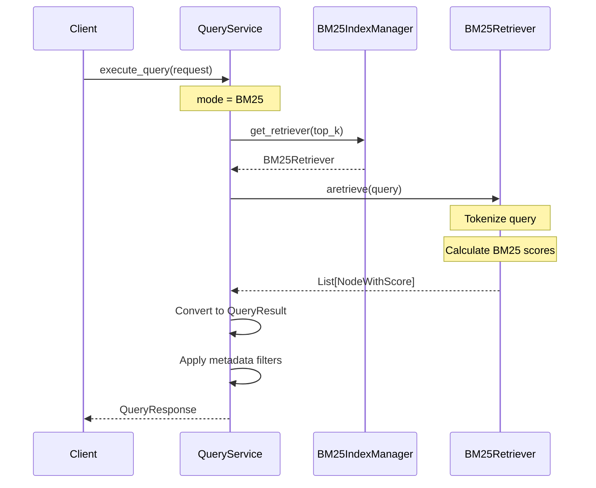
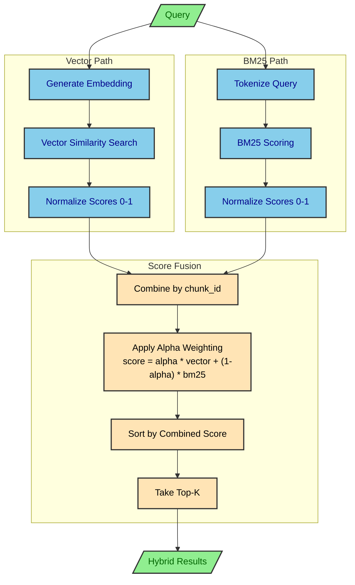
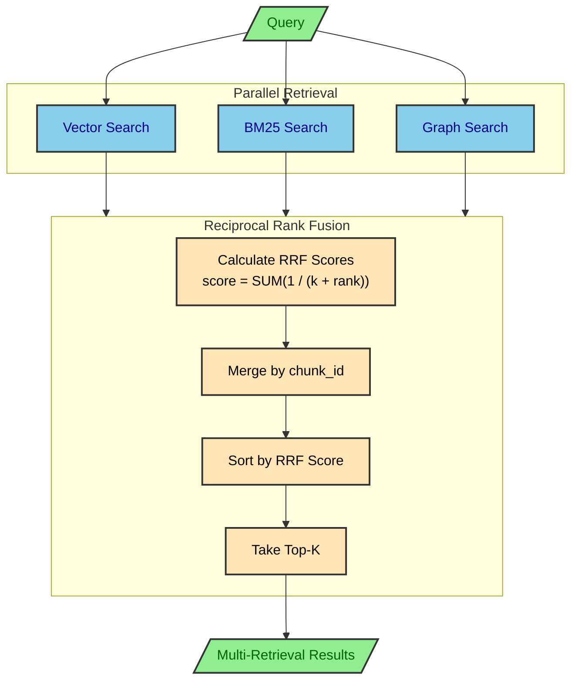
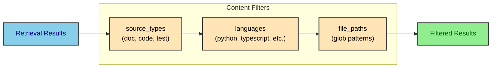
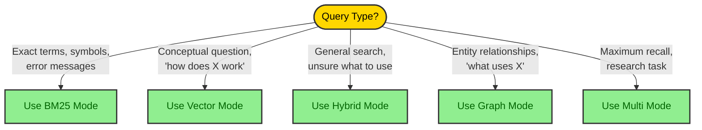

# Query Flow Architecture

This document details how queries are routed, processed, and ranked in Agent Brain's multi-modal retrieval system.

## Query Modes Overview

Agent Brain supports five distinct query modes, each optimized for different search scenarios.



## Query Mode Comparison

| Mode | Speed | Use Case | Algorithm | Score Type |
|------|-------|----------|-----------|------------|
| **VECTOR** | Medium | Conceptual queries, explanations | Cosine similarity | 0.0-1.0 similarity |
| **BM25** | Fast | Exact terms, function names, errors | TF-IDF + BM25 | BM25 score |
| **HYBRID** | Slow | General queries, balanced retrieval | Vector + BM25 with alpha | Weighted blend |
| **GRAPH** | Medium | Entity relationships, call chains | Graph traversal | Graph relevance |
| **MULTI** | Slowest | Maximum recall, comprehensive | RRF over all modes | RRF score |

## Vector Search Flow

Pure semantic search using OpenAI embeddings and ChromaDB.



### Vector Search Details

1. **Query Embedding**: The query text is converted to a 3072-dimensional vector using OpenAI's `text-embedding-3-large` model
2. **Cosine Similarity**: ChromaDB uses cosine distance (configured via `hnsw:space: cosine`)
3. **Distance to Similarity**: Scores are converted from distance (0 = identical) to similarity (1 = identical)
4. **Threshold Filtering**: Results below `similarity_threshold` are excluded

## BM25 Keyword Search Flow

Fast keyword-based retrieval using the BM25 ranking algorithm.



### BM25 Algorithm

BM25 (Best Matching 25) is a probabilistic ranking function:

```
score(D,Q) = SUM( IDF(qi) * (f(qi,D) * (k1 + 1)) / (f(qi,D) + k1 * (1 - b + b * |D|/avgdl)) )
```

Where:
- **IDF(qi)**: Inverse document frequency of term qi
- **f(qi,D)**: Term frequency in document D
- **|D|/avgdl**: Document length normalization
- **k1, b**: Tuning parameters (typically k1=1.5, b=0.75)

### Advantages of BM25

1. **Exact Match**: Finds exact term occurrences
2. **Speed**: No API calls required
3. **Transparent**: Scores based on term statistics
4. **Technical Content**: Excellent for code symbols, error messages

## Hybrid Search Flow

Combines vector and BM25 search with configurable weighting.



### Hybrid Score Calculation

```python
# Score normalization
vector_normalized = vector_score / max_vector_score
bm25_normalized = bm25_score / max_bm25_score

# Alpha blending (default alpha = 0.5)
combined_score = (alpha * vector_normalized) + ((1 - alpha) * bm25_normalized)
```

### Alpha Parameter Guide

| Alpha | Vector Weight | BM25 Weight | Best For |
|-------|---------------|-------------|----------|
| 0.0 | 0% | 100% | Pure keyword search |
| 0.3 | 30% | 70% | Technical documentation |
| 0.5 | 50% | 50% | Balanced (default) |
| 0.7 | 70% | 30% | Conceptual queries |
| 1.0 | 100% | 0% | Pure semantic search |

## Graph Search Flow (GraphRAG)

Knowledge graph-based retrieval using entity relationships.

```mermaid
flowchart TB
    Query[/"Query Text"/]

    subgraph EntityExtraction["Entity Extraction"]
        direction TB
        Parse[Parse Query]
        Identify["Identify Entities<br/>(CamelCase, snake_case, etc.)"]
        Clean[Clean & Deduplicate]
    end

    Query --> Parse
    Parse --> Identify
    Identify --> Clean

    Clean --> GraphQuery

    subgraph GraphQuery["Graph Traversal"]
        direction TB
        Match[Match Entities in Graph]
        Traverse["Traverse Relationships<br/>(depth = traversal_depth)"]
        Collect[Collect Triplets]
    end

    Match --> Traverse
    Traverse --> Collect

    Collect --> ChunkLookup

    subgraph ChunkLookup["Document Lookup"]
        direction TB
        GetIDs[Get source_chunk_ids]
        FetchDocs[Fetch from VectorStore]
        BuildResults[Build QueryResults]
    end

    GetIDs --> FetchDocs
    FetchDocs --> BuildResults

    BuildResults --> Fallback

    subgraph Fallback["Fallback Logic"]
        direction TB
        Check{Results Found?}
        VectorFallback[Vector Search Fallback]
    end

    Check -->|No| VectorFallback
    Check -->|Yes| Response

    VectorFallback --> Response[/"Graph Results"/]

    classDef query fill:#90EE90,stroke:#333,stroke-width:2px,color:darkgreen
    classDef extract fill:#87CEEB,stroke:#333,stroke-width:2px,color:darkblue
    classDef graph fill:#FFE4B5,stroke:#333,stroke-width:2px,color:black
    classDef lookup fill:#E6E6FA,stroke:#333,stroke-width:2px,color:darkblue
    classDef decision fill:#FFD700,stroke:#333,stroke-width:2px,color:black

    class Query,Response query
    class Parse,Identify,Clean extract
    class Match,Traverse,Collect graph
    class GetIDs,FetchDocs,BuildResults lookup
    class Check decision
```

### Entity Extraction Patterns

The graph query extracts entities using these patterns:

| Pattern | Example | Entity Type |
|---------|---------|-------------|
| CamelCase | `QueryService` | Class/Type |
| PascalCase | `VectorStoreManager` | Class/Type |
| snake_case | `execute_query` | Function |
| SCREAMING_SNAKE | `MAX_CHUNK_SIZE` | Constant |
| Capitalized | `FastAPI` | Framework/Library |

### Graph Result Enhancement

Graph results include additional context:
- **related_entities**: Connected entities in the graph
- **relationship_path**: e.g., "QueryService -> uses -> VectorStoreManager"
- **graph_score**: Relevance based on traversal distance

## Multi-Retrieval with RRF

Combines all retrieval methods using Reciprocal Rank Fusion.



### RRF Algorithm

Reciprocal Rank Fusion combines rankings without requiring score normalization:

```python
# RRF constant (default k=60)
k = settings.GRAPH_RRF_K

# For each retriever
for rank, result in enumerate(vector_results):
    rrf_scores[chunk_id] += 1.0 / (k + rank + 1)

for rank, result in enumerate(bm25_results):
    rrf_scores[chunk_id] += 1.0 / (k + rank + 1)

for rank, result in enumerate(graph_results):
    rrf_scores[chunk_id] += 1.0 / (k + rank + 1)

# Final ranking by RRF score
final_results = sorted(combined, key=lambda x: x.rrf_score, reverse=True)
```

### Why RRF?

1. **Score Independence**: Works with incompatible scoring systems
2. **Rank-Based**: Focuses on relative ordering, not absolute scores
3. **Robust**: Less sensitive to outliers
4. **Simple**: Single hyperparameter (k)

## Content Filtering

All query modes support post-retrieval filtering.



### Filter Examples

```python
# Code-only search
QueryRequest(
    query="authentication",
    source_types=["code"],
    languages=["python", "typescript"]
)

# Documentation search
QueryRequest(
    query="setup guide",
    source_types=["doc"],
    file_paths=["docs/*.md"]
)

# Test file search
QueryRequest(
    query="test coverage",
    source_types=["test"],
    languages=["python"]
)
```

## Query Request Model

```python
class QueryRequest(BaseModel):
    query: str                    # Search text (1-1000 chars)
    top_k: int = 5                # Results to return (1-50)
    similarity_threshold: float = 0.7  # Min score (0-1)
    mode: QueryMode = HYBRID      # vector, bm25, hybrid, graph, multi
    alpha: float = 0.5            # Hybrid weighting (0=BM25, 1=vector)

    # Filters
    source_types: list[str] | None  # doc, code, test
    languages: list[str] | None     # python, typescript, etc.
    file_paths: list[str] | None    # Glob patterns
```

## Query Response Model

```python
class QueryResult(BaseModel):
    text: str                     # Chunk content
    source: str                   # File path
    score: float                  # Primary score
    vector_score: float | None    # Vector similarity
    bm25_score: float | None      # BM25 score
    graph_score: float | None     # Graph relevance
    chunk_id: str                 # Unique identifier
    source_type: str              # doc, code, test
    language: str | None          # Programming language
    related_entities: list[str] | None  # Graph entities
    relationship_path: list[str] | None # Graph paths
    metadata: dict                # Additional metadata

class QueryResponse(BaseModel):
    results: list[QueryResult]    # Ranked results
    query_time_ms: float          # Execution time
    total_results: int            # Result count
```

## Performance Characteristics

| Mode | Latency | API Calls | Memory | Best For |
|------|---------|-----------|--------|----------|
| **BM25** | 10-50ms | 0 | Low | Interactive search |
| **VECTOR** | 100-300ms | 1 (OpenAI) | Medium | Semantic queries |
| **HYBRID** | 150-400ms | 1 (OpenAI) | Medium | General search |
| **GRAPH** | 100-500ms | 0 | High | Entity exploration |
| **MULTI** | 200-600ms | 1 (OpenAI) | High | Comprehensive |

## Choosing the Right Mode


