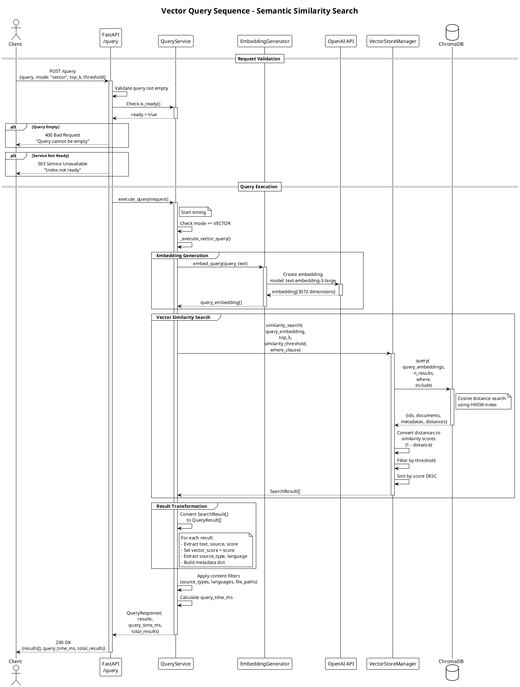
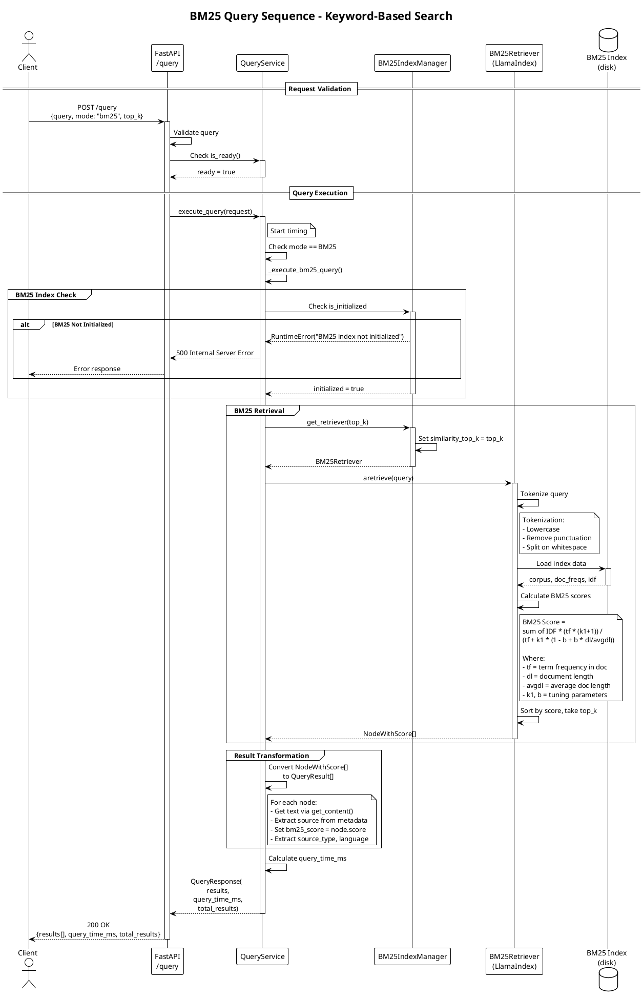
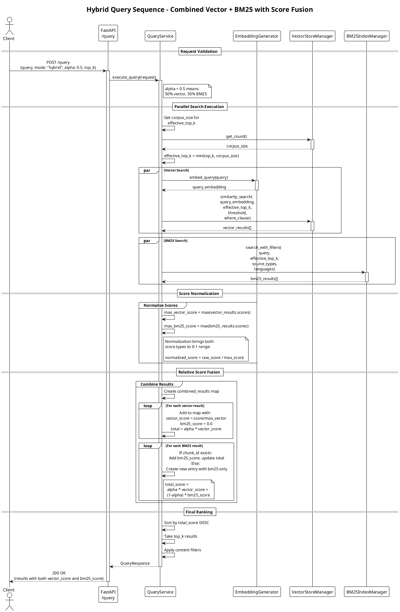
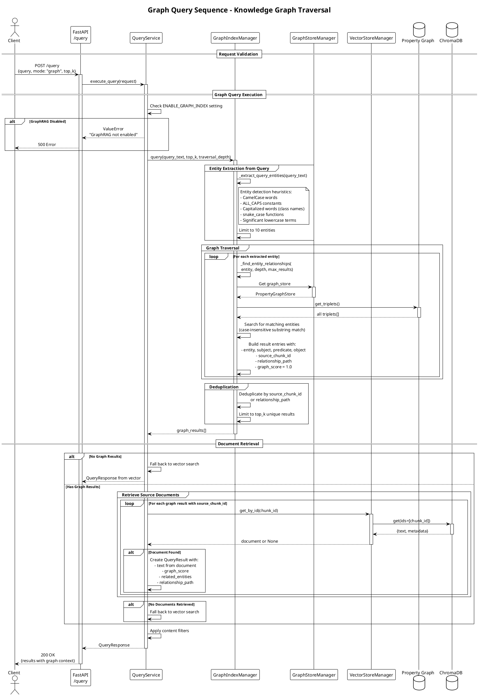
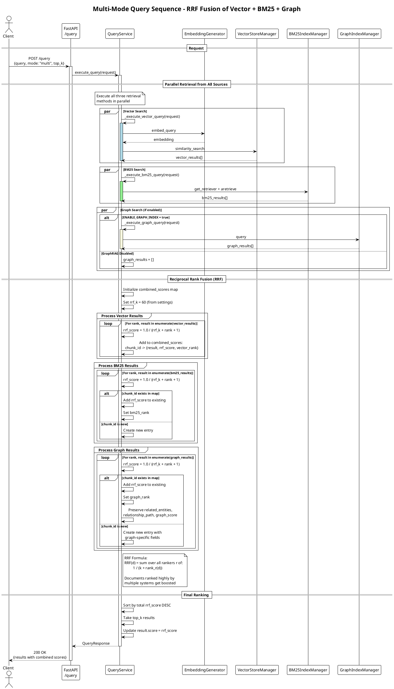

# Query Sequence Diagrams

This document contains PlantUML sequence diagrams for all query modes in Agent Brain.
Each diagram shows the complete flow from client request to response.

## Table of Contents

1. [Vector Query Sequence](#1-vector-query-sequence)
2. [BM25 Query Sequence](#2-bm25-query-sequence)
3. [Hybrid Query Sequence](#3-hybrid-query-sequence)
4. [Graph Query Sequence](#4-graph-query-sequence)
5. [Multi-Mode Query Sequence](#5-multi-mode-query-sequence)

---

## 1. Vector Query Sequence

### Diagram



### Walkthrough

1. **Request Validation Phase**
   - Client sends POST request to `/query` endpoint with query text and mode="vector"
   - FastAPI validates the request body against `QueryRequest` Pydantic model
   - API checks if query is non-empty (returns 400 if empty)
   - API checks if QueryService is ready (returns 503 if indexing or not initialized)

2. **Embedding Generation Phase**
   - QueryService delegates to EmbeddingGenerator
   - EmbeddingGenerator calls OpenAI API with model `text-embedding-3-large`
   - Returns a 3072-dimensional embedding vector
   - **Performance**: ~100-200ms per query (OpenAI API latency)

3. **Vector Similarity Search Phase**
   - VectorStoreManager queries ChromaDB with the embedding
   - ChromaDB uses HNSW (Hierarchical Navigable Small World) algorithm for efficient ANN search
   - Cosine distance is used, then converted to similarity score (1 - distance)
   - Results are filtered by similarity threshold and sorted descending
   - **Performance**: ~10-50ms for typical corpus sizes

4. **Result Transformation Phase**
   - SearchResults are converted to QueryResult objects with enriched metadata
   - vector_score field is populated with the similarity score
   - Content filters (source_types, languages, file_paths) are applied post-retrieval

### Error Handling

- **Empty Query**: Returns 400 with "Query cannot be empty"
- **Service Not Ready**: Returns 503 with appropriate message
- **OpenAI API Failure**: Propagates as 500 Internal Server Error
- **ChromaDB Failure**: Propagates as 500 Internal Server Error

### Performance Considerations

- Embedding generation is the primary latency contributor
- Consider caching embeddings for repeated queries
- ChromaDB HNSW provides O(log n) search complexity
- Threshold filtering happens after retrieval (not optimized in ChromaDB query)

---

## 2. BM25 Query Sequence

### Diagram



### Walkthrough

1. **Request Validation Phase**
   - Client sends POST request with mode="bm25"
   - Standard validation for non-empty query and service readiness

2. **BM25 Index Check Phase**
   - Verifies the BM25 index has been initialized
   - Index is built during document indexing and persisted to disk
   - **Error**: Throws RuntimeError if index not initialized

3. **BM25 Retrieval Phase**
   - BM25Retriever is obtained with configured top_k
   - Query is tokenized (lowercase, remove punctuation, split)
   - BM25 scores are calculated using the classic formula
   - Results are sorted by score and top_k are returned
   - **Performance**: ~5-20ms (all in-memory after initial load)

4. **Result Transformation Phase**
   - NodeWithScore objects are converted to QueryResult
   - bm25_score field is populated with the BM25 relevance score

### BM25 Algorithm Details

The BM25 (Best Matching 25) algorithm scores documents based on:
- **Term Frequency (tf)**: How often query terms appear in the document
- **Inverse Document Frequency (IDF)**: Rarity of terms across corpus
- **Document Length Normalization**: Penalizes long documents

Key parameters:
- **k1** (default 1.2): Controls term frequency saturation
- **b** (default 0.75): Controls document length normalization

### Performance Considerations

- BM25 is extremely fast after initial index load
- Index is loaded from disk on first query
- Consider memory usage for large corpora (entire index in RAM)
- No network calls (unlike vector search)

---

## 3. Hybrid Query Sequence

### Diagram



### Walkthrough

1. **Request Validation Phase**
   - Client sends POST with mode="hybrid" and alpha parameter
   - Alpha controls the weighting: 1.0 = pure vector, 0.0 = pure BM25
   - Default alpha is 0.5 (equal weight)

2. **Parallel Search Execution Phase**
   - Vector and BM25 searches can conceptually run in parallel
   - Both use effective_top_k to avoid requesting more than corpus size
   - **Vector path**: embedding generation + ChromaDB query
   - **BM25 path**: tokenization + BM25 scoring with metadata filters

3. **Score Normalization Phase**
   - Scores from different systems have different ranges
   - Vector similarity: typically 0.0-1.0
   - BM25 scores: unbounded positive values
   - Normalization divides by max score to bring both to 0-1 range

4. **Relative Score Fusion Phase**
   - Results are merged by chunk_id into a combined map
   - Documents found by both systems get combined scores
   - Documents found by only one system use zero for the missing score
   - **Formula**: `total = alpha * vector_normalized + (1-alpha) * bm25_normalized`

5. **Final Ranking Phase**
   - Combined results are sorted by total_score descending
   - Top_k results are returned
   - Both vector_score and bm25_score are preserved in response

### Alpha Parameter Guide

| Alpha | Behavior |
|-------|----------|
| 1.0 | Pure vector search (semantic) |
| 0.7 | Vector-dominant hybrid |
| 0.5 | Equal weight (default) |
| 0.3 | BM25-dominant hybrid |
| 0.0 | Pure BM25 search (keyword) |

### Performance Considerations

- Total latency is dominated by vector search (embedding generation)
- BM25 adds minimal overhead (~5-20ms)
- Consider caching embeddings for repeated queries
- Fusion computation is O(n) where n = combined result count

---

## 4. Graph Query Sequence

### Diagram



### Walkthrough

1. **Graph Feature Check**
   - Verifies ENABLE_GRAPH_INDEX environment variable is true
   - Returns error if GraphRAG is not enabled
   - Graph queries require the knowledge graph to be built during indexing

2. **Entity Extraction from Query Phase**
   - Query text is analyzed for potential entity names
   - Heuristics detect: CamelCase, ALL_CAPS, Capitalized, snake_case words
   - Stop words are filtered out (what, where, when, etc.)
   - Limited to 10 entities to prevent query explosion

3. **Graph Traversal Phase**
   - For each extracted entity, the graph is searched
   - Matches are found via case-insensitive substring matching
   - Triplets are retrieved with subject-predicate-object structure
   - Each match gets a graph_score of 1.0 (direct match)
   - Relationship paths are formatted as "subject -> predicate -> object"

4. **Deduplication Phase**
   - Results are deduplicated by source_chunk_id (preferred) or relationship_path
   - Ensures no duplicate documents in final results

5. **Document Retrieval Phase**
   - For each graph result with a source_chunk_id
   - The actual document text is retrieved from ChromaDB
   - Documents not found are skipped
   - **Fallback**: If no documents found, falls back to vector search

6. **Result Enrichment Phase**
   - QueryResults include graph-specific fields:
     - `related_entities`: Subject and object from triplet
     - `relationship_path`: Formatted triplet string
     - `graph_score`: Relevance score from graph

### Graph Entities

The knowledge graph stores:
- **Subjects**: Functions, classes, modules, concepts
- **Predicates**: Relationships (defines, uses, imports, calls, etc.)
- **Objects**: Target entities of relationships
- **Source Chunk ID**: Links triplets back to source documents

### Performance Considerations

- Graph traversal is in-memory after initial load
- Document retrieval is O(n) ChromaDB lookups
- Consider caching frequently accessed documents
- Large graphs may require more efficient indexing

---

## 5. Multi-Mode Query Sequence

### Diagram



### Walkthrough

1. **Parallel Retrieval Phase**
   - All three retrieval methods are executed:
     - **Vector**: Semantic similarity via embeddings
     - **BM25**: Keyword matching via term frequency
     - **Graph**: Knowledge graph traversal (if enabled)
   - Graph search is optional based on ENABLE_GRAPH_INDEX setting
   - Each method returns its own ranked list

2. **Reciprocal Rank Fusion (RRF) Phase**
   - RRF is a proven rank aggregation algorithm
   - Each document gets a score based on its rank in each list
   - Formula: `RRF(d) = 1 / (k + rank(d))` where k=60 (default)
   - Documents appearing in multiple lists accumulate scores
   - **Key benefit**: Requires no score normalization

3. **Score Accumulation Phase**
   - combined_scores map tracks each document's contributions
   - Stores individual ranks (vector_rank, bm25_rank, graph_rank)
   - Graph-specific fields are preserved (related_entities, relationship_path)
   - Documents found by all three systems get highest RRF scores

4. **Final Ranking Phase**
   - Documents are sorted by total RRF score descending
   - Top_k results are selected
   - Final score is the RRF score

### RRF Algorithm Details

Reciprocal Rank Fusion (Cormack et al., 2009):

```
RRF(d) = sum over all rankers r of: 1 / (k + rank_r(d))
```

Where:
- **k** = 60 (prevents high-ranked documents from dominating)
- **rank_r(d)** = rank of document d in ranker r (1-indexed)

**Example**:
- Document A ranked #1 in vector, #3 in BM25, #2 in graph
- RRF(A) = 1/(60+1) + 1/(60+3) + 1/(60+2) = 0.0164 + 0.0159 + 0.0161 = 0.0484

### Why RRF Works Well

1. **No Normalization Needed**: Unlike weighted fusion, RRF doesn't require normalizing scores
2. **Robust to Outliers**: The k parameter prevents any single ranker from dominating
3. **Rewards Consensus**: Documents ranked highly by multiple systems get boosted
4. **Simple and Fast**: O(n) computation where n = total results

### Performance Considerations

- Multi-mode is the slowest due to three retrieval passes
- Consider caching results for repeated queries
- Graph search may add significant overhead with large graphs
- Total latency: vector_time + max(bm25_time, graph_time) + fusion_time

---

## Summary of Query Modes

| Mode | Algorithm | Best For | Latency |
|------|-----------|----------|---------|
| VECTOR | Semantic similarity | Conceptual/meaning-based queries | Medium |
| BM25 | Term frequency | Exact keyword matching | Low |
| HYBRID | Weighted fusion | Balanced semantic + keyword | Medium |
| GRAPH | Knowledge graph | Entity relationships | Variable |
| MULTI | RRF fusion | Maximum recall | High |

---

## Common Error Scenarios

### 1. Service Not Ready (503)

```
POST /query -> 503 Service Unavailable
{
  "detail": "Index not ready. Please index documents first."
}
```

**Cause**: Vector store not initialized or indexing in progress.

### 2. Empty Query (400)

```
POST /query -> 400 Bad Request
{
  "detail": "Query cannot be empty"
}
```

**Cause**: Query text is empty or whitespace only.

### 3. BM25 Not Initialized (500)

```
POST /query -> 500 Internal Server Error
{
  "detail": "Query failed: BM25 index not initialized"
}
```

**Cause**: BM25 index file not found or corrupted.

### 4. GraphRAG Not Enabled (500)

```
POST /query -> 500 Internal Server Error
{
  "detail": "Query failed: GraphRAG not enabled. Set ENABLE_GRAPH_INDEX=true"
}
```

**Cause**: Graph query requested but feature flag is false.
