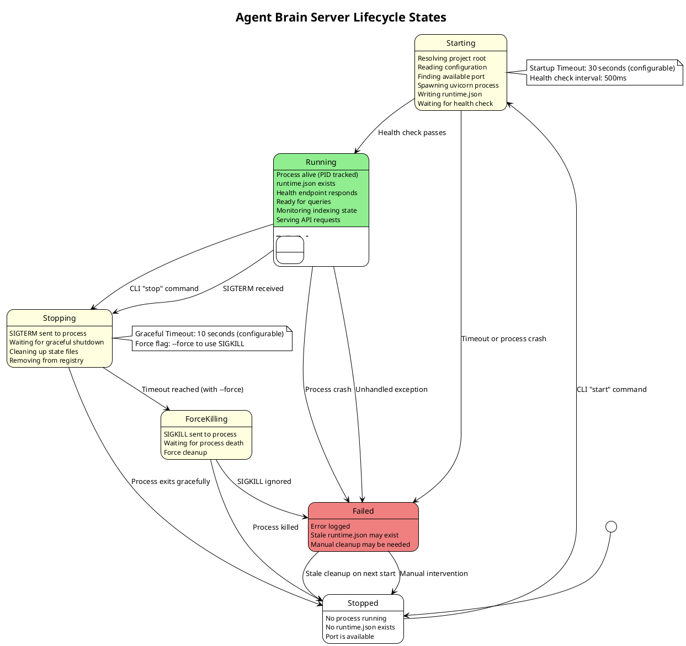
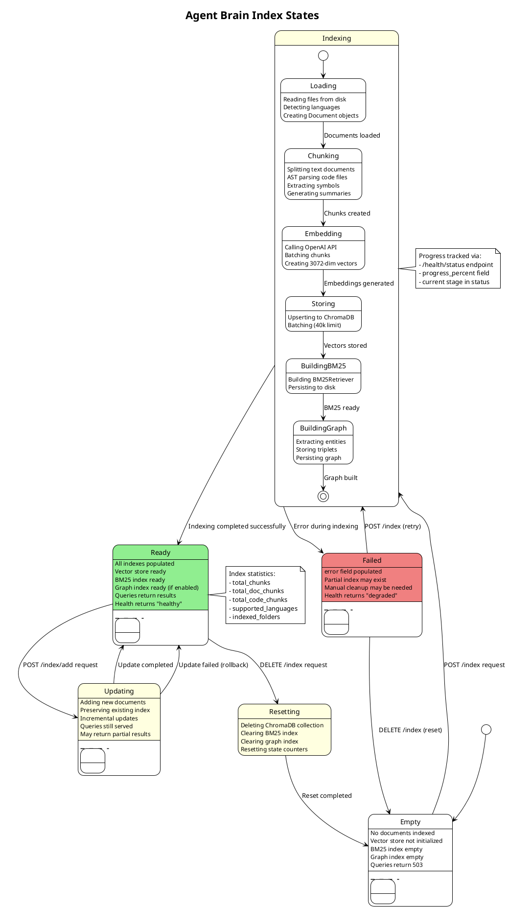
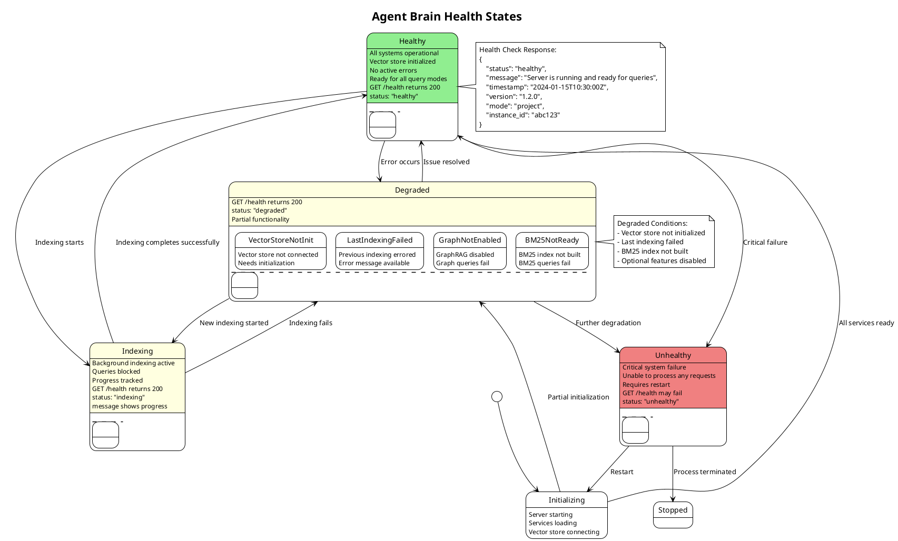
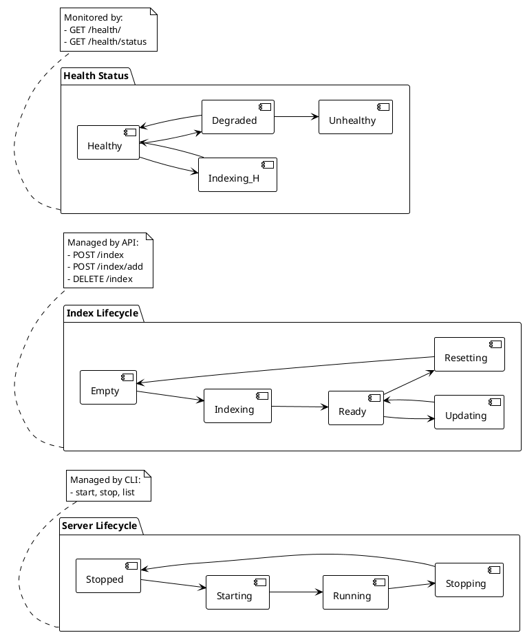

# Server State Diagrams

This document contains PlantUML state diagrams for Agent Brain server lifecycle,
index management, and health monitoring.

## Table of Contents

1. [Server Lifecycle States](#1-server-lifecycle-states)
2. [Index States](#2-index-states)
3. [Health States](#3-health-states)

---

## 1. Server Lifecycle States

### Diagram



### State Descriptions

| State | Description | Triggers |
|-------|-------------|----------|
| **Stopped** | No server process running. Port is available. No runtime.json. | Initial state, after clean stop |
| **Starting** | Server is being initialized. Spawning process, waiting for health. | `agent-brain start` command |
| **Running** | Server is operational. Accepting requests. Health check passes. | Health check success |
| **Stopping** | Graceful shutdown in progress. SIGTERM sent. | `agent-brain stop`, SIGTERM |
| **ForceKilling** | Forced shutdown. SIGKILL sent after timeout. | `--force` flag, SIGTERM timeout |
| **Failed** | Error state. Stale files may exist. | Crash, timeout, unhandled error |

### Transitions

1. **Stopped -> Starting**
   - Trigger: `agent-brain start` command
   - Actions:
     - Resolve project root (git root or marker detection)
     - Read config.json from state directory
     - Find available port (auto-detect or explicit)
     - Spawn uvicorn subprocess with environment variables
     - Write runtime.json with PID, port, base_url
     - Poll health endpoint until ready

2. **Starting -> Running**
   - Trigger: Health check returns 200 OK
   - Timeout: 30 seconds (configurable with `--timeout`)
   - Actions:
     - Update global registry at `~/.doc-serve/registry.json`
     - Display success message with URL

3. **Starting -> Failed**
   - Trigger: Health check timeout or process crash
   - Actions:
     - Kill orphaned process (if still alive)
     - Delete runtime.json
     - Log error message

4. **Running -> Stopping**
   - Trigger: `agent-brain stop` or SIGTERM signal
   - Actions:
     - Send SIGTERM to process
     - Wait for graceful shutdown (10 seconds default)

5. **Stopping -> Stopped**
   - Trigger: Process exits cleanly
   - Actions:
     - Delete runtime.json, lock file, PID file
     - Remove from global registry

6. **Stopping -> ForceKilling**
   - Trigger: Graceful timeout with `--force` flag
   - Actions:
     - Send SIGKILL to process

7. **ForceKilling -> Stopped**
   - Trigger: Process killed
   - Actions:
     - Force cleanup all state files

### runtime.json Structure

```json
{
    "schema_version": "1.0",
    "mode": "project",
    "project_root": "/path/to/project",
    "instance_id": "a1b2c3d4e5f6",
    "base_url": "http://127.0.0.1:8042",
    "bind_host": "127.0.0.1",
    "port": 8042,
    "pid": 12345,
    "started_at": "2024-01-15T10:30:00Z"
}
```

---

## 2. Index States

### Diagram



### State Descriptions

| State | Description | Health Status |
|-------|-------------|---------------|
| **Empty** | No documents indexed. Fresh start. | degraded |
| **Indexing** | Active indexing operation. | indexing |
| **Ready** | All indexes populated and ready. | healthy |
| **Updating** | Adding documents to existing index. | indexing |
| **Resetting** | Clearing all indexes. | indexing |
| **Failed** | Error occurred during indexing. | degraded |

### Indexing Sub-States

1. **Loading** (0-20%)
   - Reading files from disk
   - Detecting file types and languages
   - Creating Document objects with metadata

2. **Chunking** (20-50%)
   - Text documents: ContextAwareChunker splits by sections
   - Code files: CodeChunker uses AST parsing
   - Summary generation (optional, Claude API)

3. **Embedding** (50-90%)
   - Batching chunks (100 per batch)
   - OpenAI API calls for embeddings
   - Rate limiting and retry logic

4. **Storing** (90-95%)
   - ChromaDB upsert operations
   - Batching (40,000 limit per batch)

5. **BuildingBM25** (95-97%)
   - Creating BM25Retriever from nodes
   - Persisting to disk

6. **BuildingGraph** (97-100%)
   - Entity extraction (code metadata + LLM)
   - Triplet storage
   - Graph persistence

### Query Behavior by State

| State | Query Behavior |
|-------|----------------|
| Empty | 503 Service Unavailable |
| Indexing | 503 Service Unavailable |
| Ready | Normal query processing |
| Updating | Queries served (may be partial) |
| Resetting | 503 Service Unavailable |
| Failed | 503 Service Unavailable |

---

## 3. Health States

### Diagram



### State Descriptions

| State | HTTP Status | Meaning |
|-------|-------------|---------|
| **Initializing** | 200 (pending) | Server starting up |
| **Healthy** | 200 | All systems operational |
| **Indexing** | 200 | Background indexing active |
| **Degraded** | 200 | Partial functionality |
| **Unhealthy** | 500/503 | Critical failure |

### Health Check Response

```json
{
    "status": "healthy",
    "message": "Server is running and ready for queries",
    "timestamp": "2024-01-15T10:30:00Z",
    "version": "1.2.0",
    "mode": "project",
    "instance_id": "a1b2c3d4e5f6",
    "project_id": "/path/to/project",
    "active_projects": null
}
```

### Status Values

| Status | Condition | Query Impact |
|--------|-----------|--------------|
| `healthy` | All ready, no errors | Full query support |
| `indexing` | Active indexing job | Queries blocked (503) |
| `degraded` | Partial functionality | Some query modes fail |
| `unhealthy` | Critical failure | All queries fail |

### Degraded Conditions

1. **Vector Store Not Initialized**
   - Message: "Vector store not initialized"
   - Impact: All query modes fail
   - Resolution: Run indexing

2. **Last Indexing Failed**
   - Message: "Last indexing failed: {error}"
   - Impact: May have partial index
   - Resolution: Fix error, re-index

3. **BM25 Index Not Ready**
   - Message: "BM25 index not initialized"
   - Impact: BM25 and hybrid queries fail
   - Resolution: Run indexing

4. **GraphRAG Not Enabled**
   - Not degraded (feature disabled by choice)
   - Impact: Graph and multi queries skip graph
   - Resolution: Enable ENABLE_GRAPH_INDEX

### Health Check Endpoint Details

**Endpoint**: `GET /health/`

**Response Model**: `HealthStatus`

```python
class HealthStatus(BaseModel):
    status: Literal["healthy", "indexing", "degraded", "unhealthy"]
    message: str
    timestamp: datetime
    version: str
    mode: str  # "project" or "shared"
    instance_id: Optional[str]
    project_id: Optional[str]
    active_projects: Optional[list[str]]
```

---

## State Machine Summary



### Interaction Between State Machines

| Server State | Index State | Health State |
|--------------|-------------|--------------|
| Stopped | N/A | N/A |
| Starting | Empty | Initializing |
| Running | Empty | Degraded |
| Running | Indexing | Indexing |
| Running | Ready | Healthy |
| Running | Updating | Indexing |
| Running | Failed | Degraded |
| Stopping | Any | N/A |
