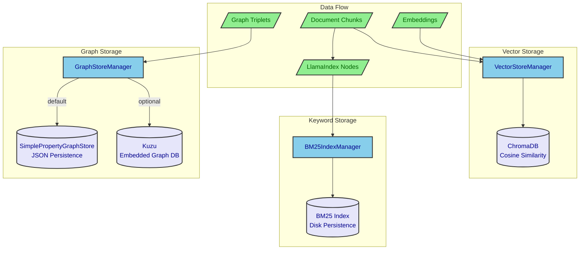
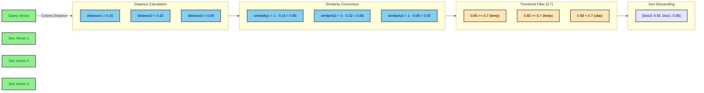
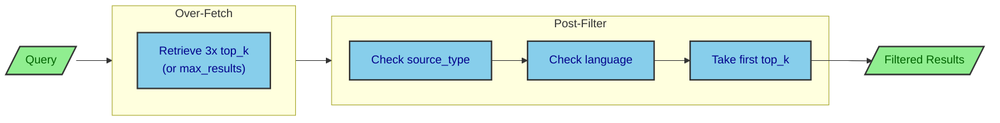
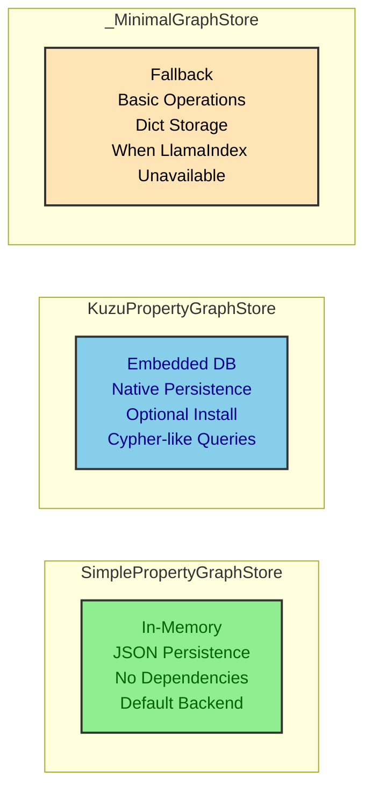
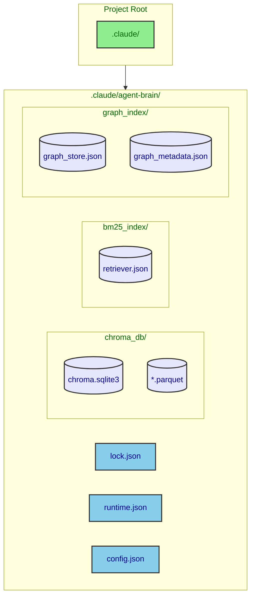
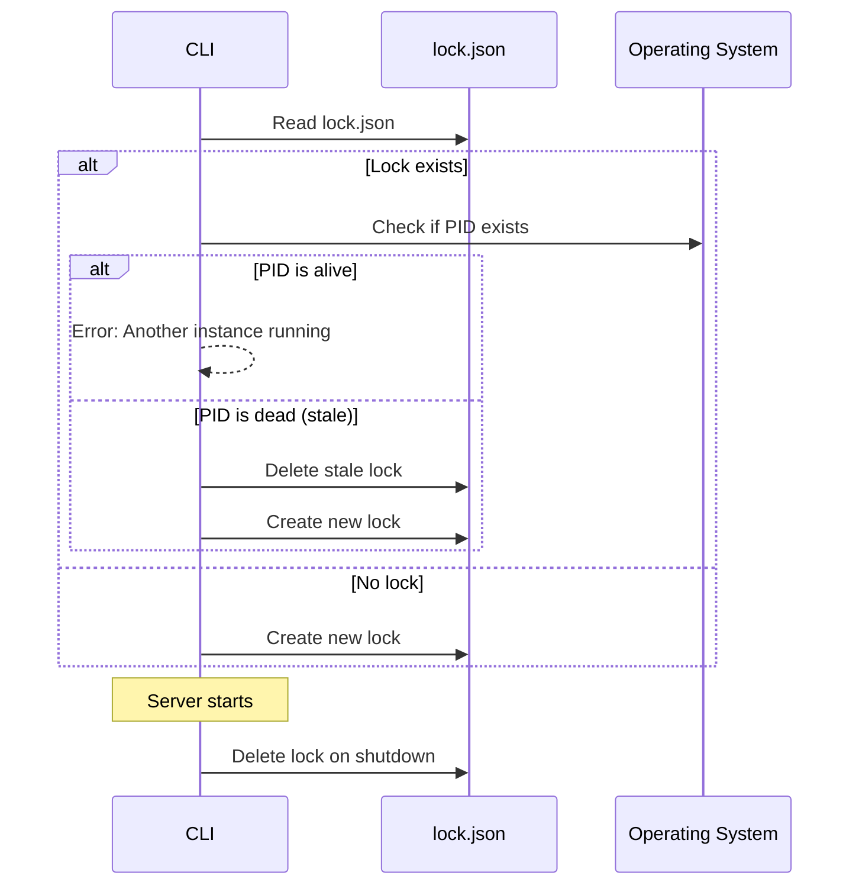
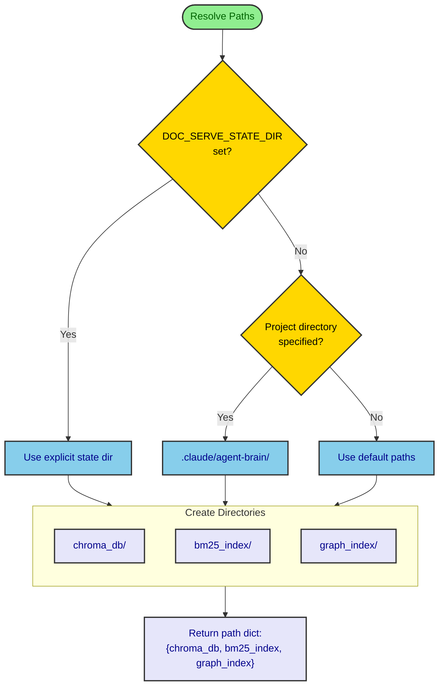
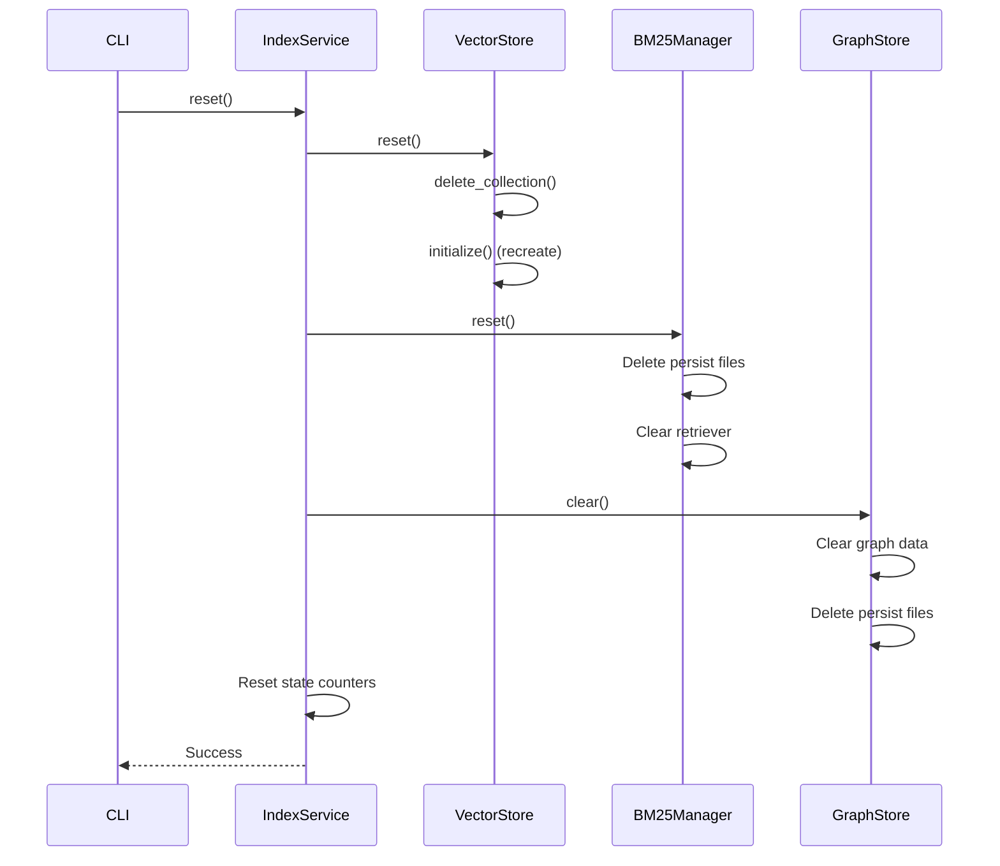

# Storage Architecture

This document details Agent Brain's multi-tier storage architecture, including vector storage, keyword indexing, and knowledge graph persistence.

## Storage Overview

Agent Brain uses three complementary storage systems optimized for different retrieval patterns.



## Storage Comparison

| Aspect | ChromaDB | BM25 Index | Graph Store |
|--------|----------|------------|-------------|
| **Purpose** | Semantic similarity | Keyword matching | Entity relationships |
| **Data Type** | Float vectors (3072-dim) | Tokenized text | Triplets |
| **Query Type** | Approximate NN | Exact match | Graph traversal |
| **Speed** | O(log n) | O(1) lookup | O(depth * edges) |
| **Persistence** | SQLite + Parquet | JSON files | JSON or Kuzu DB |
| **Memory** | High (vectors) | Medium (index) | Medium (graph) |

## Vector Store (ChromaDB)

ChromaDB provides high-performance vector similarity search using HNSW indexing.

### Architecture

```mermaid
flowchart TB
    subgraph VectorStoreManager["VectorStoreManager"]
        direction TB
        Init[initialize()]
        Add[add_documents()]
        Upsert[upsert_documents()]
        Search[similarity_search()]
        GetByID[get_by_id()]
        Reset[reset()]
    end

    subgraph ChromaClient["Chroma PersistentClient"]
        direction TB
        Settings["Settings<br/>anonymized_telemetry=False<br/>allow_reset=True"]
        Collection["Collection<br/>hnsw:space=cosine"]
    end

    subgraph Persistence["Persistence Layer"]
        direction TB
        SQLite[(sqlite3<br/>Metadata)]
        Parquet[(Parquet<br/>Vectors)]
    end

    VectorStoreManager --> ChromaClient
    ChromaClient --> Persistence

    classDef manager fill:#87CEEB,stroke:#333,stroke-width:2px,color:darkblue
    classDef client fill:#FFE4B5,stroke:#333,stroke-width:2px,color:black
    classDef storage fill:#E6E6FA,stroke:#333,stroke-width:2px,color:darkblue

    class Init,Add,Upsert,Search,GetByID,Reset manager
    class Settings,Collection client
    class SQLite,Parquet storage
```

### VectorStoreManager Interface

```python
class VectorStoreManager:
    """Manages Chroma vector store operations with thread-safe access."""

    def __init__(
        self,
        persist_dir: Optional[str] = None,      # Default: ./chroma_db
        collection_name: Optional[str] = None,   # Default: doc_serve_collection
    ):
        self._client: Optional[chromadb.PersistentClient] = None
        self._collection: Optional[chromadb.Collection] = None
        self._lock = asyncio.Lock()  # Thread-safe operations
        self._initialized = False

    async def initialize(self) -> None:
        """Initialize client and collection (creates dirs, loads existing data)."""

    async def add_documents(
        self,
        ids: list[str],
        embeddings: list[list[float]],
        documents: list[str],
        metadatas: Optional[list[dict[str, Any]]] = None,
    ) -> int:
        """Add new documents (fails if IDs exist)."""

    async def upsert_documents(
        self,
        ids: list[str],
        embeddings: list[list[float]],
        documents: list[str],
        metadatas: Optional[list[dict[str, Any]]] = None,
    ) -> int:
        """Upsert documents (update if ID exists)."""

    async def similarity_search(
        self,
        query_embedding: list[float],
        top_k: int = 5,
        similarity_threshold: float = 0.0,
        where: Optional[dict[str, Any]] = None,
    ) -> list[SearchResult]:
        """Find similar documents by embedding vector."""

    async def get_by_id(self, chunk_id: str) -> Optional[dict[str, Any]]:
        """Retrieve specific document by ID."""

    async def get_count(self, where: Optional[dict[str, Any]] = None) -> int:
        """Count documents, optionally filtered."""

    async def reset(self) -> None:
        """Delete and recreate collection."""
```

### Similarity Score Calculation

ChromaDB returns distances. Agent Brain converts to similarities:



### ChromaDB Where Clauses

Agent Brain supports metadata filtering:

```python
# Single filter
where = {"source_type": "code"}

# Multiple values
where = {"language": {"$in": ["python", "typescript"]}}

# Combined filters
where = {
    "$and": [
        {"source_type": "code"},
        {"language": {"$in": ["python", "typescript"]}}
    ]
}
```

### Storage Location

```
.claude/agent-brain/           # Per-project state directory
├── chroma_db/                 # ChromaDB persistence
│   ├── chroma.sqlite3        # Metadata database
│   └── *.parquet             # Vector data files
```

## BM25 Index

The BM25 index provides fast keyword-based retrieval using the LlamaIndex BM25Retriever.

### Architecture

```mermaid
flowchart TB
    subgraph BM25Manager["BM25IndexManager"]
        direction TB
        Init[initialize()]
        Build[build_index()]
        GetRetriever[get_retriever()]
        SearchFilter[search_with_filters()]
        Persist[persist()]
        Reset[reset()]
    end

    subgraph Retriever["BM25Retriever"]
        direction TB
        Tokenize[Tokenize Documents]
        BuildIndex[Build Inverted Index]
        CalcIDF[Calculate IDF]
        Retrieve[aretrieve()]
    end

    subgraph Persistence["Disk Persistence"]
        direction TB
        RetrieverJSON[retriever.json]
        CorpusData[corpus data]
    end

    BM25Manager --> Retriever
    Retriever --> Persistence

    classDef manager fill:#87CEEB,stroke:#333,stroke-width:2px,color:darkblue
    classDef retriever fill:#FFE4B5,stroke:#333,stroke-width:2px,color:black
    classDef storage fill:#E6E6FA,stroke:#333,stroke-width:2px,color:darkblue

    class Init,Build,GetRetriever,SearchFilter,Persist,Reset manager
    class Tokenize,BuildIndex,CalcIDF,Retrieve retriever
    class RetrieverJSON,CorpusData storage
```

### BM25IndexManager Interface

```python
class BM25IndexManager:
    """Manages the lifecycle of the BM25 index."""

    def __init__(self, persist_dir: Optional[str] = None):
        self.persist_dir = persist_dir or settings.BM25_INDEX_PATH
        self._retriever: Optional[BM25Retriever] = None

    @property
    def is_initialized(self) -> bool:
        """Check if index is ready for queries."""

    def initialize(self) -> None:
        """Load existing index from disk if available."""

    def build_index(self, nodes: Sequence[BaseNode]) -> None:
        """Build new index from LlamaIndex nodes and persist."""

    def get_retriever(self, top_k: int = 5) -> BM25Retriever:
        """Get configured retriever for queries."""

    async def search_with_filters(
        self,
        query: str,
        top_k: int = 5,
        source_types: Optional[list[str]] = None,
        languages: Optional[list[str]] = None,
        max_results: Optional[int] = None,
    ) -> list[NodeWithScore]:
        """Search with post-retrieval metadata filtering."""

    def reset(self) -> None:
        """Delete index and persistence files."""
```

### BM25 Filtering Strategy

BM25 doesn't support native metadata filtering. Agent Brain uses over-fetch + post-filter:



### Storage Location

```
.claude/agent-brain/
├── bm25_index/
│   └── retriever.json        # Serialized BM25 index
```

## Graph Store

The graph store provides knowledge graph storage for GraphRAG functionality.

### Architecture

```mermaid
flowchart TB
    subgraph GraphStoreManager["GraphStoreManager"]
        direction TB
        Init[initialize()]
        AddTriplet[add_triplet()]
        Persist[persist()]
        Load[load()]
        Clear[clear()]
    end

    subgraph Backends["Storage Backends"]
        direction TB
        Simple[SimplePropertyGraphStore]
        Kuzu[KuzuPropertyGraphStore]
        Minimal[_MinimalGraphStore]
    end

    subgraph SimpleStore["Simple Store Persistence"]
        direction TB
        GraphJSON[graph_store_llamaindex.json]
        MetaJSON[graph_metadata.json]
    end

    subgraph KuzuStore["Kuzu Persistence"]
        direction TB
        KuzuDB[kuzu_db/]
    end

    GraphStoreManager --> Backends
    Simple --> SimpleStore
    Kuzu --> KuzuStore

    classDef manager fill:#87CEEB,stroke:#333,stroke-width:2px,color:darkblue
    classDef backend fill:#FFE4B5,stroke:#333,stroke-width:2px,color:black
    classDef storage fill:#E6E6FA,stroke:#333,stroke-width:2px,color:darkblue

    class Init,AddTriplet,Persist,Load,Clear manager
    class Simple,Kuzu,Minimal backend
    class GraphJSON,MetaJSON,KuzuDB storage
```

### GraphStoreManager Interface

```python
class GraphStoreManager:
    """Manages graph storage backends for GraphRAG."""

    def __init__(self, persist_dir: Path, store_type: str = "simple"):
        self.persist_dir = persist_dir
        self.store_type = store_type  # "simple" or "kuzu"
        self._graph_store: Optional[Any] = None
        self._entity_count = 0
        self._relationship_count = 0

    @classmethod
    def get_instance(cls, persist_dir=None, store_type=None) -> "GraphStoreManager":
        """Get singleton instance."""

    def initialize(self) -> None:
        """Initialize backend based on store_type."""

    def add_triplet(
        self,
        subject: str,
        predicate: str,
        obj: str,
        subject_type: Optional[str] = None,
        object_type: Optional[str] = None,
        source_chunk_id: Optional[str] = None,
    ) -> bool:
        """Add a relationship to the graph."""

    def persist(self) -> None:
        """Save graph to disk."""

    def load(self) -> bool:
        """Load graph from disk."""

    def clear(self) -> None:
        """Clear all graph data."""

    @property
    def entity_count(self) -> int:
        """Number of unique entities."""

    @property
    def relationship_count(self) -> int:
        """Number of relationships."""
```

### Backend Comparison



| Feature | Simple | Kuzu | Minimal |
|---------|--------|------|---------|
| **Install** | Included | Optional pip | Fallback |
| **Persistence** | JSON | Native DB | JSON |
| **Memory** | Graph in RAM | Disk-backed | Dict in RAM |
| **Query** | Linear scan | Indexed | Linear scan |
| **Scale** | < 100K triplets | Millions | < 10K triplets |

### Storage Location

```
.claude/agent-brain/
├── graph_index/
│   ├── graph_store_llamaindex.json  # LlamaIndex format
│   ├── graph_metadata.json          # Entity/relationship counts
│   └── kuzu_db/                     # Kuzu database (if enabled)
```

## Multi-Instance State Management

Each project maintains isolated state in `.claude/agent-brain/`.

### Directory Structure



### State Files

| File | Purpose | Contents |
|------|---------|----------|
| `lock.json` | Prevent multiple instances | `{pid, created_at}` |
| `runtime.json` | Server discovery | `{port, pid, base_url, mode}` |
| `config.json` | Project settings | Custom configuration |

### Lock Protocol



## Storage Path Resolution

Agent Brain resolves storage paths based on configuration.



### Default vs Project Paths

| Mode | ChromaDB | BM25 | Graph |
|------|----------|------|-------|
| **Shared** | `./chroma_db` | `./bm25_index` | `./graph_index` |
| **Project** | `.claude/agent-brain/chroma_db` | `.claude/agent-brain/bm25_index` | `.claude/agent-brain/graph_index` |

## Backup and Recovery

### Data Portability

All storage is file-based and portable:

```bash
# Backup entire state
tar -czf agent-brain-backup.tar.gz .claude/agent-brain/

# Restore to new location
tar -xzf agent-brain-backup.tar.gz -C /new/project/
```

### Reset Sequence



## Storage Sizing Guidelines

| Content Size | ChromaDB | BM25 | Graph | Total |
|--------------|----------|------|-------|-------|
| 100 docs | ~50 MB | ~5 MB | ~1 MB | ~56 MB |
| 1,000 docs | ~500 MB | ~50 MB | ~10 MB | ~560 MB |
| 10,000 docs | ~5 GB | ~500 MB | ~100 MB | ~5.6 GB |

### Memory Usage

| Component | Idle | Active (1K docs) |
|-----------|------|------------------|
| Server process | ~100 MB | ~200 MB |
| ChromaDB collection | ~50 MB | ~500 MB |
| BM25 index | ~10 MB | ~50 MB |
| Graph store | ~5 MB | ~50 MB |

## Performance Optimization

### ChromaDB Tuning

```python
# Collection metadata for HNSW tuning
collection = client.get_or_create_collection(
    name=collection_name,
    metadata={
        "hnsw:space": "cosine",      # Distance metric
        "hnsw:M": 16,                 # Graph connections (default)
        "hnsw:ef_construction": 100,  # Build quality (default)
        "hnsw:ef": 10,                # Search quality (default)
    }
)
```

### BM25 Performance

- **Tokenization**: Done once at index build
- **Query**: O(1) term lookup + O(n) scoring
- **Persistence**: JSON serialization of inverted index

### Graph Performance

- **Simple store**: Linear scan O(n) for queries
- **Kuzu**: Indexed lookup O(log n) for entity queries
- **Traversal**: O(depth * average_degree)
